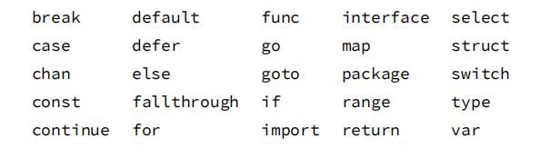

# 基础

## GO的优点/优越性

Go语言是一种**静态编译语言**，但是又具备动态语言开发维护的高效率性，从语法和设计理念比较像**C+python**的结合体。Go有比较多先进的特性，内置了对并发编程的支持，包管理系统、垃圾回收机制等等。还有就是语言成分很干净，只有20多个关键字。

- 简单易学（Go的语法比C还简单, 支持大多数其他语言的特性：封装、继承、多态、反射等）
- 丰富的标准库（Go目前已经内置了大量的库，特别是网络库非常强大）
- 跨平台编译和部署

- - Go代码可直接编译成机器码，不依赖其他库，部署就是扔一个文件上去就完事了. 并且Go代码还可以做到跨平台编译(例如: window系统编译linux的应用)

- 内置强大的工具

- - Go语言里面内置了很多工具链，最好的应该是gofmt工具，自动化格式化代码，能够让团队review变得如此的简单，代码格式一模一样，想不一样都很困难

- 性能优势: Go 极其地快。其性能与 C 或 C++相似。

- - 语言层面支持并发，这个就是Go最大的特色，天生的支持并发，可以充分的利用多核，很容易的使用并发
  - 内置runtime，支持垃圾回收

## 面向对象的三大特性

- 封装

- - 封装是面向对象方法的重要原则，就是把对象的属性和操作（或服务）结合为一个独立的整体，并尽可能隐藏对象的内部实现细节
  - 将类的某些信息隐藏在类的内部，不允许外部程序进行直接的访问调用
  - 通过该类提供的方法实现对隐藏信息的操作和访问
  - 隐藏对象的信息
  - 留出访问的对外接口

- 继承

- - 继承就是子类继承父类的特征和行为，使得子类对象具有父类的实例域和方法，或子类从父类继承方法，使得子类具有父类相同的行为。在父类中拥有私有属性（private修饰），则子类是不能被继承的
  - 子类可以拥有父类的属性和方法
  - 子类可以拥有自己的属性和方法
  - 子类可以重写父类的方法
  - 可以提高代码复用性
  - 可以轻松的定义子类
  - 使设计应用程序变得简单

- 多态

- - 多态是同一个行为具有不同表现形式或形态的能力
  - 消除类型之间的耦合关系，实现低耦合
  - 灵活性、可扩充性、可替换性
  - 体现形式：继承、父类引用指向子类、重写

## 关键字



## 两个 Nil 可能不相等吗？

**Go 中两个 Nil 可能不相等。**

接口(interface) 是对非接口值(例如指针，struct 等)的封装，内部实现包含 2 个字段，类型 T 和 值 V。一个接口等于 nil，当且仅当 T 和 V 处于 unset 状态（T=nil，V is unset）。

**两个接口值比较时，会先比较 T，再比较 V。 接口值与非接口值比较时，会先将非接口值尝试转换为接口值，再比较。**


例子中，将一个 nil 非接口值 p 赋值给接口 i，此时,i 的内部字段为(T=*int, V=nil)，i 与 p 作比较时，将 p 转换为接口后再比较，因此 i == p，p 与 nil 比较，直接比较值，所以 p == nil。

但是当 i 与 nil 比较时，会将 nil 转换为接口(T=nil, V=nil),与 i(T=*int, V=nil)不相等，因此 i != nil。因此 V 为 nil ，但 T 不为 nil 的接口不等于 nil。

## Go与面向对象问题

面向对象：基于对象编程，封装、继承、多态

Go是面向对象的语言吗？

是，也不是。

Go有类型和方法，允许面向对象编程风格，但是没有类型层次，所以Go中的对象比JAVA的更轻巧；

Go的接口

## string 类型的值可以修改吗

不能，尝试使用索引遍历字符串，来更新字符串中的个别字符，是不允许的。

string 类型的值是只读的二进制 byte slice，如果真要修改字符串中的字符，将 string 转为 []byte 修改后，再转为 string 即可。

## 哪些类型不支持比较？

- 映射（map）
- 切片
- 函数
- 包含不可比较字段的结构体类型

- - 元素类型为不可比较类型的数组类型

- 不支持比较的类型不能用做映射类型的键值类型。

请注意：

尽管映射，切片和函数值不支持比较，但是它们的值可以与类型不确定的nil标识符比较。

如果两个接口值的动态类型相同且不可比较，那么在运行时比较这两个接口的值会产生一个恐慌。

## 哪些类型的值可以被取地址，哪些不可以被取地址？

以下的值是不可以寻址的：

- 字符串的字节元素
- 映射元素
- 接口值的动态值（类型断言的结果）
- 常量值
- 字面值
- 声明的包级别函数
- 方法（用做函数值）
- 中间结果值

- - 函数调用
  - 显式值转换
  - 各种操作，不包含指针解引用（dereference）操作，但是包含：

- - - 数据通道接收操作
    - 子字符串操作
    - 子切片操作
    - 加法、减法、乘法、以及除法等等。

请注意：&T{}在Go里是一个语法糖，它是tmp := T{}; (&tmp)的简写形式。 所以&T{}是合法的,并不代表字面值T{}是可寻址的。

以下的值是可寻址的，因此可以被取地址：

变量

可寻址的结构体的字段

可寻址的数组的元素

任意切片的元素（无论是可寻址切片或不可寻址切片）

指针解引用（dereference）操作

## 类型占用字节数


## 引用类型

Go语言中的引用类型有func（函数类型），interface（接口类型），slice（切片类型），map（字典类型），channel（管道类型），*（指针类型）等。

## new 和 make 

用来分配和初始化不同类型的数据, make返回引用类型，new返回指针。

**make 仅用来分配及初始化类型为 slice、map、chan 的数据**，其返回值是所创建类型的本身，而不是新的指针引用。**make 返回引用**，即 Type，new 分配的空间被清零， make 分配空间后，会进行初始。

new 可分配任意类型的数据，**根据传入的类型申请一块内存，返回指向这块内存的指针**，即类型 *Type。

**new 函数也能初始化 make 的三种类型， make 函数的区别、优势是什么呢？**

本质上在于 make 函数在初始化时，会初始化 slice、chan、map 类型的内部数据结构，new 函数并不会。

例如：在 map 类型中，合理的长度（len）和容量（cap）可以提高效率和减少开销。

**更进一步的区别：**

make 函数：

能够分配并初始化类型所需的内存空间和结构，返回引用类型的本身。

具有使用范围的局限性，仅支持 channel、map、slice 三种类型。

具有独特的优势，make 函数会对三种类型的内部数据结构（长度、容量等）赋值。

new 函数：

能够分配类型所需的内存空间，返回指针引用（指向内存的指针）。

可被替代，能够通过字面值快速初始化。

```go
func main() {
    // 返回*int
    a := new(int)
    // 赋值需要解引用
    *a = 2
    // 输出地址
    fmt.Pintln(a)
    // 输出值
    fmt.Println(*a)
    // 涉及到指针类型的时候初始化内存空间需要注意
    b := new(B)
    b.name = "test1"
    // 输出&{test1}
    fmt.Println(b)
    
    var c *B
    // panic
    c.name = "test2"
    fmt.Println(c)
    
    var c B
    c.name = "test2"
    // 输出{test2}
    fmt.Println(c)
}

type B struct {
    name string
}
```

## nil是什么


# 数组

## array 类型的值作为函数参数是引⽤传递还是值传递？

在 C/C++ 中，数组（名）是指针。将数组作为参数传进函数时，相当于传递了数组内存地址的引用，在函数内部会改变该数组的值。
在 Go 中，**数组是值**。作为参数传进函数时，**传递的是数组的原始值拷贝**，此时在函数内部是无法更新该数组的。

# slice

## 数组和slice的区别

数组：数组是固定长度的，不能动态扩容，在编译期就会确定大小。

slice : 轻量级的数据结构，提供了访问数组子序列（或者全部）元素的功能，slice的底层是引用一个数组对象。

一个slice由三个部分构成：指针、长度和容量。

指针指向第一个slice元素对应的底层数组元素的地址（slice的第一个元素并不一定就是数组的第一个元素）

长度对应slice中元素的数目；长度不能超过容量。

容量一般是从slice的开始位置到底层数据的结尾位置。

内置的len和cap函数分别返回slice的长度和容量。

切片可以使用append追加元素，当cap不足时进行动态扩容。

## 零切片、空切⽚、nil切⽚

- 零切片

切片内部数组的元素都是零值或者底层数组的内容就全是 nil 的切片叫做零切片，**使用****make****创建的、长度、容量都不为0的切片**就是零值切片：值是0，有长度有容量

```go
slice := make([]int,5) // 0 0 0 0 0
slice := make([]*int,5) // nil nil nil nil nil
```

- nil切片

nil切片的长度和容量都为0，并且和nil比较的结果为true，采用直接创建切片的方式、new创建切片的方式都可以创建nil切片：指针、长度、容量都为空

```go
var slice []int
var slice = *new([]int)
```

- 空切片

空切片的长度和容量也都为0，但是和nil的比较结果为false，因为所有的空切片的数据指针都指向同一个地址 0xc42003bda0；使用字面量、make可以创建空切片：指针有，长度和容量为空

```go
var slice = []int{}
var slice = make([]int, 0)
```

空切片和nil切片**指向的地址不一样**
nil切片引用数组指针地址为0（没有指向任何实际地址）
空切片有引用数组指针地址，并且是固定的一个值

**Go 中对 nil 的 Slice 和空 Slice 的处理是一致的吗?**

首先 Go 的 JSON 标准库对 nil slice 和 空 slice 的处理是**不一致。**

slice := make([]int,0）：slice 不为 nil，但是 slice 没有值，slice 的底层的空间是空的。

slice := []int{} ：slice 的值是 nil，可用于需要返回 slice 的函数，当函数出现异常的时候，保证函数依然会有 nil 的返回值。

## slice深拷⻉和浅拷⻉ 

在Go语言，切片拷贝有三种方式：

- 使用=操作符拷贝切片，这种就是浅拷贝
- 使用[:]下标的方式复制切片，这种也是浅拷贝
- 使用Go语言的内置函数copy()进行切片拷贝，这种就是深拷贝

深浅拷贝，其实都是进行**复制**，主要区别在于复制出来的新对象和原来的对象，它们的数据发生改变时，是否会相互影响。

简单而言，B 复制 A，如果 A 的数据发生变化，B 也跟着变化，这是浅拷贝。 如果 B 不发生变化，则为深拷贝。深浅拷贝差异的根本原因在于，复制出来的对象与原对象是否会指向同一个地址。

## Slice 如何扩容？

在**使用 append 向 slice 追加元素时**，若 **slice 空间不足则会发生扩容**，扩容会重新分配一块更大的内存，**将原 slice 拷贝到新 slice ，然后返回新 slice**。扩容后再将数据追加进去。

扩容操作只对容量，扩容后的 slice 长度不变，容量变化规则如下：

切片在扩容时会进行内存对齐，这个和内存分配策略相关。

- - 若 slice 容量小于 1024 个元素，那么扩容的时候 slice 的 cap 就翻番，乘以 2；一旦元素个数超过 1024 个元素，增长因子就变成 1.25，即每次增加原来容量的四分之一。
  - 若 slice 容量够用，则将新元素追加进去，slice.len++，返回原 slice
  - 若 slice 容量不够用，将 slice 先扩容，扩容得到新 slice，将新元素追加进新 slice，slice.len++，返回新 slice。

## 拷贝大切片一定比小切片代价大吗？

不是，所有切片的大小相同；三个字段（一个指针 ，两个int）。

切片中的第一个字是指向切片底层数组的指针，这是切片的存储空间

第二个字段是切片的长度，第三个字段是容量。

将一个 slice 变量分配给另一个变量只会复制三个机器字。

所以 拷贝大切片跟小切片的代价应该是一样的。

## 参数传递 切片和切片指针

切片底层就是一个结构体，里面有三个元素：分别表示切片底层数据的地址，切片长度，切片容量。

当切片作为参数传递时，其实就是一个结构体的传递，因为Go语言参数传递只有值传递，传递一个切片就会浅拷贝原切片，但因为底层数据的地址没有变，所以在函数内对切片的修改，也将会影响到函数外的切片。

也有特例，当切片发生了扩容时，函数外的切片指向了一个新的底层数组，所以函数内外不会相互影响，因此可以得出一个结论：当参数直接传递切片时，**如果****指向底层数组的指针被覆盖或者修改****（copy、重分配、append触发扩容），此时函数内部对数据的修改将****不再影响到外部的切片****，代表长度的len和容量cap也均不会被修改**。

切片指针：如果你想修改切片中元素的值，并且更改切片的容量和底层数组，那就使用指针传递。

## range遍历切片问题

使用range遍历切片时会先拷贝一份，然后再遍历拷贝数据。

所以改变遍历中的拷贝数据，不会对原数据产生影响。

## 字符串转成byte切片，会发生内存拷贝吗？

字符串转成切片，会产生拷贝。严格来说，只要是发生类型强转都会发生内存拷贝。

追问：频繁的内存拷贝操作听起来对性能不大友好。有没有什么办法可以在字符串转成切片的时候不用发生拷贝呢？

StringHeader 是字符串在go的底层结构。

**type** StringHeader **struct** {
 Data **uintptr** Len **int**}

SliceHeader 是切片在go的底层结构。

**type** SliceHeader **struct** {
 Data **uintptr** Len **int** Cap **int**}

那么如果想要在底层转换二者，只需要把 StringHeader 的地址强转成 SliceHeader 就行。那么go有个很强的包叫 unsafe 。

1.unsafe.Pointer(&a)方法可以得到变量a的地址。

2.(*reflect.StringHeader)(unsafe.Pointer(&a)) 可以把字符串a转成底层结构的形式。

3.(*[]byte)(unsafe.Pointer(&ssh)) 可以把ssh底层结构体转成byte的切片的指针。

4.再通过 *转为指针指向的实际内容。

## slice能用“==”判定相等吗？

slice和map类型不可比较，只能与零值nil做比较。

# map

## map 实现原理

数组+[链表](https://so.csdn.net/so/search?q=链表&spm=1001.2101.3001.7020)、拉链法

go的map是分bucket和链式结构，低八位找在哪个bucket，高八位找具体在bucket的哪个位置。


## map 如何实现顺序读取？

Go 中 map 如果要实现顺序读取的话，可以先把 map 中的 key，通过 sort 包排序。

## map 初始化问题


map不初始化⻓度和初始化⻓度的区别 

## map 的扩容机制

- **增量扩容, 也叫渐进式扩容，和redis一样**

Go采用的是增量扩容方案，当map开始扩容后，每一次map操作都会触发一部分扩容搬迁工作（每进行一次赋值，会做至少一次搬迁工作）。由hmap中的nevacuate成员记录当前的搬迁进度。                                                                                         

注：在map进行扩容迁移的期间，不会触发第二次扩容。只有在前一个扩容迁移工作完成后，map才能进行下一次扩容操作。

- **扩容触发**

以下两种情况会触发map扩容

（1）存储的键值对数量过多（负载因子已达到当前界限）。

（2）由overflow指针所连接的溢出桶数量过多。

Go的**负载因子界限：6.5**

负载因子 = 哈希表中元素数量 / 桶的数量

**扩容情况一：存储的键值对数量过多**

这种情况下map会进行翻倍扩容。

Go创建一个新的buckets数组，这个buckets数组的容量是旧buckets数组的两倍，并将旧数组的数据逐步迁移至新数组。

旧的buckets数组不会被直接删除，而是会把原来对旧数组的引用去掉，让GC来清除内存。

**扩容情况二：溢出桶数量过多**

如果出现了这种情况，可能是因为哈希表里有过多的空键值对，很多桶的内部出现了空洞（装不满）。这个时候就需要通过map扩容做内存整理。目的就是为了清除bmap桶中空闲的键值对。

这种情况下map扩容步骤与情况一基本相同，只不过扩容后map容量还是原来的大小。Go会创建一个与原buckets数组容量相同的buckets数组，并将旧数组的数据逐步迁移至这个新数组。再去除旧数组的引用，让GC来清除内存。

## 使⽤range 迭代 map 是有序的吗?

无序的。Go 的运行时是有意打乱迭代顺序的，所以你得到的迭代结果可能不一致。但也并不总会打乱，得到连续相同的 5 个迭代结果也是可能的。

## 使用值为 nil 的 [slice](https://so.csdn.net/so/search?q=slice&spm=1001.2101.3001.7020)、map会发生啥

允许对值为 nil 的 slice 添加元素，但对值为 nil 的 map 添加元素，则会造成运行时 panic。

## 访问 map 中的 key，需要注意啥

当访问 map 中不存在的 key 时，Go 则会返回元素对应数据类型的零值，比如 nil、" "、false 和 0，取值操作总有值返回，故不能通过取出来的值，来判断 key 是不是在 map 中。

**检查 key 是否存在可以用 map 直接访问，检查返回的第二个参数即可。**

## slice map 非线性安全问题

map 和 slice 不支持并发读写，故非线性安全

## 如何支持并发读写

map 可以上锁，slice没什么方法，可以放弃用它并发。

**sync.RWMutex**

```go
var counter = struct{
    sync.RWMutex
    m map[string]int
}{m: make(map[string]int)}

要想从变量中中读出数据，则调用读锁：
counter.RLock()
n := counter.m["煎鱼"]
counter.RUnlock()
fmt.Println("煎鱼:", n)

要往变量中写数据，则调用写锁：
counter.Lock()
counter.m["煎鱼"]++
counter.Unlock()
```

# 结构体

## Struct 能不能比较？

相同 struct 类型的可以比较

不同 struct 类型的不可以比较，编译都不过，类型不匹配

## 结构体嵌入机制和匿名成员

Go语言提供的不同寻常的结构体嵌入机制让一个命名的结构体包含另一个结构体类型的匿名成员，这样就可以通过简单的点运算符x.f来访问匿名成员链中嵌套的x.d.e.f成员。

```go
type Circle struct {
    Point
    Radius int
}

type Wheel struct {
    Circle
    Spokes int
}
var w Wheel
w.X = 8            // equivalent to w.Circle.Point.X = 8
w.Y = 8            // equivalent to w.Circle.Point.Y = 8
w.Radius = 5       // equivalent to w.Circle.Radius = 5
w.Spokes = 20
```

# JSON格式

## JSON 概念

JavaScript对象表示法（JSON）是一种用于发送和接收结构化信息的标准协议。

## 解析 JSON 数据时，默认将数值当做哪种类型 

在 encode/decode JSON 数据时，Go 默认会将数值当做 float64 处理。

## JSON 标准库对 nil slice 和 空 slice 的处理是一致的吗

首先 JSON 标准库对 nil slice 和 空 slice 的处理是不一致。


通常错误的用法，会报数组越界的错误，因为只是声明了slice，却没有给实例化的对象。

var slice []int

slice[1] = 0

此时slice的值是nil，这种情况可以用于需要返回slice的函数，当函数出现异常的时候，保证函数依然会有nil的返回值。

empty slice 是指slice不为nil，但是slice没有值，slice的底层的空间是空的，此时的定义如下：

slice := make([]int,0）

slice := []int{}

当我们查询或者处理一个空的列表的时候，这非常有用，它会告诉我们返回的是一个列表，但是列表内没有任何值。

## json包里使用的时候，结构体里的变量不加tag能不能正常转成json里的字段？

如果变量首字母小写，则为private。无论如何不能转，因为取不到反射信息。

如果变量首字母大写，则为public。

- - 不加tag，可以正常转为json里的字段，json内字段名跟结构体内字段原名一致。
  - 加了tag，从struct转json的时候，json的字段名就是tag里的字段名，原字段名已经没用。

通过通信来共享内存，而不是共享内存来通信。

# 概念

## 协程、线程、进程的区别

**进程 :**

进程是具有一定独立功能的程序，进程是系统资源分配和调度的最小单位。 每个进程都有自己的独立内存空间，不同进程通过进程间通信来通信。由于进程比较重量，占据独立的内存，所以上下文进程间的切换开销（栈、寄存器、虚拟内存、文件句柄等）比较大，但相对比较稳定安全。

**线程 :**

线程是进程的一个实体, 线程是内核态, 而且是 CPU 调度和分派的基本单位,它是比进程更小的能独立运行的基本单位。线程间通信主要通过共享内存，上下文切换很快，资源开销较少，但相比进程不够稳定容易丢失数据。

**协程（Goroutine）:**

协程是一种用户态的轻量级线程，协程的调度完全是由用户来控制的。独立的栈空间，共享堆空间， 协程拥有自己的寄存器上下文和栈。 协程调度切换时，将寄存器上下文和栈保存到其他地方，在切回来的时候，恢复先前保存的寄存器上下文和栈，直接操作栈则基本没有内核切换的开销，可以不加锁的访问全局变量，所以上下文的切换非常快。

## 协程Goroutine 和线程的区别？

- 一个线程可以有多个协程
- 线程、进程都是同步机制，而协程是异步
- 协程可以保留上一次调用时的状态，当过程重入时，相当于进入了上一次的调用状态
- 协程是需要线程来承载运行的，所以协程并不能取代线程，线程是被分割的 CPU 资源，协程是组织好的代码流程

https://www.kancloud.cn/aceld/golang/1958305

# goroutine

## goroutine的概念与使用

在Go语言中，每一个并发的执行单元叫作一个goroutine。

启动goroutine的方式非常简单，只需要在调用的函数（普通函数和匿名函数）前面加上一个go关键字。

```go
func hello() {
    fmt.Println("Hello Goroutine!")
}
func main() {
    go hello() // 启动另外一个goroutine去执行hello函数
    fmt.Println("main goroutine done!")
    time.Sleep(time.Second)
}
```

## GPM 调度系统

**Go调度本质是把大量的goroutine分配到少量线程上去执行，并利用多核并行，实现更强大的并发。**

GPM是Go语言运行时（runtime）层面的实现，是go语言自己实现的一套调度系统。

- G（Goroutine）： 协程，轻量级线程，使用go关键词创建的执行单元。
- M（Machine）：操作系统的**线程**，在 Go 中称为 Machine，数量对应真实的 CPU 数（真正干活的对象）。
- P（Processor）： **处理器**（Go 中定义的一个摡念，非 CPU），包含运行 Go 代码的必要资源，负责Machine与Goroutine的连接，它能提供线程需要的上下文环境，也能分配G到它应该去的线程上执行，有了它，每个G都能得到合理的调用。P的个数是通过runtime.GOMAXPROCS设定（最大256），默认为核心数。


P与M一般也是一一对应的。他们关系是： P管理着一组G挂载在M上运行。当一个G长久阻塞在一个M上时，runtime会新建一个M，阻塞G所在的P会把其他的G 挂载在新建的M上。当旧的G阻塞完成或者认为其已经死掉时回收旧的M。


1、我们通过 go func()来**创建一个goroutine**；

2、有**两个存储G的队列**，一个是**局部调度器P的本地队列**、一个是**全局G队列**。新创建的G会先保存在P的本地队列中，如果P的本地队列已经满了就会保存在全局的队列中；

3、G只能运行在M中，一个**M必须持有一个P，M与P是1：1的关系**。M会从P的本地队列弹出一个可执行状态的G来执行，如果P的本地队列为空，就会想其他的MP组合偷取一个可执行的G来执行；

4、一个M调度G执行的过程是一个循环机制；

5、当M执行某一个G时候如果发生了syscall或则其余阻塞操作，M会阻塞，如果当前有一些G在执行，runtime会把这个线程M从P中摘除(detach)，然后再创建一个新的操作系统的线程(如果有空闲的线程可用就复用空闲线程)来服务于这个P；

6、当M系统调用结束时候，这个G会尝试获取一个空闲的P执行，并放入到这个P的本地队列。如果获取不到P，那么这个线程M变成休眠状态， 加入到空闲线程中，然后这个G会被放入全局队列中。

## Go中的操作系统线程和goroutine的关系：

- 1.一个操作系统线程对应用户态多个goroutine。
- 2.go程序可以同时使用多个操作系统线程。
- 3.goroutine和OS线程是多对多的关系，即m:n。

## 怎么查看 Goroutine 的数量？怎么限制 Goroutine 的数量？

- 在 Golang 中,GOMAXPROCS 中控制的是未被阻塞的所有 Goroutine,可以被 Multiplex 到多少个线程上运行,通过 GOMAXPROCS 可以查看 Goroutine 的数量。
- 使用通道。每次执行的 go 之前向通道写入值，直到通道满的时候就阻塞了。

## 为什么会发生内存泄露？

Goroutine 需要维护执行用户代码的上下文信息，在运行过程中需要消耗一定的内存来保存这类信息，如果一个程序持续不断地产生新的 goroutine，且不结束已经创建的 goroutine 并复用这部分内存，就会造成内存泄漏的现象。

## Goroutine 发生了泄漏如何检测？

可以通过 Go 自带的工具 pprof 或者使用 Gops 去检测诊断当前在系统上运行的 Go 进程的占用的资源。

## 主协程如何等其余协程完再操作？

使用 sync.WaitGroup。WaitGroup，就是用来等待一组操作完成的。WaitGroup 内部实现了一个计数器，用来记录未完成的操作个数。Add()用来添加计数；Done()用来在操作结束时调用，使计数减一；Wait()用来等待所有的操作结束，即计数变为 0，该函数会在计数不为 0 时等待，在计数为 0 时立即返回。

## waitGroup传值会发生什么

```go
// 正常执行
func n(wg *sync.WaitGroup) {
    defer wg.Done()
    fmt.Println("TEST2")
}

// 这时候的wg.Done()没有任何作用，协程执行完成后发生死锁报错，
    //fatal error: all goroutines are asleep - deadlock!
// 在goland中会提示
//'p' passes a lock by the value: type 'sync.WaitGroup' contains 'interface{}' which is 'sync.Locker' 
// 就是这个原因导致waitGroup失效 
func p(wg sync.WaitGroup) {
    defer wg.Done()
    fmt.Println("TEST1")
}
```

# channel

## channel概念与原理

为实现go的并发特性，使用channel在不同的协程单元goroutine之间同步通信。如果说goroutine是Go程序并发的执行体，channel就是它们之间的连接。channel是可以让一个goroutine发送特定值到另一个goroutine的通信机制。

通道像一个传送带或者队列，总是遵循先入先出（First In First Out）的规则，保证收发数据的顺序。每一个通道都是一个具体类型的导管，也就是声明channel的时候需要为其指定元素类型。


channel是一种类型，一种引用类型。使用方法如下：

```go
var ch1 chan int   // 声明一个传递整型的通道
var ch2 chan bool  // 声明一个传递布尔型的通道
var ch3 chan []int // 声明一个传递int切片的通道
创建channel的格式如下：
	make(chan 元素类型, [缓冲大小])
channel的缓冲大小是可选的。
举几个例子：
ch4 := make(chan int)
ch5 := make(chan bool)
ch6 := make(chan []int)
```

通道有发送（send）、接收(receive）和关闭（close）三种操作。

发送和接收都使用<-符号。

```go
定义一个通道：
ch := make(chan int)

发送
将一个值发送到通道中。
ch <- 10 // 把10发送到ch中

接收
从一个通道中接收值。
x := <- ch // 从ch中接收值并赋值给变量x
<-ch       // 从ch中接收值，忽略结果

关闭
我们通过调用内置的close函数来关闭通道。
close(ch)
```

## 常见的channel异常

- 向一个nil channel发送信息会发生什么

- - 永久阻塞导致死锁，会发生fatal error: all goroutines are asleep - deadlock!

- 从一个nil channel接收消息会发生什么

- - 永久阻塞导致死锁，会发生fatal error: all goroutines are asleep - deadlock!

- 以上两种情况的fatal error都是在**所有协程进入阻塞或睡眠状态**才会发生的报错
- 向一个已经关闭的channel发送信息会发生什么

- - 会直接发生panic:panic: send on closed channel

- 从一个已经关闭的channel接收消息会发生什么

- - 可以正常接收值，<-channel中可以返回两个值，第一个为接收到的值，第二个代表是否正常接受数据，如果channel已经关闭，第一个为传输数据类型的零值，第二个为false


## CSP模型（Communicating Sequential Processes）

**CSP模型（依赖channel实现）**

CSP 模型是“以通信的方式来共享内存”，不同于传统的多线程通过共享内存来通信。

用于描述两个独立的并发实体通过共享的通讯 channel (管道)进行通信的并发模型。

## channel 为什么它可以做到线程安全？

Channel 可以理解是一个先进先出的队列，通过管道进行通信,发送一个数据到 Channel 和从 Channel 接收一个数据都是原子性的。不要通过共享内存来通信，而是通过通信来共享内存，前者就是传统的加锁，后者就是 Channel。设计 Channel 的主要目的就是在多任务间传递数据的，本身就是安全的。

## Channel 是同步的还是异步的？

无缓冲的channel是同步的，而有缓冲的channel是非同步。 channel 存在 3 种状态：

1. nil，未初始化的状态，只进行了声明，或者手动赋值为 nil
2. active，正常的 channel，可读或者可写
3. closed，已关闭，千万不要误认为关闭 channel 后，channel 的值是 nil，不是 

## 无缓冲和缓冲通道之间有什么区别？

无缓冲的channel是同步的，而有缓冲的channel是非同步。

无缓冲的通道指的是通道的大小为0，也就是说，这种类型的通道在接收前没有能力保存任何值，它要求发送 goroutine 和接收 goroutine 同时准备好，才可以完成发送和接收操作。

channel无缓冲时，发送阻塞直到数据被接收，接收阻塞直到读到数据。

channel有缓冲时，当缓冲满时发送阻塞，当缓冲空时接收阻塞。

## select

Go的select主要是处理多个channel的操作.  

**为请求设置超时时间**

在 golang 1.7 之前， http 包并没有引入 context 支持，通过 http.Client 向一个坏掉的服务发送请求会导致响应缓慢。类似的场景下，我们可以使用 select 控制服务响应时间。

**完成 channel**

它可以用于保证流水线上每个阶段goroutine 的退出。

**退出 channel** 

在很多场景下，quit channel 和 done channel 是一个概念。在并发程序中，通常 main routine 将任务分给其它 go routine 去完成，而自身只是起到调度作用。这种情况下，main 函数无法知道 其它goroutine 任务是否完成，此时我们需要 quit channel；

**selcet是怎么执行的？**

- select中的case语句必须是一个channel操作
- select中的default子句总是可运行的,速度非常快。
- 如果有多个case都可以运行，select会随机公平地选出一个执行，其他不会执行。
- 如果没有可运行的case语句，且有default语句，那么就会执行default的动作。
- 如果没有可运行的case语句，且没有default语句，select将阻塞，直到某个case通信可以运行

```go
func main() {
    ch1 := make(chan int)
    go testSelect(ch1)
    // 主进程睡眠一秒
    time.Sleep(1 *  time.Millisecond)
    // 发送消息
    ch1<-2
    // 打印消息
    fmt.Println(<-ch1)
    // 睡眠3秒等待触发time out
    time.Sleep(3 * time.Second)
}

// 运行结果
// 1
// timeout
func testSelect(ch1 chan int) {
    // 死循环监听
    for {
        select {
        case <-ch1:
            ch1<- 1
        case <-time.After(2 *time.Second):
            fmt.Println("time out")
        }
    }
}
```

# 并发安全、数据竞态、锁

## 并发安全

对同一变量或内存位置同时进行读写访问的操作，也就是同一个变量可能因为读写的先后完成顺序导致结果不同，这称之数据竞态，出现这种情况的程序往往是不安全不稳定的，这个可以考虑1）WaitGroup等待  2）加锁

## context 结构原理

Context（上下文）是 Golang 应用开发常用的并发控制技术 ，它可以控制一组呈树状结构的 goroutine，每个 goroutine 拥有相同的上下文。

Context 是并发安全的，主要是用于控制多个协程之间的协作、取消和超时控制操作。

```go
type Context interface {

    Deadline() (deadline time.Time, ok bool)

    Done() <-chan struct{}

    Err() error

    Value(key interface{}) interface{}
}
```

Context接口包含四个方法：

- Deadline  返回绑定当前context的**任务被取消的截止时间**；如果没有设定期限，将返回ok == false。
- Done    当绑定当前context的任务被取消时，将返回一个关闭的channel；如果当前context不会被取消，将返回nil。
- Err   如果Done返回的channel没有关闭，将返回nil;如果Done返回的channel已经关闭，将返回非空的值表示任务结束的原因。如果是context被取消，Err将返回Canceled；如果是context超时，Err将返回DeadlineExceeded。
- Value   返回context存储的键值对中当前key对应的值，如果没有对应的key,则返回nil。


 

## 数据竞态

由于go语言天然支持高并发，所以不可避免的可能出现对同一变量或内存位置同时进行读写访问的操作，也就是同一个变量可能因为读写的先后完成顺序导致结果不同。

**解决方法：**

Go（从v1.1开始）具有内置的数据竞争检测器，可以使用它来查明潜在的数据竞争条件。

使用它就像-race在普通的Go命令行工具中添加标志一样简单。

运行时检查竟态的命令：go run -race main.go

构建时检查竟态的命令：go build -race main.go

测试时检查竟态的命令：go test -race main.go

除此以外，还有三种办法可供参考：

1. WaitGroup等待：解决数据竟态的最直接方法是阻止读取访问，直到完成写操作为止
2. 用channel阻塞等待
3. 返回channel通道
4. 使用互斥锁

通常来说，使用WaitGroup可以以最少的麻烦解决问题，但使用时需要小心，必须保证Add和Done方法出现的次数一致，最后调用Wait等待添加的任务都执行完毕。如果Add和Done数量不一致，就会一直阻塞程序，无限制地消耗内存等资源，直到资源耗尽服务宕机。以上解决数据竟态的几种方法背后的核心原则是防止对同一变量或内存位置同时进行读写访问。

## Mutex互斥锁 rwmutex读写锁 sync包

互斥锁：

能够保证同一时间有且只有一个goroutine进入临界区，其他的goroutine则在等待锁；

当互斥锁释放后，等待的goroutine才可以获取锁进入临界区，多个goroutine同时等待一个锁时，唤醒的策略是随机的。

RWMutex读写互斥锁：

　　读写锁分为两种：读锁和写锁。

当一个goroutine获取读锁之后，其他的goroutine如果是获取读锁会继续获得锁，如果是获取写锁就会等待；

当一个goroutine获取写锁之后，其他的goroutine无论是获取读锁还是写锁都会等待。

- 读锁RLock() ，我开始读了，你们也可以来读，但是谁都别写
- 写锁Lock() ，我要写了，所有人注意，别做任何操作

## 读写锁或者互斥锁读的时候能写吗?

Go中读写锁包括读锁和写锁，多个读线程可以同时访问共享数据；写线程必须等待所有读线程都释放锁以后，才能取得锁；同样的，读线程必须等待写线程释放锁后，才能取得锁，也就是说读写锁要确保的是如下互斥关系，可以同时读，但是读-写，写-写都是互斥的。

## 除了加 Mutex 锁外还有哪些方式安全读写共享变量？

Go 中 Goroutine 可以通过 Channel 进行安全读写共享变量。

## 内存逃逸

golang程序变量会携带有一组校验数据，编译器用来做逃逸分析，用来证明它的整个生命周期是否在运行时完全可知（变量的作用域有没有跑出函数范围）。如果变量**通过**了这些**校验（没有跑出）**，它就可以在**栈上分配**。否则就说它**逃逸** 了，必须在**堆上分配**。

**逃逸规则**

我们其实都知道一个普遍的规则，就是**如果变量需要使用堆空间，那么他就应该进行逃逸**。

一般我们**给一个引用类对象中的引用类成员进行赋值，可能出现逃逸现象**。可以理解为访问一个引用对象实际上底层就是通过一个指针来间接的访问了，但如果再访问里面的引用成员就会有第二次间接访问，这样操作这部分对象的话，极大可能会出现逃逸的现象。Go语言中的引用类型有func（函数类型），interface（接口类型），slice（切片类型），map（字典类型），channel（管道类型），*（指针类型）等。

能引起变量逃逸到堆上的典型情况：

1. 在方法内把局部变量指针返回 局部变量原本应该在栈中分配，在栈中回收。但是由于返回时被外部引用，因此其生命周期大于栈，则溢出。
2. 发送指针或带有指针的值到 channel 中。 在编译时，是没有办法知道哪个 goroutine 会在 channel 上接收数据。所以编译器没法知道变量什么时候才会被释放。
3. 在一个切片上存储指针或带指针的值。 一个典型的例子就是 []*string 。这会导致切片的内容逃逸。尽管其后面的数组可能是在栈上分配的，但其引用的值一定是在堆上。
4. slice 的背后数组被重新分配了，因为 append 时可能会超出其容量( cap )。 slice 初始化的地方在编译时是可以知道的，它最开始会在栈上分配。如果切片背后的存储要基于运行时的数据进行扩充，就会在堆上分配。
5. 在 interface 类型上调用方法。 在 interface 类型上调用方法都是动态调度的 —— 方法的真正实现只能在运行时知道。想像一个 io.Reader 类型的变量 r , 调用 r.Read(b) 会使得 r 的值和切片b 的背后存储都逃逸掉，所以会在堆上分配。

通过 go build -gcflags=-m 查看逃逸的情况。
# 接口

## interface的定义与概念

接口（interface）是一种类型，一种抽象的类型。

它不会暴露出它所代表的对象的内部值的结构和这个对象支持的基础操作的集合；它们只会表现出它们自己的方法。也就是说当你有看到一个接口类型的值时，你不知道它是什么，唯一知道的就是可以通过它的方法来做什么。接口做的事情就像是定义一个协议（规则），只要一台机器有洗衣服和甩干的功能，我就称它为洗衣机。不关心属性（数据），只关心行为（方法）。

Go语言提倡面向接口编程。

每个接口由数个方法组成，接口的定义格式如下：

```go
type 接口类型名 interface{
    方法名1( 参数列表1 ) 返回值列表1
    方法名2( 参数列表2 ) 返回值列表2
        …
}
eg：
type writer interface{
    Write([]byte) error
}
//当你看到这个接口类型的值时，你不知道它是什么，
//唯一知道的就是可以通过它的Write方法来做一些事情。
```

## Go interface的原理问题

在 Go 语言中，接口的底层数据结构在运行时一共分为两类结构体（struct），分别是：


- runtime.eface 结构体：表示不包含任何方法的空接口，也称为 empty interface。
- runtime.iface 结构体：表示包含方法的接口。
- 

## 值接收者和指针接收者实现接口的区别


**接口的实现，值类型接收者和指针类型接收者不一样：**

- 以值类型接收者实现接口，类型本身和该类型的指针类型，都实现了该接口；
- 以指针类型接收者实现接口，只有对应的指针类型才被认为实现了接口。

**如果你想使用指针接收者，可以想想是否有以下诉求：**

- 期望接收者直接修改能够直接修改源值。
- 期望在大结构体的情况下，性能更好，可以在理论上避免每次值拷贝，但也会有增加别的开销，需要具体情况具体权衡。

```go
type Mover interface {
	move()
}
type dog struct{}

//值接收者 
func (d dog) move() {
	fmt.Println("狗会动")
}
var wangcai = dog{} // 旺财是dog类型
x = wangcai         // x可以接收dog类型


//指针接收者
func (d *dog) move() {
    fmt.Println("狗会动")
}
x = wangcai         // x不可以接收dog类型
```

## 两个interface 能不能⽐较

- 判断类型是否一样

reflect.TypeOf(a).Kind() == reflect.TypeOf(b).Kind()

- 判断两个interface{}是否相等

reflect.DeepEqual(a, b interface{})

- 将一个interface{}赋值给另一个interface{}

reflect.ValueOf(a).Elem().Set(reflect.ValueOf(b))

## 接⼝是怎么实现的？

## 空接口

空接口 ： 没有定义任何方法的接口。

空接口可以存储任何类型的值

## 类型断言（type assertion）

类型断言是用来从一个接口里面读取数值给一个具体的类型变量。

# 垃圾回收

## Go的垃圾回收机制

垃圾回收本质是一种自动内存管理机制。我们在程序中定义一个变量后，会在内存中开辟相应空间进行存储。当不需要此变量后，需要手动销毁此对象，并释放内存。而这种对不再使用的内存资源进行自动回收的功能即为垃圾回收。Go的垃圾回收机制是一个不断进步的过程。

Go的垃圾回收机制是由最早1.3版本的标记清除法（先停止程序的运行，从根节点（垃圾回收器在标记过程最先检查的对象）出发，标记所有可达目标，再回收未标记目标，但是缺点是在整个GC期间需要将整个程序暂停STW(stop the world)）。

而在1.5版本中，则使用了三色标记法

1）⽩⾊：代表最终需要清理的对象内存块 

2）灰⾊：待处理的内存块 

3）⿊⾊：活跃的内存块

**流程**

1）起初将所有对象都置为⽩⾊

2）扫描出所有的可达（可以搜寻到的）对象，也就是还在使⽤的，不需要清理的对象，标记为灰⾊，放⼊待处 

理队列

3）从队列中提取灰⾊对象，将其引⽤对象标记为灰⾊放⼊队列，将⾃身标记为⿊⾊

4）有专有的锁监视对象内存修改 

5）在完成全部的扫描和标记⼯作之后，剩余的只有⿊⾊和⽩⾊，分别代表活跃对象与回收对象

6）清理所有的⽩⾊对象

这种方法在程序执行的同时进行收集，并不需要暂停整个程序。但是也会有一个缺陷，可能程序中的垃圾产生的速度会大于垃圾收集的速度，这样会导致程序中的垃圾越来越多无法被收集掉。

1.8版本中，取其精华去其糟粕，提出了混合写屏障机制。混合写屏障 = 删除写屏障 + 插入写屏障。

总结：

混合写屏障继承了插入写屏障的优点，起始无需 STW 打快照，直接并发扫描垃圾即可；

混合写屏障继承了删除写屏障的优点，赋值器是黑色赋值器，扫描过一次就不需要扫描了，这样就消除了插入写屏障时期最后 STW 的重新扫描栈；

混合写屏障扫描精度继承了删除写屏障，比插入写屏障更低，随着带来的是 GC 过程全程无 STW；

混合写屏障扫描栈虽然没有 STW，但是扫描某一个具体的栈的时候，还是要停止这个 goroutine 赋值器的工作的哈（针对一个 goroutine 栈来说，是暂停扫的，要么全灰，要么全黑哈，原子状态切换）；

## GC 的触发条件？

**主动触发(手动触发)**，通过调用 runtime.GC 来触发 GC，此调用阻塞式地等待当前 GC 运行完毕。

**被动触发**，分为两种方式：

- 使用系统监控，当超过两分钟没有产生任何 GC 时，强制触发 GC。
- 使用步调（Pacing）算法，其核心思想是控制内存增长的比例,每次内存分配时检查当前内存分配量是否已达到阈值（环境变量 GOGC）：默认 100%，即当内存扩大一倍时启用 GC。

## 内存模型中为什么小对象多了会造成 GC 压力？

通常小对象过多会导致 GC 三色法消耗过多的 CPU。优化思路是，减少对象分配。

# 异常

## go语言触发异常的场景有哪些

- 空指针解析
- 下标越界
- 除数为0
- 调用 panic 函数

## defer

defer函数属延迟执行，延迟到调用者函数执行 return 命令前被执行。多个defer之间按LIFO先进后出顺序执行。

若函数中有多个 defer，其执行顺序为 先进后出，可以理解为栈。

return 会做几件事：

- 给返回值赋值
- 调用 defer 表达式
- 返回给调用函数

若 defer 表达式有返回值，将会被丢弃。

**defer的执行顺序：**多个defer出现的时候，**它是一个“栈”的关系，也就是先进后出**。一个函数中，写在前面的defer会比写在后面的defer调用的晚。

**defer与return谁先谁后 ：return之后的语句先执行，defer后的语句后执行**


## 如何从 panic 中恢复

在一个 defer 延迟执行的函数中调用 recover ，它便能捕捉/中断 panic。

```go
// 错误的 recover 调用示例
func main() {
 recover() // 什么都不会捕捉
 panic("not good") // 发生 panic，主程序退出
 recover() // 不会被执行
 println("ok")
}
 
// 正确的 recover 调用示例
func main() {
 defer func() {
  fmt.Println("recovered: ", recover())
 }()
 panic("not good")
}
```

## Recover捕获异常的时机

recover 必须在 defer 函数中运行。

## 在循环内部执行defer语句会发生啥

defer 在函数退出时才能执行，在 for 执行 defer 会导致资源延迟释放。

```go
func main() {
    for i := 0; i < 5; i++ {
        func() {
            f, err := os.Open("/path/to/file")
            if err != nil {
                log.Fatal(err)
            }
            defer f.Close()
        }()
    }
}
```

# 反射

Go语言提供了一种机制，能够**在运行时更新变量和检查它们的值、调用它们的方法和它们支持的内在操作**，而不需要在编译时就知道这些变量的具体类型。这种机制被称为反射。

反射是由 reflect 包提供的。它定义了两个重要的类型，Type 和 Value。一个 Type 表示一个Go类型。它是一个接口，有许多方法来区分类型以及检查它们的组成部分.

1.获取变量内部信息


2.struct的反射

3.匿名或嵌入字段的反射

4.判断传入的类型是否是我们想要的类型

5.通过反射修改内容

6.通过反射调用方法


# 缓存

go-cache（凯去）put set

# 泛型

泛型的语法: 

**MyType[T1 constraint1 | constraint2, T2 constraint3...] ...** 

MyType可以是函数名, 结构体名, 类型名…

T1, T2…是泛型名, 可以随便取

constraint的意思是约束, 也是泛型中最重要的概念, 接下来会详解constraint

使用 | 可以分隔多个constraint, T满足其中之一即可(如T1可以是constraint1和constraint2中的任何一个)

**Constraint(约束)是什么**

约束的意思是限定范围, constraint的作用就是限定范围, 将T限定在某种范围内

```go
func MyPrintln[T any](a T) {
	fmt.Println(a)
}
func main() {
	MyPrintln(1)
	MyPrintln("小王")
	MyPrintln([]int{3, 2, 1})
    //运行结果:
	//1
	//小王
	//[3 2 1]
}
```

# 函数

## go语言的main函数

main 函数**不能带参数**；main 函数**不能定义返回值**。

main 函数所在的包必须为 main 包；main 函数中可以使用 flag 包来获取和解析命令行参数。

## go语言中局部变量和全局变量的缺省值是什么

全局变量的缺省值是与这个类型相关的零值。

## 函数传参是值类型还是引用类型？

在 Go 语言中只存在值传递，要么是值的副本，要么是指针的副本。无论是值类型的变量还是引用类型的变量亦或是指针类型的变量作为参数传递都会发生值拷贝，开辟新的内存空间。

另外值传递、引用传递和值类型、引用类型是两个不同的概念，不要混淆了。引用类型作为变量传递可以影响到函数外部是因为发生值拷贝后新旧变量指向了相同的内存地址。

## 值接收者和指针接收者的区别？

**方法的接收者:**

- - 值类型，既可以调用值接收者的方法，也可以调用指针接收者的方法；
  - 指针类型，既可以调用指针接收者的方法，也可以调用值接收者的方法。

**但是接口的实现，值类型接收者和指针类型接收者不一样：**

- 以值类型接收者实现接口，类型本身和该类型的指针类型，都实现了该接口；
- 以指针类型接收者实现接口，只有对应的指针类型才被认为实现了接口。

通常我们**使用指针作为方法的接收者**的理由：

- 使用指针方法能够修改接收者指向的值。
- **可以避免在每次调用方法时复制该值，在值的类型为大型结构体时，这样做会更加高效。**

## Golang可变参数

函数方法的参数，**可以是任意多个**，这种我们称之为可以变参数，比如我们常用的fmt.Println()这类函数，可以接收一个可变的参数。

可以变参数，可以是任意多个。我们自己也可以定义可以变参数，可变参数的定义，在类型前加上省略号…即可。

```go
func main() {
 print("1","2","3")
}
func print (a ...interface{}){
 for _,v:=range a{
  fmt.Print(v)
 }
 fmt.Println()
}
```

# 方法

方法声明

在函数声明时，在其名字之前放上一个变量，即是一个方法。这个附加的参数会将该函数附加到这种类型上，即相当于为这种类型定义了一个独占的方法。


附加的参数p，叫做方法的接收器（receiver）。

# 封装

一个对象的变量或者方法如果对调用方是不可见的话，一般就被定义为“封装”。封装有时候也被叫做信息隐藏，同时也是面向对象编程最关键的一个方面。

Go语言只有一种控制可见性的手段：大写首字母的标识符会从定义它们的包中被导出，小写字母的则不会。这种限制包内成员的方式同样适用于struct或者一个类型的方法。

