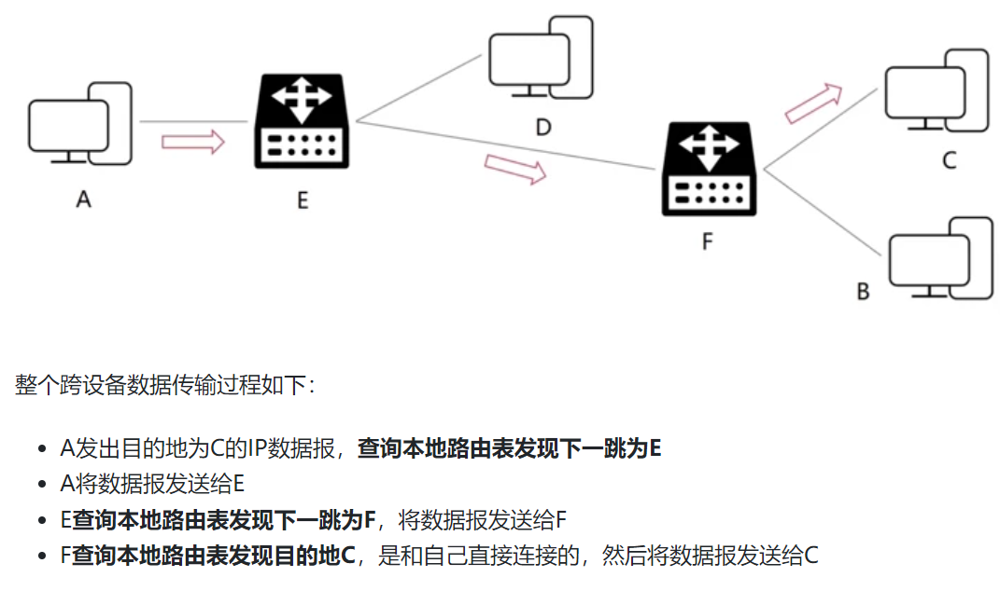

- [计算机网络](#计算机网络)
  - [TCP/IP五层协议](#tcpip五层协议)
  - [OSI七层协议](#osi七层协议)
  - [物理层有什么作用](#物理层有什么作用)
  - [数据链路层有什么作用](#数据链路层有什么作用)
  - [网络层有什么作用](#网络层有什么作用)
  - [传输层有什么作用](#传输层有什么作用)
  - [会话层有什么作用](#会话层有什么作用)
  - [表示层有什么作用](#表示层有什么作用)
  - [应用层有什么作用](#应用层有什么作用)
- [TCP](#tcp)
  - [TCP与UDP区别](#tcp与udp区别)
  - [为何TCP可靠](#为何tcp可靠)
  - [为何UDP不可靠](#为何udp不可靠)
  - [TCP报文头部结构](#tcp报文头部结构)
  - [TCP三次握手过程](#tcp三次握手过程)
  - [为什么TCP握手需要三次，两次行不行？](#为什么tcp握手需要三次两次行不行)
  - [**TCP四次挥手过程**](#tcp四次挥手过程)
  - [**为什么TCP握手三次，挥手需要4次**](#为什么tcp握手三次挥手需要4次)
  - [**为什么四次挥手释放连接时需要等待2MSL**](#为什么四次挥手释放连接时需要等待2msl)
  - [TCP粘包现象](#tcp粘包现象)
  - [TCP协议的滑动窗口：实现流量控制](#tcp协议的滑动窗口实现流量控制)
  - [TCP协议的拥塞控制](#tcp协议的拥塞控制)
  - [快重传](#快重传)
  - [初始序列号](#初始序列号)
  - [半连接队列](#半连接队列)
  - [SYN攻击](#syn攻击)
  - [**DNS协议**](#dns协议)
  - [**DNS解析过程**](#dns解析过程)
  - [**简述DNS劫持**](#简述dns劫持)
- [HTTP](#http)
  - [**HTTP协议**](#http协议)
  - [**HTTP方法（告知服务器意图）**](#http方法告知服务器意图)
  - [HTTP连接管理](#http连接管理)
  - [**cookie**](#cookie)
  - [**session**](#session)
  - [**http状态码和对应的信息**](#http状态码和对应的信息)
  - [转发和重定向的区别](#转发和重定向的区别)
  - [https的连接过程](#https的连接过程)
  - [REST API](#rest-api)
  - [Get与Post区别](#get与post区别)
  - [**Put与Delete区别**](#put与delete区别)
  - [Get方法参数有大小限制吗](#get方法参数有大小限制吗)
  - [浏览器中输入一个网址后，具体发生了什么](#浏览器中输入一个网址后具体发生了什么)
  - [**http请求包含了什么**](#http请求包含了什么)
  - [简述TLS/SSL, HTTP, HTTPS的关系](#简述tlsssl-http-https的关系)
  - [SSL](#ssl)
  - [http1.0](#http10)
  - [简述http1.1的改进](#简述http11的改进)
  - [HTTP短连接与长连接区别](#http短连接与长连接区别)
  - [简述http2.0的改进](#简述http20的改进)
  - [http2.0（基于SPDY实现）](#http20基于spdy实现)
  - [http2.0的缺陷](#http20的缺陷)
  - [http3.0（QUIC协议）](#http30quic协议)
  - [http与https的区别](#http与https的区别)
  - 
  - 
# 计算机网络

## TCP/IP五层协议 

TCP/IP五层协议包括：物理层，数据链路层，网络层，运输层，应用层

## OSI七层协议

## 物理层有什么作用 

主要解决两台物理机之间的通信，通过二进制比特流的传输来实现，二进制数据表现为电流电压上的强弱，到达目的地再转化为二进制机器码。网卡、集线器工作在这一层。 

## 数据链路层有什么作用 

在不可靠的物理介质上提供可靠的传输，接收来自物理层的位流形式的数据，并封装成帧，传送到上一层；同样，也将来自上层的数据帧，拆装为位流形式的数据转发到物理层。这一层在物理层提供的比特流的基础上，通过差错控制、流量控制方法，使有差错的物理线路变为无差错的数据链路。提供物理地址寻址功能。交换机工作在这一层。 

相关协议：

CSMA协议：发送帧之前监听信道是否空闲，信道空闲后再发送。

CSMA/CD协议：发送帧之前监听信道是否空闲，并在发送时保持监听是否有其他信道发送，若产生碰撞则停止发送。

## 网络层有什么作用

将网络地址翻译成对应的物理地址，并决定如何将数据从发送方路由到接收方，通过路由选择算法为分组通过通信子网选择最佳路径。路由器工作在这一层。 

**ARP协议**：只知道目标的IP地址，在封装成帧时需要知道目标的MAC地址，此时就需要使用ARP协议。 

通过发送一个叫做ARP请求的数据包(ARP数据包也是被包含在以太网帧中的，发送时，帧头部中的目的MAC地址填写为0xffffffff，表示在本地局域网上广播，这样该局域网的所有机器接收到这个广播帧的时候都会向协议栈递交这个帧中的数据包)，而仅当某台机器的IP地址与该ARP请求中的要询问的IP地址相同时，那台机器就才会向发送方返回一个ARP回应数据包，这个回应包中就包含了先前要询问的机器的IP地址 + MAC地址，本地主机接收到这个回应的ARP数据包后，会提取ip地址和mac地址，并记录到ARP表中。

**IP协议**：负责封装IP数据包，并进行寻址转发。**不可靠**。

## 传输层有什么作用 

传输层提供了进程间的逻辑通信，传输层向高层用户屏蔽了下面网络层的核心细节，使应用程序看起来像是在两个传输层实体之间有一条端到端的逻辑通信信道。 

TCP协议、UDP协议

## 会话层有什么作用 

建立会话：身份验证，权限鉴定等； 

保持会话：对该会话进行维护，在会话维持期间两者可以随时使用这条会话传输局； 

断开会话：当应用程序或应用层规定的超时时间到期后，OSI会话层才会释放这条会话。 

## 表示层有什么作用 

对数据格式进行编译，对收到或发出的数据根据应用层的特征进行处理，如处理为文字、图片、音频、视频、文档等，还可以对压缩文件进行解压缩、对加密文件进行解密等。 

## 应用层有什么作用 

提供应用层协议，如HTTP协议，FTP协议等等，方便应用程序之间进行通信。 

# TCP

## TCP与UDP区别

TCP作为面向流的协议，提供可靠的、面向连接的运输服务，并且提供点对点通信

UDP作为面向报文的协议，不提供可靠交付，并且不需要连接，不仅仅对点对点，也支持多播和广播。

## 为何TCP可靠 

TCP有三次握手建立连接，四次挥手关闭连接的机制。 

除此之外还有滑动窗口和拥塞控制算法。最最关键的是还保留超时重传的机制。 

对于每份报文也存在校验，保证每份报文可靠性。 

## 为何UDP不可靠

UDP面向数据报无连接的，数据报发出去，就不保留数据备份了。 

仅仅在IP数据报头部加入校验和复用。 

UDP没有服务器和客户端的概念。 

UDP报文过长的话是交给IP切成小段，如果某段报废报文就废了。 

## TCP报文头部结构

## TCP三次握手过程 

\1. 第一次握手：客户端发送 SYN 报文，并进入 SYN_SENT 状态，等待服务器的确认； 

\2. 第二次握手：服务器收到 SYN 报文，需要给客户端发送 ACK 确认报文，同时服务器也要向客户端发送一个 SYN 报文，所以也就是向客户端发送 SYN + ACK 报文，此时服务器进入 SYN_RCVD 状态；

\3. 第三次握手：客户端收到 SYN + ACK 报文，向服务器发送确认包，客户端进入 ESTABLISHED 状态。待服务器收到客户端发送的 ACK 包也会进入 ESTABLISHED 状态，完成三次握手。（**注意：第三次握手可以携带数据**）

## 为什么TCP握手需要三次，两次行不行？ 

不行。TCP进行可靠传输的关键就在于维护一个序列号，三次握手的过程即是通信双方相互告知序列号起始值，并确认对方已经收到了序列号起始值。如果只是两次握手， 至多只有客户端的起始序列号能被确认， 服务器端的序列号则得不到确认。 

1. TCP 建立连接之前，需要确认客户端与服务器双方的收包和发包的能力。第一次握手：服务端确认客户端的发送能力和自身的接受能力。第二次握手：客户端确认自身的收发能力和客户端的收发能力，但客户端仍不知到客户端的接收能力是否正常。第三次握手：服务端确认客户端的收发能力。
2. 客户端由于某些原因发出了两个SNY请求连接数据包，服务端若以与新的请求建立连接并收到第三次握手时客户端发来的ACK确认，再收到旧包时就不会再浪费资源进行处理。

## **TCP四次挥手过程** 

\1. 第一次挥手。客户端发起 FIN 包（FIN = 1）,客户端进入 FIN_WAIT_1 状态。TCP 规定，即使 FIN 包不携带数据，也要消耗一个序号。 

\2. 第二次挥手。服务器端收到 FIN 包，发出确认包 ACK（ack = u + 1），并带上自己的序号 seq=v，服务器端进入了 CLOSE_WAIT 状态。这个时候客户端已经没有数据要发送了，不过服务器端有数据发送的话，客户端依然需要接收。客户端接收到服务器端发送的 ACK 后，进入了 FIN_WAIT_2 状态。 

\3. 第三次挥手。服务器端数据发送完毕后，向客户端发送 FIN 包（seq=w ack=u+1），半连接状态下服务器可能又发送了一些数据，假设发送 seq 为 w。服务器此时进入了 LAST_ACK 状态。 

\4. 第四次挥手。客户端收到服务器的 FIN 包后，发出确认包（ACK=1，ack=w+1），此时客户端就进入了 TIME_WAIT 状态。注意此时 TCP 连接还没有释放，必须经过 2*MSL 后，才进入 CLOSED 状态。而服务器端收到客户端的确认包 ACK 后就进入了 CLOSED 状态，可以看出服务器端结束 TCP 连接的时间要比客户端早一些。 

## **为什么TCP握手三次，挥手需要4次** 

在 TCP 握手的时候，服务端发送 SYN+ACK 的包是将一个 ACK 和一个 SYN 合并到一个包中，所以减少了一次包的发送，三次完成握手。

挥手时，当服务端收到客户端的 FIN 数据包后，服务端可能还有数据没发完，不会立即close。所以服务端会先将 ACK 发过去告诉客户端我收到你的断开请求了，但请再给我一点时间，这段时间用来发送剩下的数据报文，发完之后再将 FIN 包发给客户端表示现在可以断了。之后客户端需要收到 FIN包后发送 ACK 确认断开信息给服务端。 

## **为什么四次挥手释放连接时需要等待2MSL** 

1. MSL 指的是报文在网络中最大生存时间。在客户端发送对服务器端的 FIN 的确认包 ACK 后，这个 ACK 包是有可能不可达的，服务器端如果收不到 ACK 的话需要重新发送 FIN 包。所以客户端发送 ACK 后需要留出 2MSL 时间（ACK 到达服务器 + 服务器发送 FIN 重传包，一来一回）等待确认服务器端确实收到了 ACK 包。也就是说客户端如果等待 2MSL 时间也没有收到服务器端的重传包 FIN，说明可以确认服务器已经收到客户端发送的 ACK。
2. 在客户端发送完最后一个 ACK 报文段后，在经过 2MSL 时间，就可以使本连接持续的时间内所产生的所有报文都从网络中消失，使下一个新的连接中不会出现这种旧的连接请求报文。有些路由器会缓存 IP 数据包，如果连接重用了，那么这些延迟收到的包就有可能会跟新连接混在一起。

## TCP粘包现象 

1. **什么是粘包**？TCP粘包就是指发送方发送的若干包数据到达接收方时粘成了一包，从接收缓冲区来看，后一包数据的头紧接着前一包数据的尾。
2. **造成粘包的原因**？① **发送方**：将多次间隔较小、数据量较小的数据，合并成一个数据量大的数据块，然后进行封包。② **接收方**：TCP接收到数据包时，并不会马上交到应用层进行处理，或者说应用层并不会立即处理。实际上，TCP将接收到的数据包保存在接收缓存里，然后应用程序主动从缓存读取收到的分组。这样一来，如果TCP接收数据包到缓存的速度大于应用程序从缓存中读取数据包的速度，多个包就会被缓存，应用程序就有可能读取到多个首尾相接粘到一起的包。
3. **什么时候需要处理粘包？**如果发送方发送的多组数据本来就是同一块数据的不同部分，比如说一个文件被分成多个部分发送，这时当然不需要处理粘包现象。如果多个分组毫不相干，甚至是并列关系，那么这个时候就一定要处理粘包现象了。
4. **如何处理粘包？**① **发送方**：关闭这种优化算法。② **接收方**：接收方无法处理，需要上层协议处理。③ **应用层**：可以1、将数据固定格式，加入开始符和结束符。2、发送数据时将数据的长度一并发送。
5. **UDP会产生粘包吗?**  UDP则是面向消息传输的，是有保护消息边界的，接收方一次只接受一条独立的信息，所以不存在粘包问题。

## TCP协议的滑动窗口：实现流量控制

滑动窗口是传输层进行流量控制的一种措施，接收方通过通告发送方自己的窗口大小，从而控制发送方的发送速度，防止发送方发送速度过快而导致自己被淹没。 

如果没有滑动窗口，则服务端每次发送一个数据包后都需等待接收客户端的ACK包才能发送下一个数据包，通信效率很低。滑动窗口即无需等待确认应答即可继续发送数据的最大值。

1. 如果确认应答丢失：即使有少部分ACK包丢失也不一定会使服务端重发，服务端可以通过下一个ACK确认应答来进行确认。（即ACK中ack=3001时，表明此前服务端发送的报文都已收到。）

如果服务端报文丢失：

## TCP协议的拥塞控制 

拥塞控制是防止过多的包被发送到网络中，避免出现网络负载过大，网络拥塞的情况。

**慢开始**(slow-start)

**拥塞避免**(congestion avoidance)

**快重传**(fast retransmit)

**快恢复**(fast recovery)

在TCP开始传输数据或检测到重传超时导致丢包时，执行**慢启动**策略：初始的cwnd（拥塞窗口）为1MSS，每次收到一个ACK就会使cwnd加一，通过这种方式cwnd将会呈指数增加。

当发生超时重传时，ssthresh（慢开始门限）将被设为原有cwnd的一半，当慢启动的cwnd增长到等于ssthresh时，需要执行**拥塞避免**： 每次收到ACK时，cwnd小幅增长（例如1/10MSS），呈现出线性增长趋势。

当收到连续3个重复的ACK报文（即快重传）时，执行**快速恢复**算法： ssthresh设为之前cwnd的一半，而cwnd也为原来的一半（部分实现是ssthresh+3MSS）而非从1开始，之后进入拥塞避免阶段。

## 快重传 

如果在超时重传定时器溢出之前，接收到连续的三个重复冗余ACK，发送端便知晓哪个报文段在传输过程中丢失了，于是重发该报文段，不需要等待超时重传定时器溢出再发送该报文。 

## 初始序列号

TCP 发送方的字节数据编号的原点，告诉对方我要开始发送数据的初始化序列号（ISN）。初始序列号如果是固定的，攻击者很容易猜出后续的确认序号，为了安全起见，避免被第三方猜到从而发送伪造的 RST 报文，因此 ISN 是动态生成的。

## 半连接队列 

TCP握手中，当服务器处于SYN_RCVD 状态，服务器会把此种状态下请求连接放在一个队列里，该队列称为半连接队列。 

## SYN攻击 

SYN攻击即利用TCP协议缺陷，通过发送大量的半连接请求，占用半连接队列，耗费CPU和内存资源。 

优化方式： 

1. 缩短SYN Timeout时间 2. 记录IP，若连续受到某个IP的重复SYN报文，从这个IP地址来的包会被一概丢弃。 

## **DNS协议** 

DNS协议是基于UDP的应用层协议，它的功能是根据用户输入的域名，解析出该域名对应的IP地址，从而给客户端进行访问。 

## **DNS解析过程** 

1. 客户机发出查询请求，在本地计算机缓存查找，若没有找到，就会将请求发送给dns服务器；
2. 本地dns服务器会在自己的区域里面查找，找到即根据此记录进行解析，若没有找到，就会在本地的缓存里面查找；
3. 本地服务器没有找到客户机查询的信息，就会将此请求发送到根域名dns服务器；
4. 根域名服务器解析客户机请求的根域部分，它把包含的下一级的dns服务器的地址返回到客户机的dns服务器地址； 
5. 客户机的dns服务器根据返回的信息接着访问下一级的dns服务器； 
6. 这样递归的方法一级一级接近查询的目标，最后在有目标域名的服务器上面得到相应的IP信息； 
7. 客户机的本地的dns服务器会将查询结果返回给我们的客户机； 
8. 客户机根据得到的ip信息访问目标主机，完成解析过程。

## **简述DNS劫持** 

DNS是指将网页域名翻译为对应的IP的一种方法。DNS劫持指攻击者篡改结果，使用户对域名的解析IP变成了另一个IP。

# HTTP

## **HTTP协议** 

http协议是超文本传输协议。它是基于TCP协议的应用层传输协议，即客户端和服务端进行数据传输的一种规则。该协议本身HTTP 是一种无状态的协议。 

## **HTTP方法（告知服务器意图）**

http1.0: GET  POST  HEAD  PUT  DELETE  

http1.1: GET  POST  HEAD  PUT  DELETE  OPTIONS  TRACE  CONNECT 

HEAD方法：用于获取HTTP报文首部，不返回报文实体部分。用于确认URL的有效性以及资源更新时间。

GET方法：用于获取资源。

POST方法：用于传输实体。

OPTIONS方法：用于查询服务器支持的方法

CONNECT方法：要求在与代理服务器通信时建立隧道。使用 SSL（Secure Sockets Layer，安全套接层）和 TLS（Transport Layer Security，传输层安全）协议把通信内容加密后经网络隧道传输。

**GET与POST方法的区别**：GET 和 POST 的请求都能使用额外的参数，但是 **GET 的参数是以查询字符串出现在 URL 中，而 POST 的参数存储在实体主体中**。GET请求参数会被完整保留在浏览器历史记录里，而POST中的参数不会被保留。此外，GET方法只产生一个TCP包，将HTTP头和数据一起发送。POST方法会产生2个TCP包，浏览器先发送HTTP头，收到服务器响应后再发送数据。

## HTTP连接管理

HTTP中的长连接短连接指HTTP底层TCP的连接。 

**短连接**： 客户端与服务器进行一次HTTP连接操作，就进行一次TCP连接，连接结束TCP关闭连接。 

**长连接**：只需要建立一次 TCP 连接就能进行多次 HTTP 通信。（使用浏览器请求一个包含多张图片的HTML页面时，除了请求访问的 HTML 页面资源，还会请求图片资源。如果每进行一次 HTTP 通信就要新建一个 TCP 连接，那么开销会很大。）

如果HTTP头部带有参数**keep-alive**，即开启长连接网页完成打开后，底层用于传输数据的TCP 连接不会直接关闭，会根据服务器设置的保持时间保持连接，保持时间过后连接关闭。

从 HTTP/1.1 开始默认是长连接的，如果要断开连接，使用 Connection : close；

在 HTTP/1.1 之前默认是短连接的，如果需要使用长连接，则使用 Connection : Keep-Alive。

**管道**：默认情况下，HTTP 请求是按顺序发出的，下一个请求只有在当前请求收到响应之后才会被发出。由于受到网络延迟和带宽的限制，在下一个请求被发送到服务器之前，可能需要等待很长时间。流水线是在同一条长连接上连续发出请求，而不用等待响应返回，这样可以减少延迟。

## **cookie** 

HTTP 协议本身是无状态的，为了使其能处理更加复杂的逻辑，HTTP/1.1 引入 Cookie 来保存状态信息。 

Cookie技术通过在请求和响应报文中写入Cookie信息来控制客户端的状态。Cookie会根据从服务端发送的响应报文内的Set-Cookie的首部字段信息，通知客户端保存Cookie。当下次客户端再往该服务器发送请求时，会在请求报文中加入Cookie值后发送出去。

Cookie是由服务端产生的，再发送给客户端保存，当客户端再次访问的时候，服务器可根据cookie辨识客户端是哪个，以此可以做个性化推送，免账号密码登录等等。 

## **session** 

session用于标记特定客户端信息，存在在服务器的一个文件里。 

一般客户端带Cookie对服务器进行访问，可通过cookie中的session id从整个session中查询到服务器记录的关于客户端的信息。 

session被用于记录一个用户在网站上的一些行为、一些状态，可以理解为一个上下文，这些内容被**存储在服务器**中，往往通过Cookie进行实现：session的运行基于sessionID，服务端在收到客户端的请求报文后，将sessionID存在cookie中发给客户端，客户端在后续的请求报文头部都加上sessionID，服务端通过这种方式识别客户端。

## **http状态码和对应的信息** 

1XX：接收的信息正在处理 

2XX：请求正常处理完毕3XX：重定向 

4XX：客户端错误 

5XX：服务端错误 

常见错误码： 

301：永久重定向 

302：临时重定向 

304：资源没修改，用之前缓存就行 

400：客户端请求的报文有错误 

403：表示服务器禁止访问资源 

404：表示请求的资源在服务器上不存在或未找到 

## 转发和重定向的区别 

转发是服务器行为,客户端只请求一次。客户浏览器发送http请求 -> web服务器接受此请求->调用内部的一个方法在容器内部完成请求处理和转发动作->将目标资源发送给客户；在这里，转发的路径必须是同一个web容器下的url，其不能转向到其他的web路径上去，中间传递的是自己的容器内的request。 

重定向是客户浏览器发送http请求-> web服务器接受后发送302状态码响应及对应新的location给客户浏览器->客户浏览器发现是302响应，则自动再发送一个新的http请求，请求url是新的location地址->服务器根据此请求寻找资源并发送给客户。 

## https的连接过程 

\1. 浏览器将支持的加密算法信息发给服务器 

\2. 服务器选择一套浏览器支持的加密算法，以证书的形式回发给浏览器 

\3. 客户端(SSL/TLS)解析证书验证证书合法性，生成对称加密的密钥，我们将该密钥称之为client key，即客户端密钥，用服务器的公钥对客户端密钥进行非对称加密。 

\4. 客户端会发起HTTPS中的第二个HTTP请求，将加密之后的客户端对称密钥发送给服务器 

\5. 服务器接收到客户端发来的密文之后，会用自己的私钥对其进行非对称解密，解密之后的明文就是 客户端密钥，然后用客户端密钥对数据进行对称加密，这样数据就变成了密文。 

\6. 服务器将加密后的密文发送给客户端；

\7. 客户端收到服务器发送来的密文，用客户端密钥对其进行对称解密，得到服务器发送的数据。这样HTTPS中的第二个HTTP请求结束，整个HTTPS传输完成。

## REST API

REST API全称为表述性状态转移（Representational State Transfer，REST）即利用HTTP中get、post、put、delete以及其他的HTTP方法构成REST中数据资源的增删改查操作： 

Create ： POST 

Read ： GET 

Update ： PUT/PATCH 

Delete： DELETE 

## Get与Post区别 

Get：指定资源请求数据，刷新无害，Get请求的数据会附加到URL中，传输数据的大小受到url的限制。 

Post：向指定资源提交要被处理的数据。刷新会使数据会被重复提交。post在发送数据前会先将请求头发送给服务器进行确认，然后才真正发送数据。 

## **Put与Delete区别** 

Put规定默认为更新某一资源，和Post一样，一般该操作会对服务器资源进行改变 

Delete规定默认为删除某一资源，和Post一样，一般该操作会对服务器资源进行改变 

## Get方法参数有大小限制吗 

一般HTTP协议里并不限制参数大小限制。但一般由于get请求是直接附加到地址栏里面的，由于浏览器地址栏有长度限制，因此使GET请求在浏览器实现层面上看会有长度限制。 

## 浏览器中输入一个网址后，具体发生了什么

1. 首先，在浏览器地址栏中输入url，先解析url，检测url地址是否合法；
2. 浏览器先查看浏览器缓存系统缓存-路由器缓存，如果缓存中有，会直接在屏幕中显示页面内容。若没有，则跳到第三步操作。

- 浏览器缓存:浏览器会记录DNS一段时间，因此，只是第一个地方解析DNS请求;
- 操作系统缓存:如果在浏览器缓存中不包含这个记录，则会使系统调用操作系统，获取操作系统的记录(保存最近的DNS查询缓存)
- 路由器缓存:如果上述两个步骤均不能成功获取DNS记录，继续搜索路由器缓存；
- ISP缓存:若上述均失败，继续向ISP搜索。

1. 在发送http请求前，需要域名解析(DNS解析)，解析获取相应的IP地址；
2. 浏览器向服务器发起tcp连接，与浏览器建立tcp三次握手；
3. 握手成功后，浏览器向服务器发送http请求，请求数据包；
4. 服务器处理收到的请求，将数据返回至浏览器；
5. 浏览器收到HTTP响应；
6. 浏览器解码响应，如果响应可以缓存，则存入缓存；
7. 浏览器发送请求获取嵌入在HTML中的资源(html，css，javascript，图片，音乐……)，对于未知类型，会弹出对话框；
8. 浏览器发送异步请求；
9. 页面全部渲染结束。

## **http请求包含了什么** 

包含：请求方法字段、URL字段、HTTP协议版本 

产生请求的浏览器类型，请求数据，主机地址。

## 简述TLS/SSL, HTTP, HTTPS的关系 

SSL全称为Secure Sockets Layer即安全套接层，其继任为TLSTransport Layer Security传输层安全协议，均用于在传输层为数据通讯提供安全支持。 

可以将HTTPS协议简单理解为HTTP协议＋TLS/SSL 

## SSL

SSL全称为Secure Sockets Layer即安全套接层，其继任为TLSTransport Layer Security传输层安全协议，均用于在传输层为数据通讯提供安全支持。 

**公开密钥和私有密钥**：公开密钥可以让任何人获取，私有密钥仅能自己知道。具体实现：发送密文的一方使用对方公开密钥加密的信息发送给接收方，接收方收到后使用自己的私有密钥进行解密，提取出其中的信息。（这种方式存在一定的漏洞，无法证明获取到的公开密钥就是货真价实的密钥，有可能在传输过程中被替换了。因此存在第三方机构进行CA认证）。

**共享密钥**：加密和解密使用同一个密钥的方式成为共享密钥。

SSL采取混合加密机制：先使用公开密钥和私有密钥使通信双方获得共享密钥，再使用共享密钥进行通信。

## http1.0 

1.无法复用连接：每一个请求都是一个单独的连接，做不到连接的复用 。每次请求都需要新建立一个TCP连接。

2.队头阻塞：规定了请求头和请求尾，响应头和响应尾（get post）。下一次请求需要等待上一次请求的响应到达后才能发出，若一个请求的响应一直无法到达，则会导致后续请求都被阻塞。 

## 简述http1.1的改进 

1. **长连接**：HTTP/1.1增加了一个Connection字段，通过设置Keep-alive（默认已设置）可以保持连接不断开，避免了每次客户端与服务器请求都要重复建立释放TCP连接，提高了网络的利用率。如果客户端想关闭HTTP连接，可以在请求头中携带Connection:false来告知服务器关闭请求。
2. **支持请求管道化**（pipelining）。基于HTTP/1.1的长连接，使得请求管线化成为可能。一个请求无需等到收到上一个请求的响应时才能发出，客户端能一次发送多个请求。需要注意的是，服务器必须按照客户端请求的先后顺序依次回送相应的结果，以保证客户端能够区分出每次请求的响应内容，也就是说，不允许同时存在两个并行的响应。**虽然HTTP/1.1支持管道化，但是服务器也必须进行逐个响应的送回，这个是很大的一个缺陷。实际上，现阶段的浏览器厂商采取了另外一种做法，它允许我们打开多个TCP的会话来实现并行。**
3. 服务端无法主动push 

## HTTP短连接与长连接区别

HTTP中的长连接短连接指HTTP底层TCP的连接。 

短连接： 客户端与服务器进行一次HTTP连接操作，就进行一次TCP连接，连接结束TCP关闭连接。 

长连接：如果HTTP头部带有参数keep-alive，即开启长连接网页完成打开后，底层用于传输数据的TCP 连接不会直接关闭，会根据服务器设置的保持时间保持连接，保持时间过后连接关闭。 

## 简述http2.0的改进 

提出多路复用。多路复用前，文件时串行传输的，请求a文件，b文件只能等待，并且连接数过多。引入多路复用，a文件b文件可以同时传输。 

引入了二进制数据帧。其中帧对数据进行顺序标识，有了序列id，服务器就可以进行并行传输数据。 

## http2.0（基于SPDY实现）

HTTP1.1虽然支持了长连接和管道，但因为服务器必须按顺序发送响应客户端才能正确解析，导致浏览器只有建立多个TCP连接（通常是6个）才能实现真正的并行，消耗了很多资源。

HTTP2.0的目标：回到单个TCP连接，解决队头阻塞。

HTTP2.0 将请求和响应数据分割为更小的帧，并且它们采用二进制编码。HTTP2.0在每个块前面放置一个所谓的数据帧（DATA frame）。这些数据帧主要包含两个关键的元数据。第一：下面的块属于哪个资源。每个资源的“字节流（bytestream）”都被分配了一个唯一的数字，即流id（stream id）。第二：块的大小是多少。协议还有许多其他帧类型，例如头部帧（HEADERS frame），这样甚至可以将头（headers）从它们的实际响应数据中分离出来。

因此，通过“framing”单个消息，HTTP/2 比 HTTP/1.1 更加灵活。它允许在单个 TCP 连接上通过交错排列块来多路传输多个资源。它还解决了第一个资源缓慢时的队头阻塞问题：而不必等待查询数据库生成的index.html，服务器可以在等待index.html时开始发送其他资源。

## http2.0的缺陷

由于TCP队头阻塞的存在，http2.0在使用多路复用时的效率可能不一定高于6个TCP并行连接的http1.1。具体原因如下：

如果 TCP 数据包2在网络中丢失，但数据包1和数据包3已经到达，会发生什么情况？请记住，TCP只知道它需要按顺序传递数据。因此，它知道数据包1的内容可以安全使用，并将这些内容传递给浏览器。然而，它发现数据包1中的字节和数据包3中的字节（放数据包2 的地方）之间存在间隙，因此还不能将数据包3传递给浏览器。TCP 将数据包3保存在其接收缓冲区（receive buffer）中，直到它接收到数据包2的重传副本（这至少需要往返服务器一次），之后它可以按照正确的顺序将这两个数据包都传递给浏览器。换个说法：丢失的数据包2 队头阻塞了数据包3。

https://zhuanlan.zhihu.com/p/330300133

## http3.0（QUIC协议）

由于TCP队头阻塞，提出了基于UDP的http3.0协议。

与 HTTP/2 的数据帧（DATA frames）非常相似，QUIC 的流帧（STREAM frames）分别跟踪每个流的字节范围。像以前一样，让我们考虑一下如果 QUIC 数据包2丢失，而 1 和 3 到达会发生什么。与 TCP 类似，数据包1中流1（stream 1）的数据可以直接传递到浏览器。然而，对于数据包3，QUIC 可以比 TCP 更聪明。它查看流1的字节范围，发现这个流帧（STREAM frame）完全遵循流id 1的第一个流帧 STREAM frame（字节 450 跟在字节 449 之后，因此数据中没有字节间隙）。它可以立即将这些数据提供给浏览器进行处理。然而，对于流id 2，QUIC确实看到了一个缺口（它还没有接收到字节0-299，这些字节在丢失的 QUIC 数据包2中）。它将保存该流帧（STREAM frame），直到 QUIC 数据包2的重传（retransmission）到达。

但在实际应用中，QUIC是否真的能加速网络传输呢？

QUIC在传输大小差异很大的两个数据包时具有优势：12121211111111111，这样能使得2尽早交付到上层，但也存在如下情况：

## http与https的区别 

https = http +SSL

http所有传输的内容都是明文，并且客户端和服务器端都无法验证对方的身份。 

https具有安全性的ssl加密传输协议，加密采用对称加密， 

https协议需要到ca申请证书，一般免费证书很少，需要交费。

## 

## 