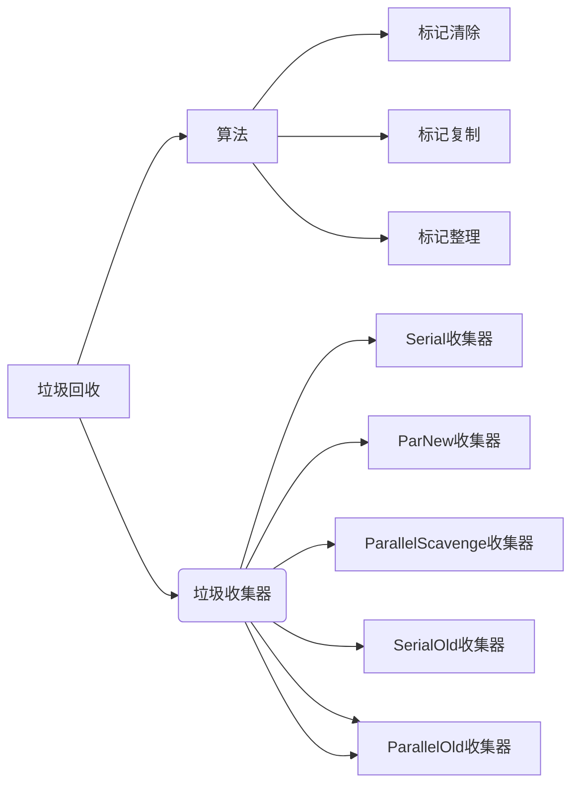
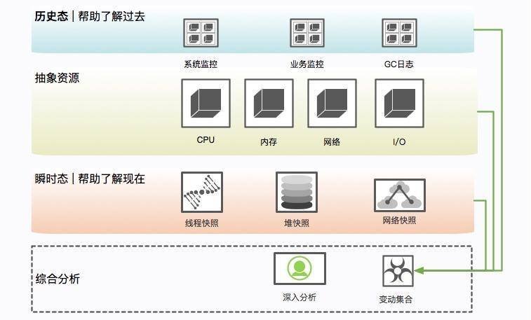
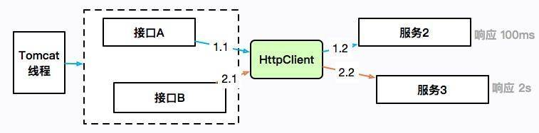

# 类加载

## Java 类的加载流程是怎样的？
类的加载方式：
- 动态加载：从外存储器中加载类，一般类加载机制分析的也是动态加载
- 静态加载：从内存中创建类的实例对象，此时类已经被加载到内存中
	类加载的生命周期：
	加载（Loading）
	在硬盘上查找并通过IO读入.class字节码文件（使用到类时才会加载，例如调用类的main()方法，new对象等等），在加载阶段会在堆内存中生成一个代表这个类的java.lang.Class对象，作为方法区这个类的各种数据的访问入口。
	验证（Verification）
	校验加载进来的`.class`文件中的内容是否符合规范，是否正确。
	准备（Preparation）
	正式给类的静态变量分配内存，并赋予默认值，这些内存都在方法区中进行分配，变量仅包括类标量不包括实例变量。
	解析（Resolution）
	将常量池中的符号引用替换为直接引用的过程。
	初始化（Initialization）
	类加载中核心，执行类构造器()方法，对类的静态变量初始化为指定的值，执行静态代码块
	使用（Using）
	初始化完就可以开始使用这个对象
	卸载（Unloading）
	将方法区中无用的类回收，而类需要同时满足下面3个条件才算无用的类：
		-   该类所有的实例都已经被回收，也就是Java堆中不存在该类的任何实例。
		-   加载该类的ClassLoader已经被回收。
		-   该类对应的`java.lang.Class`对象没有在任何地方被引用，无法在任何地方通过反射访问该类的方法。
## 什么是双亲委派机制？
Java内置三个加载器：
- 引导类加载器（爷）：这个加载器的底层是通过c++代码实现的，它主要的功能是用来加载java核心类库，像是java.lang之类的。
- 扩展类加载器（爹）：该加载器主要是通过Java代码实现了，可以通过idea来进行相关代码的追踪。该加载器的功能是加载JRE中lib目录下的ext扩展目录的相关类库的。
- 应用程序加载器（我）：该加载器和扩展类加载器一样，底层都是通过Java代码实现的。它主要负责加载用户自定义的放在类路径（classPath）下的类。
Java的**双亲委派机制**就是通过以上三个类之间的互相调用来实现的（加载器其实就是一个类）。
双亲委派机制就是子类（应用程序加载器）查询自己所管理的加载区域内有没有加载过需要加载的类，没有的话就要父类（扩展类加载器）去查，然后父类（扩展类加载器）没有找到的话，再让祖父类（引导类加载器）去查找。然后祖父类（引导类加载器）如果没有在加载区域找到的话就会去对应的类路径下查找具体类文件进行加载。如果祖父类（引导类加载器）所管理的类路径下没有找到，就会安排父类（扩展类加载器）去它锁管理的类路径下去找，仍然没有找到的话，就让子类（应用程序加载器）去自己管理的类路径下去寻找，如果还是没有找到就报异常了。
优点
-   沙箱安全机制：双亲委派机制保证了Java核心类库中的核心内不会被用户自定义的类所取代，可以防止核心API被随意串改。
-   避免类被重复加载：当父类加载了需要加载的类之后，子类就不会再去加载了，保证了被加载类的唯一性。

## 什么是指令序列重排序？


## JVM 内存是如何对应到操作系统内存的？

## 简述JVM类加载过程加载:
1. 通过全类名获取类的二进制字节流.  
2. 将类的静态存储结构转化为方法区的运行时数据结构。
3. 在内存中生成类的Class对象，作为方法区数据的入口。 验证:对文件格式，元数据，字节码，符号引用等验证正确性。 准备:在方法区内为类变量分配内存并设置为0值。 解析:将符号引用转化为直接引用。 初始化:执行类构造器clinit方法，真正初始化。

## 类加载器
BootstrapClassLoader启动类加载器:加载/lib下的jar包和类。C++编写。 
ExtensionClassLoader扩展类加载器: /lib/ext目录下的jar包和类。java编写。 
AppClassLoader应用类加载器，加载当前classPath下的jar包和类。java编写。

## 双亲委派机制
一个类加载器收到类加载请求之后，首先判断当前类是否被加载过。已经被加载的类会直接返回，如果没有被加载，首先将类加载请求转发给父类加载器，一直转发到启动类加载器，只有当父类加载器无法完成时才尝试自己加载。
加载类顺序:BootstrapClassLoader->ExtensionClassLoader->AppClassLoader->CustomClassLoader 检查类是否加载顺序: CustomClassLoader->AppClassLoader->ExtensionClassLoader->BootstrapClassLoader

## 双亲委派机制的优点
1. 避免类的重复加载。相同的类被不同的类加载器加载会产生不同的类，双亲委派保证了java程序的 稳定运行。
2. 保证核心API不被修改。 

## 如何破坏双亲委派机制
重载loadClass()方法，即自定义类加载器。 

## 如何构建自定义类加载器
1. 新建自定义类继承自java.lang.ClassLoader 
2. 重写findClass、loadClass、defineClass方法


# JVM内存模型/内存区域  

## 运行时数据区域


**线程私有的：**

- 程序计数器
- 虚拟机栈
- 本地方法栈

**线程共享的：**
- 堆
- 方法区
- 直接内存 (非运行时数据区的一部分)

## 程序计数器
程序计数器表示当前线程所执行的字节码的行号指示器。 

主要有两个作用：

- 字节码解释器通过改变程序计数器来依次读取指令，从而实现代码的流程控制，如：顺序执行、选择、循环、异常处理。
- 在多线程的情况下，程序计数器用于记录当前线程执行的位置，从而当线程被切换回来的时候能够知道该线程上次运行到哪儿了。

程序计数器不会产生StackOverflowError和OutOfMemoryError。

## 虚拟机栈
Java的方法调用都是靠栈调用的。虚拟机栈为虚拟机执行 Java 方法 （也就是字节码）服务。
栈中元素用于支持虚拟机进行方法调用，每个方法在执行时都会创建一个栈帧存储方法的局部变量表、操作栈、动态链接和返回地址等信息，线程结束后栈空间被回收。
虚拟机栈会产生两类异常: 

- StackOverflowError: 线程请求的栈深度大于虚拟机允许的深度抛出。 

- OutOfMemoryError: 如果 JVM 栈容量可以动态扩展，虚拟机栈占用内存超出抛出。

## 本地方法栈
本地方法栈与虚拟机栈作用相似，不同的是虚拟机栈为虚拟机执行 Java 方法服务，**本地方法栈为本地方法服务**。可以将虚拟机栈看作普通的java函数对应的内存模型，**本地方法栈看作由native关键词修饰的函数对应的内存模型**。
本地方法栈会产生两类异常: 

- StackOverflowError:线程请求的栈深度大于虚拟机允许的深度抛出。
-  OutOfMemoryError:如果 JVM 栈容量可以动态扩展，虚拟机栈占用内存超出抛出。

## 堆
堆主要作用是**存放对象实例**，Java 里几乎所有对象实例都在堆分配内存。Java里平时说的内存管理、垃圾回收主要就是针对堆这一区域进行。 Java 堆可以细分为：新生代和老年代。

可通过 -Xms 和 -Xmx 设置堆的最小和最大容量。
堆会抛出 OutOfMemoryError异常（最常见）。 

## 方法区
方法区用于存储被虚拟机加载的类信息、常量、静态变量等数据。
方法区的实现是依靠元空间（JDK1.8）代替永久代：原因是整个永久代有一个 JVM 本身设置的固定大小上限，无法进行调整，而元空间使用的是直接内存，受本机可用内存的限制，虽然元空间仍旧可能溢出，但是比原来出现的几率会更小。
方法区会抛出 OutOfMemoryError异常。 

`-XX：MaxMetaspaceSize` 标志设置最大元空间大小

`-XX：MetaspaceSize` 调整标志定义元空间的初始大小

## 运行时常量池
运行时常量池存放常量池表，用于**存放**编译器生成的各种**字面量与符号引用**。

字面量是源代码中的固定值的表示法，即通过字面我们就能知道其值的含义。字面量包括整数、浮点数和字符串字面量。

符号引用包括类符号引用、字段符号引用、方法符号引用和接口方法符号引用。

JDK8之前，放在方法区，大小受限于方法区。JDK8将**运行时常量池存放堆**中。 

## 字符串常量池

**字符串常量池** 是 JVM 为了提升性能和减少内存消耗针对字符串（String 类）专门开辟的一块区域，主要目的是为了避免字符串的重复创建。

HotSpot 虚拟机中字符串常量池的实现本质上就是一个`HashSet<String>` ,容量为 `StringTableSize`（可以通过 `-XX:StringTableSize` 参数来设置）。**保存的是字符串对象的引用，字符串对象的引用指向堆中的字符串对象。**

Java 程序中通常会有大量的被创建的字符串等待回收，将字符串常量池放到堆中，能够更高效及时地回收字符串内存。

## 直接内存

直接内存也称为堆外内存，就是把内存对象分配在JVM堆外的内存区域。这部分内存不是虚拟机管理， 而是由操作系统来管理。  
Java通过通过DriectByteBuffer对其进行操作，避免了在 Java 堆和 Native堆来回复制数据。


## 简述java创建对象的过程

1.  检查该指令的参数能否在常量池中定位到一个类的符号引用，并检查引用代表的类是否已被加载、 解析和初始化，如果没有就先执行类加载。    
2.  通过检查通过后虚拟机将为新生对象分配内存。
3.  完成内存分配后虚拟机将成员变量设为零值
4.  设置对象头，包括哈希码、GC 信息、锁信息、对象所属类的类元信息等。
5.  执行 init 方法，初始化成员变量，执行实例化代码块，调用类的构造方法，并把堆内对象的首地址
    赋值给引用变量。

## 简述JVM给对象分配内存的策略
1.  指针碰撞: 这种方式在内存中放一个指针作为分界指示器将使用过的内存放在一边，空闲的放在另 一边，通过指针挪动完成分配。
2.  空闲列表: 对于 Java 堆内存不规整的情况，虚拟机必须维护一个列表记录哪些内存可用，在分配 时从列表中找到一块足够大的空间划分给对象并更新列表记录。    

## java对象内存分配是如何保证线程安全的
1.  对分配内存空间采用CAS机制，配合失败重试的方式保证更新操作的原子性。该方式效率低。
2.  每个线程在Java堆中预先分配一小块内存，然后再给对象分配内存的时候，直接在自己这块"私有"内存中分配。一般采用这种策略。

## 简述对象的内存布局
对象在堆内存的存储布局可分为对象头、实例数据和对齐填充。
对象头主要包含两部分数据: MarkWord、类型指针。MarkWord 用于存储哈希码(HashCode)、GC 分代年龄、锁状态标志位、线程持有的锁、偏向线程ID等信息。 类型指针即对象指向他的类元数据指针，如果对象是一个 Java 数组，会有一块用于记录数组长度的数据，
实例数据存储代码中所定义的各种类型的字段信息。
对齐填充起占位作用。HotSpot 虚拟机要求对象的起始地址必须是8的整数倍，因此需要对齐填充。 

## 常见内存分配策略
大多数情况下对象在新生代 Eden 区分配，当 Eden 没有足够空间时将发起一次 Minor GC。 大对象需要大量连续内存空间，直接进入老年代区分配。
如果经历过第一次 Minor GC 仍然存活且能被 Survivor 容纳，该对象就会被移动到 Survivor 中并将年龄 设置为 1，并且每熬过一次 Minor GC 年龄就加 1 ，当增加到一定程度(默认15)就会被晋升到老年 代。
如果在 Survivor 中相同年龄所有对象大小的总和大于 Survivor 的一半，年龄不小于该年龄的对象就可 以直接进入老年代。
空间分配担保。MinorGC 前虚拟机必须检查老年代最大可用连续空间是否大于新生代对象总空间，如果 满足则说明这次 Minor GC 确定安全。如果不，JVM会查看HandlePromotionFailure 参数是否允许担保 失败，如果允许会继续检查老年代最大可用连续空间是否大于历次晋升老年代对象的平均大小，如果满 足将Minor GC，否则改成一次 FullGC。


# JVM垃圾回收



## 如何判断对象是否是垃圾

**引用计数法**:设置引用计数器，对象被引用计数器加 1，引用失效时计数器减 1，如果计数器为 0 则被 标记为垃圾。会存在对象间循环引用的问题，一般不使用这种方法。

**可达性分析**:通过 GC Roots 的根对象作为起始节点，从这些节点开始，根据引用关系向下搜索，如果 某个对象没有被搜到，则会被标记为垃圾。可作为 GC Roots 的对象包括虚拟机栈和本地方法栈中引用 的对象、类静态属性引用的对象、常量引用的对象。

## java的引用类型  
**强引用**: 被强引用关联的对象不会被回收。一般采用 new 方法创建强引用。
**软引用**:被软引用关联的对象只有在内存不够的情况下才会被回收。一般采用 SoftReference 类来创建 软引用。
**弱引用**:垃圾收集器碰到即回收，也就是说它只能存活到下一次垃圾回收发生之前。一般采用 WeakReference 类来创建弱引用。
**虚引用**: 无法通过该引用获取对象。唯一目的就是为了能在对象被回收时收到一个系统通知。虚引用必 须与引用队列联合使用。

## 垃圾回收算法
### 标记清除算法
标记清除算法:先标记需清除的对象，之后统一回收。这种方法效率不高，会产生大量不连续的碎片。
### 标记整理算法
标记整理算法:先标记存活对象，然后让所有存活对象向一端移动，之后清理端边界以外的内存
### 标记复制算法
标记复制算法:将可用内存按容量划分为大小相等的两块，每次只使用其中一块。当使用的这块空间用
完了，就将存活对象复制到另一块，再把已使用过的内存空间一次清理掉。
### 分代收集算法
根据对象存活周期将内存划分为几块，不同块采用适当的收集算法。
一般将堆分为新生代和老年代，对这两块采用不同的算法。
新生代使用:标记复制算法
老年代使用:标记清除或者标记整理算法

## 垃圾收集器
### Serial垃圾收集器 
单线程串行收集器。垃圾回收的时候，必须暂停其他所有线程。新生代使用标记复制算法，老年代使用标记整理算法。简单高效。

### ParNew垃圾收集器 
可以看作Serial垃圾收集器的多线程版本，新生代使用标记复制算法，老年代使用标记整理算法。

### Parallel Scavenge垃圾收集器 
注重吞吐量，即cpu运行代码时间 / cpu耗时总时间(cpu运行代码时间+ 垃圾回收时间)。
新生代使用标记复制算法，老年代使用标记整理算法。

### CMS垃圾收集器
注重最短时间停顿。CMS垃圾收集器为最早提出的并发收集器，垃圾收集线程与用户线程同时工作。采 用标记清除算法。该收集器分为初始标记、并发标记、并发预清理、并发清除、并发重置这么几个步 骤。
初始标记:暂停其他线程(stop the world)，标记与GC roots直接关联的对象。并发标记:可达性分析过 程(程序不会停顿)。
并发预清理:查找执行并发标记阶段从年轻代晋升到老年代的对象，重新标记，暂停虚拟机(stop the world)扫描CMS堆中剩余对象。
并发清除:清理垃圾对象，(程序不会停顿)。 并发重置，重置CMS收集器的数据结构。

### G1垃圾收集器
和之前收集器不同，该垃圾收集器把堆划分成多个大小相等的独立区域(Region)，新生代和老年代不 再物理隔离。通过引入 Region 的概念，从而将原来的一整块内存空间划分成多个的小空间，使得每个 小空间可以单独进行垃圾回收。
初始标记:标记与GC roots直接关联的对象。 并发标记:可达性分析。
最终标记，对并发标记过程中，用户线程修改的对象再次标记一下。
筛选回收:对各个Region的回收价值和成本进行排序，然后根据用户所期望的GC停顿时间制定回收计 划并回收。

### Minor GC  
Minor GC指发生在新生代的垃圾收集，因为 Java 对象大多存活时间短，所以 Minor GC 非常频繁，一般回收速度也比较快。

### Full GC  
Full GC 是清理整个堆空间—包括年轻代和永久代。调用System.gc(),老年代空间不足，空间分配担保失败，永生代空间不足会产生full gc。 


# JVM参数和调优

## JVM常见调优参数
-Xms 初始堆大小  
-Xmx 最大堆大小  
-XX:NewSize 年轻代大小 
-XX:MaxNewSize 年轻代最大值 
-XX:PermSize 永生代初始值 
-XX:MaxPermSize 永生代最大值 
-XX:NewRatio 新生代与老年代的比例

## 调用system.gc()一定会发生垃圾收集吗?为什么? 
调用System.gc()的时候，其实并不会马上进行垃圾回收,只会把这次gc请求记录下来。
需配合System.runFinalization()才会进行真正回收

## 静态变量存储位置
在1.8以前，静态成员变量存在方法区，在1.8后，由于JDK8取消永生代，静态变量存储到了堆中。


### 线上故障排查

#### 1、硬件故障排查

如果一个实例发生了问题，根据情况选择，要不要着急去重启。如果出现的CPU、内存飙高或者日志里出现了OOM异常

**第一步是隔离**，第二步是**保留现场**，第三步才是**问题排查**。

**隔离**

就是把你的这台机器从请求列表里摘除，比如把 nginx 相关的权重设成零。

**现场保留**

**瞬时态和历史态**



查看比如 CPU、系统内存等，通过历史状态可以体现一个趋势性问题，而这些信息的获取一般依靠监控系统的协作。           

**保留信息**

（1）**系统当前网络连接**

```
ss -antp > $DUMP_DIR/ss.dump 2>&1
```


使用 ss 命令而不是 netstat 的原因，是因为 netstat 在网络连接非常多的情况下，执行非常缓慢。

后续的处理，可通过查看各种网络连接状态的梳理，来排查 TIME_WAIT 或者 CLOSE_WAIT，或者其他连接过高的问题，非常有用。

（2）**网络状态统计**

```java
netstat -s > $DUMP_DIR/netstat-s.dump 2>&1
```


它能够按照各个协议进行统计输出，对把握当时整个网络状态，有非常大的作用。

```java
sar -n DEV 1 2 > $DUMP_DIR/sar-traffic.dump 2>&1
```


在一些速度非常高的模块上，比如 Redis、Kafka，就经常发生跑满网卡的情况。表现形式就是网络通信非常缓慢。

（3）**进程资源**

```java
lsof -p $PID > $DUMP_DIR/lsof-$PID.dump
```


通过查看进程，能看到打开了哪些文件，可以以进程的维度来查看整个资源的使用情况，包括每条网络连接、每个打开的文件句柄。同时，也可以很容易的看到连接到了哪些服务器、使用了哪些资源。这个命令在资源非常多的情况下，输出稍慢，请耐心等待。

（4）**CPU 资源**

```
mpstat > $DUMP_DIR/mpstat.dump 2>&1
vmstat 1 3 > $DUMP_DIR/vmstat.dump 2>&1
sar -p ALL  > $DUMP_DIR/sar-cpu.dump  2>&1
uptime > $DUMP_DIR/uptime.dump 2>&1
```

主要用于输出当前系统的 CPU 和负载，便于事后排查。

（5）**I/O 资源**

```java
iostat -x > $DUMP_DIR/iostat.dump 2>&1
```


一般，以计算为主的服务节点，I/O 资源会比较正常，但有时也会发生问题，比如**日志输出过多，或者磁盘问题**等。此命令可以输出每块磁盘的基本性能信息，用来排查 I/O 问题。在第 8 课时介绍的 GC 日志分磁盘问题，就可以使用这个命令去发现。

（6）**内存问题**

```java
free -h > $DUMP_DIR/free.dump 2>&1
```


free 命令能够大体展现操作系统的内存概况，这是故障排查中一个非常重要的点，比如 SWAP 影响了 GC，SLAB 区挤占了 JVM 的内存。

（7）**其他全局**

```java
ps -ef > $DUMP_DIR/ps.dump 2>&1
dmesg > $DUMP_DIR/dmesg.dump 2>&1
sysctl -a > $DUMP_DIR/sysctl.dump 2>&1
```


dmesg 是许多静悄悄死掉的服务留下的最后一点线索。当然，ps 作为执行频率最高的一个命令，由于内核的配置参数，会对系统和 JVM 产生影响，所以我们也输出了一份。

（8）**进程快照**，最后的遗言（jinfo）

```java
${JDK_BIN}jinfo $PID > $DUMP_DIR/jinfo.dump 2>&1
```


此命令将输出 Java 的基本进程信息，包括**环境变量和参数配置**，可以查看是否因为一些错误的配置造成了 JVM 问题。

**（9）dump 堆信息**

```java
${JDK_BIN}jstat -gcutil $PID > $DUMP_DIR/jstat-gcutil.dump 2>&1
${JDK_BIN}jstat -gccapacity $PID > $DUMP_DIR/jstat-gccapacity.dump 2>&1
```


jstat 将输出当前的 gc 信息。一般，基本能大体看出一个端倪，如果不能，可将借助 jmap 来进行分析。

**（10）堆信息**

```java
${JDK_BIN}jmap $PID > $DUMP_DIR/jmap.dump 2>&1
${JDK_BIN}jmap -heap $PID > $DUMP_DIR/jmap-heap.dump 2>&1
${JDK_BIN}jmap -histo $PID > $DUMP_DIR/jmap-histo.dump 2>&1
${JDK_BIN}jmap -dump:format=b,file=$DUMP_DIR/heap.bin $PID > /dev/null  2>&1
```


jmap 将会得到当前 Java 进程的 dump 信息。如上所示，其实最有用的就是第 4 个命令，但是前面三个能够让你初步对系统概况进行大体判断。因为，第 4 个命令产生的文件，一般都非常的大。而且，需要下载下来，导入 MAT 这样的工具进行深入分析，才能获取结果。这是分析内存泄漏一个必经的过程。

**（11）JVM 执行栈**

```java
${JDK_BIN}jstack $PID > $DUMP_DIR/jstack.dump 2>&1
```


jstack 将会获取当时的执行栈。一般会多次取值，我们这里取一次即可。这些信息非常有用，能够还原 Java 进程中的线程情况。

```java
top -Hp $PID -b -n 1 -c >  $DUMP_DIR/top-$PID.dump 2>&1
```


为了能够得到更加精细的信息，我们使用 top 命令，来获取进程中所有线程的 CPU 信息，这样，就可以看到资源到底耗费在什么地方了。

**（12）高级替补**

```java
kill -3 $PID
```


有时候，jstack 并不能够运行，有很多原因，比如 Java 进程几乎不响应了等之类的情况。我们会尝试向进程发送 kill -3 信号，这个信号将会打印 jstack 的 trace 信息到日志文件中，是 jstack 的一个替补方案。

```java
gcore -o $DUMP_DIR/core $PID
```


对于 jmap 无法执行的问题，也有替补，那就是 GDB 组件中的 gcore，将会生成一个 core 文件。我们可以使用如下的命令去生成 dump：

```java
${JDK_BIN}jhsdb jmap --exe ${JDK}java  --core $DUMP_DIR/core --binaryheap
```

3. **内存泄漏的现象**

稍微提一下 jmap 命令，它在 9 版本里被干掉了，取而代之的是 jhsdb，你可以像下面的命令一样使用。

```java
jhsdb jmap  --heap --pid  37340
jhsdb jmap  --pid  37288
jhsdb jmap  --histo --pid  37340
jhsdb jmap  --binaryheap --pid  37340
```

一般内存溢出，表现形式就是 Old 区的占用持续上升，即使经过了多轮 GC 也没有明显改善。比如ThreadLocal里面的GC Roots，内存泄漏的根本就是，这些对象并没有切断和 GC Roots 的关系，可通过一些工具，能够看到它们的联系。


#### 2、报表异常 | JVM调优

有一个报表系统，频繁发生内存溢出，在高峰期间使用时，还会频繁的发生拒绝服务，由于大多数使用者是管理员角色，所以很快就反馈到研发这里。

业务场景是由于有些结果集的字段不是太全，因此需要对结果集合进行循环，并通过 HttpClient 调用其他服务的接口进行数据填充。使用 Guava 做了 JVM 内缓存，但是响应时间依然很长。

初步排查，JVM 的资源太少。接口 A 每次进行报表计算时，都要涉及几百兆的内存，而且在内存里驻留很长时间，有些计算又非常耗 CPU，特别的“吃”资源。而我们分配给 JVM 的内存只有 3 GB，在多人访问这些接口的时候，内存就不够用了，进而发生了 OOM。在这种情况下，没办法，只有升级机器。把机器配置升级到 4C8G，给 JVM 分配 6GB 的内存，这样 OOM 问题就消失了。但随之而来的是频繁的 GC 问题和超长的 GC 时间，平均 GC 时间竟然有 5 秒多。

进一步，由于报表系统和高并发系统不太一样，它的对象，存活时长大得多，并不能仅仅通过增加年轻代来解决；而且，如果增加了年轻代，那么必然减少了老年代的大小，由于 CMS 的碎片和浮动垃圾问题，我们可用的空间就更少了。虽然服务能够满足目前的需求，但还有一些不太确定的风险。

第一，了解到程序中有很多缓存数据和静态统计数据，为了减少 MinorGC 的次数，通过分析 GC 日志打印的对象年龄分布，把 MaxTenuringThreshold 参数调整到了 3（特殊场景特殊的配置）。这个参数是让年轻代的这些对象，赶紧回到老年代去，不要老呆在年轻代里。

第二，我们的 GC 时间比较长，就一块开了参数 CMSScavengeBeforeRemark，使得在 CMS remark 前，先执行一次 Minor GC 将新生代清掉。同时配合上个参数，其效果还是比较好的，一方面，对象很快晋升到了老年代，另一方面，年轻代的对象在这种情况下是有限的，在整个 MajorGC 中占的时间也有限。

第三，由于缓存的使用，有大量的弱引用，拿一次长达 10 秒的 GC 来说。我们发现在 GC 日志里，处理 weak refs 的时间较长，达到了 4.5 秒。这里可以加入参数 ParallelRefProcEnabled 来并行处理Reference，以加快处理速度，缩短耗时。

优化之后，效果不错，但并不是特别明显。经过评估，针对高峰时期的情况进行调研，我们决定再次提升机器性能，改用 8core16g 的机器。但是，这带来另外一个问题。

**高性能的机器带来了非常大的服务吞吐量**，通过 jstat 进行监控，能够看到年轻代的分配速率明显提高，但随之而来的 MinorGC 时长却变的不可控，有时候会超过 1 秒。累积的请求造成了更加严重的后果。

这是由于堆空间明显加大造成的回收时间加长。为了获取较小的停顿时间，我们在堆上**改用了 G1 垃圾回收器**，把它的目标设定在 200ms。G1 是一款非常优秀的垃圾收集器，不仅适合堆内存大的应用，同时也简化了调优的工作。通过主要的参数初始和最大堆空间、以及最大容忍的 GC 暂停目标，就能得到不错的性能。修改之后，虽然 GC 更加频繁了一些，但是停顿时间都比较小，应用的运行较为平滑。

到目前为止，也只是勉强顶住了已有的业务，但是，这时候领导层面又发力，**要求报表系统可以支持未来两年业务10到100倍的增长**，并保持其可用性，但是这个“千疮百孔”的报表系统，稍微一压测，就宕机，那如何应对十倍百倍的压力呢 ? 硬件即使可以做到动态扩容，但是毕竟也有极限。

使用 MAT 分析堆快照，发现很多地方可以通过代码优化，那些占用内存特别多的对象：

1、select * 全量排查，只允许获取必须的数据

2、报表系统中cache实际的命中率并不高，将Guava 的 Cache 引用级别改成弱引用（WeakKeys）

3、限制报表导入文件大小，同时拆分用户超大范围查询导出请求。

每一步操作都使得JVM使用变得更加可用，一系列优化以后，机器相同压测数据性能提升了数倍。


#### 3、大屏异常 | JUC调优

有些数据需要使用 HttpClient 来获取进行补全。提供数据的服务提供商有的响应时间可能会很长，也有可能会造成服务整体的阻塞。



接口 A 通过 HttpClient 访问服务 2，响应 100ms 后返回；接口 B 访问服务 3，耗时 2 秒。HttpClient 本身是有一个最大连接数限制的，如果服务 3 迟迟不返回，就会造成 HttpClient 的连接数达到上限，**概括来讲，就是同一服务，由于一个耗时非常长的接口，进而引起了整体的服务不可用**

这个时候，通过 jstack 打印栈信息，会发现大多数竟然阻塞在了接口 A 上，而不是耗时更长的接口 B，这个现象起初十分具有迷惑性，不过经过分析后，我们猜想其实是因为接口 A 的速度比较快，在问题发生点进入了更多的请求，它们全部都阻塞住的同时被打印出来了。

为了验证这个问题，我搭建了一个demo 工程，模拟了两个使用同一个 HttpClient 的接口。fast 接口用来访问百度，很快就能返回；slow 接口访问谷歌，由于众所周知的原因，会阻塞直到超时，大约 10 s。 利用ab对两个接口进行压测，同时使用 jstack 工具 dump 堆栈。首先使用 jps 命令找到进程号，然后把结果重定向到文件（可以参考 10271.jstack 文件）。

过滤一下 nio 关键字，可以查看 tomcat 相关的线程，足足有 200 个，这和 Spring Boot 默认的 maxThreads 个数不谋而合。更要命的是，有大多数线程，都处于 BLOCKED 状态，说明线程等待资源超时。通过grep fast | wc -l 分析，确实200个中有150个都是blocked的fast的进程。

问题找到了，解决方式就顺利成章了。

1、fast和slow争抢连接资源，通过线程池限流或者熔断处理

2、有时候slow的线程也不是一直slow，所以就得加入监控

3、使用带countdownLaunch对线程的执行顺序逻辑进行控制


#### **4、接口延迟 | SWAP调优**

有一个关于服务的某个实例，经常发生服务卡顿。由于服务的并发量是比较高的，每多停顿 1 秒钟，几万用户的请求就会感到延迟。

我们统计、类比了此服务其他实例的 CPU、内存、网络、I/O 资源，区别并不是很大，所以一度怀疑是机器硬件的问题。

接下来我们对比了节点的 GC 日志，发现无论是 Minor GC，还是 Major GC，这个节点所花费的时间，都比其他实例长得多。

通过仔细观察，我们发现在 GC 发生的时候，vmstat 的 si、so 飙升的非常严重，这和其他实例有着明显的不同。

使用 free 命令再次确认，发现 SWAP 分区，使用的比例非常高，引起的具体原因是什么呢？

更详细的操作系统内存分布，从 /proc/meminfo 文件中可以看到具体的逻辑内存块大小，有多达 40 项的内存信息，这些信息都可以通过遍历 /proc 目录的一些文件获取。我们注意到 slabtop 命令显示的有一些异常，dentry（目录高速缓冲）占用非常高。

问题最终定位到是由于某个运维工程师删除日志时，定时执行了一句命令：

find / | grep "xxx.log"


他是想找一个叫做 要被删除 的日志文件，看看在哪台服务器上，结果，这些老服务器由于文件太多，扫描后这些文件信息都缓存到了 slab 区上。而服务器开了 swap，操作系统发现物理内存占满后，并没有立即释放 cache，导致每次 GC 都要和硬盘打一次交道。


**解决方式就是关闭 SWAP 分区。**


swap 是很多性能场景的万恶之源，建议禁用。在高并发 SWAP 绝对能让你体验到它魔鬼性的一面：进程倒是死不了了，但 GC 时间长的却让人无法忍受。

#### 5、**内存溢出 | Cache调优**

> 有一次线上遇到故障，重新启动后，使用 jstat 命令，发现 Old 区一直在增长。我使用 jmap 命令，导出了一份线上堆栈，然后使用 MAT 进行分析，通过对 GC Roots 的分析，发现了一个非常大的 HashMap 对象，这个原本是其他同事做缓存用的，但是做了一个无界缓存，没有设置超时时间或者 LRU 策略，在使用上又没有重写key类对象的hashcode和equals方法，对象无法取出也直接造成了堆内存占用一直上升，后来，将这个缓存改成 guava 的 Cache，并设置了弱引用，故障就消失了。
>
> 关于文件处理器的应用，在读取或者写入一些文件之后，由于发生了一些异常，**close 方法又没有放在 finally** 块里面，造成了文件句柄的泄漏。由于文件处理十分频繁，产生了严重的内存泄漏问题。

内存溢出是一个结果，而**内存泄漏**是一个原因。内存溢出的原因有**内存空间不足、配置错误**等因素。一些错误的编程方式，不再被使用的对象、没有被回收、没有及时切断与 GC Roots 的联系，这就是内存泄漏。

举个例子，有团队使用了 HashMap 做缓存，但是并没有设置超时时间或者 LRU 策略，造成了放入 Map 对象的数据越来越多，而产生了内存泄漏。

再来看一个经常发生的内存泄漏的例子，也是由于 HashMap 产生的。代码如下，由于没有重写 Key 类的 hashCode 和 equals 方法，造成了放入 HashMap 的所有对象都无法被取出来，它们和外界失联了。所以下面的代码结果是 null。

```java
//leak example
import java.util.HashMap;
import java.util.Map;
public class HashMapLeakDemo {
    public static class Key {
        String title;
    public Key(String title) {
        this.title = title;
    }
}

public static void main(String[] args) {
    Map<Key, Integer> map = new HashMap<>();
    map.put(new Key("1"), 1);
    map.put(new Key("2"), 2);
    map.put(new Key("3"), 2);
    Integer integer = map.get(new Key("2"));
    System.out.println(integer);
    }
}
```


即使提供了 equals 方法和 hashCode 方法，也要非常小心，尽量避免使用自定义的对象作为 Key。

再看一个例子，关于文件处理器的应用，在读取或者写入一些文件之后，由于发生了一些异常，**close 方法又没有放在 finally** 块里面，造成了文件句柄的泄漏。由于文件处理十分频繁，产生了严重的内存泄漏问题。

#### 6：CPU飙高 | 死循环

我们有个线上应用，单节点在运行一段时间后，CPU 的使用会飙升，一旦飙升，一般怀疑某个业务逻辑的计算量太大，或者是触发了死循环（比如著名的 HashMap 高并发引起的死循环），但排查到最后其实是 GC 的问题。        

（1）使用 top 命令，查找到使用 CPU 最多的某个进程，记录它的 pid。使用 Shift + P 快捷键可以按 CPU 的使用率进行排序。

```java
top
```


（2）再次使用 top 命令，加 -H 参数，查看某个进程中使用 CPU 最多的某个线程，记录线程的 ID。

```java
top -Hp $pid
```


（3）使用 printf 函数，将十进制的 tid 转化成十六进制。

```java
printf %x $tid
```


（4）使用 jstack 命令，查看 Java 进程的线程栈。

```java
jstack $pid >$pid.log
```


（5）使用 less 命令查看生成的文件，并查找刚才转化的十六进制 tid，找到发生问题的线程上下文。

```java
less $pid.log
```


我们在 jstack 日志搜关键字DEAD，以及中找到了 CPU 使用最多的几个线程id。

可以看到问题发生的根源，是我们的堆已经满了，但是又没有发生 OOM，于是 GC 进程就一直在那里回收，回收的效果又非常一般，造成 CPU 升高应用假死。接下来的具体问题排查，就需要把内存 dump 一份下来，使用 MAT 等工具分析具体原因了。

