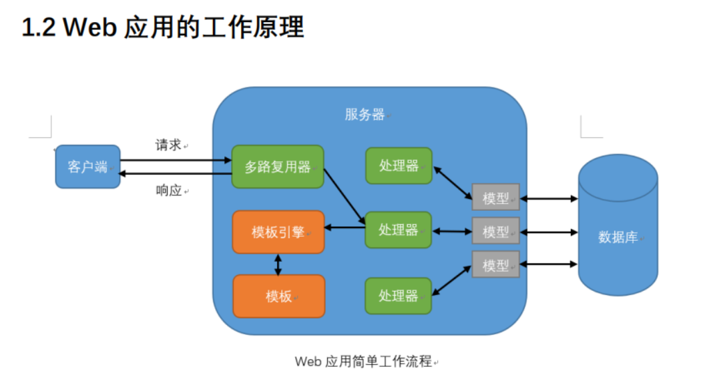
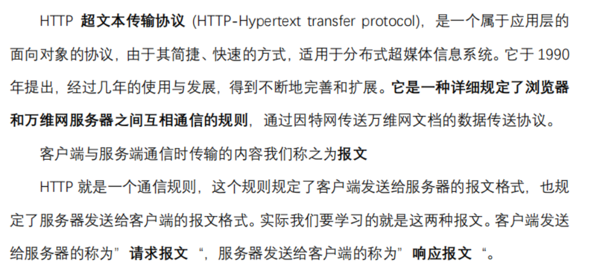
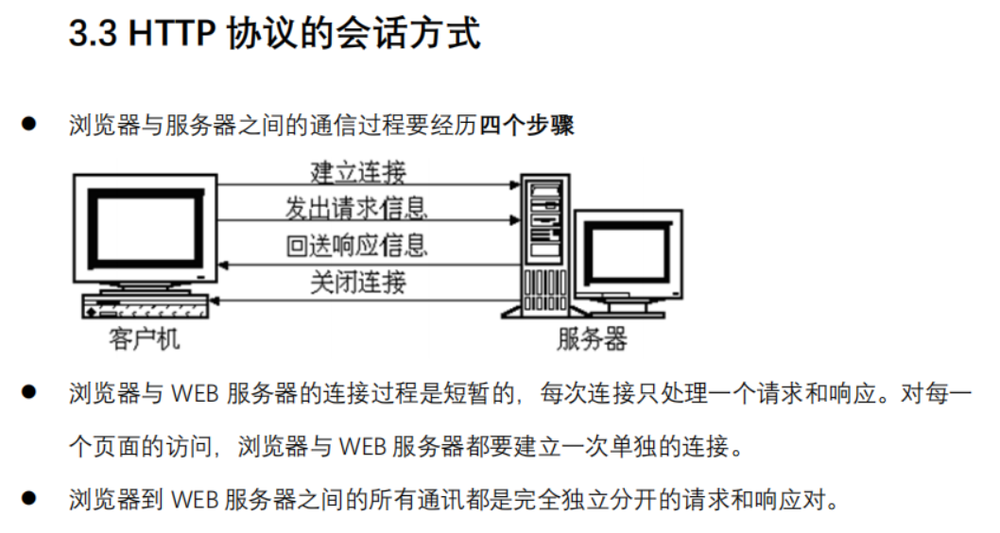
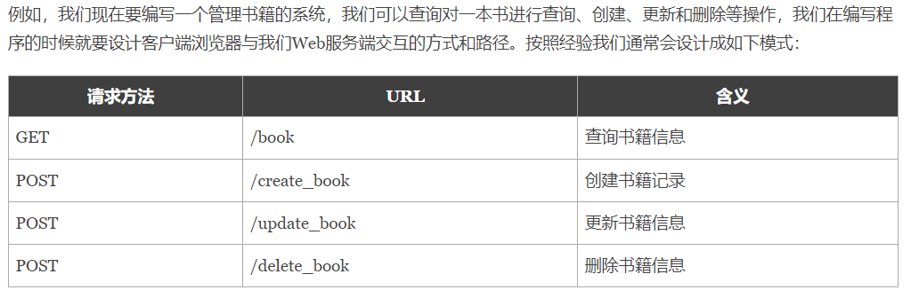
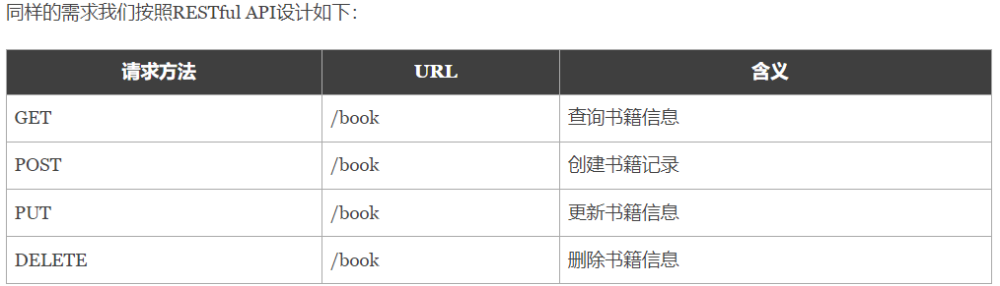
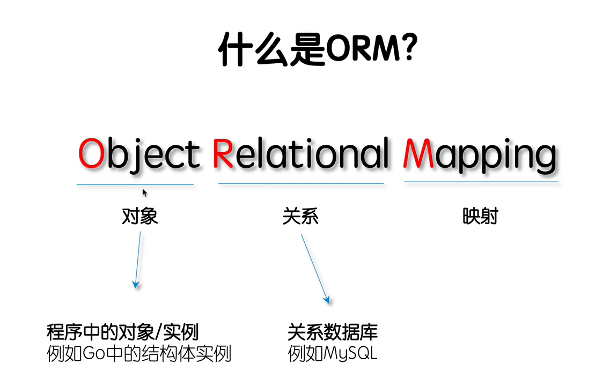

# GoWeb

Import（

“net/http”创建web服务器的标准库

“database/sql”定义对数据库的一系列操作


）



多路复用器：能接收多个输入信号,按每个输入信号可恢复方式合成单个输出信号。


http协议 请求报文 响应报文 



http协议 会话方式




报文：客户端和服务端传的信

# RESTful API

REST与技术无关，代表的是一种软件架构风格，REST是Representational State Transfer的简称，中文翻译为“表征状态转移”或“表现层状态转化”。

简单来说，REST的含义就是客户端与Web服务器之间进行交互的时候，使用HTTP协议中的4个请求方法代表不同的动作。

- GET用来获取资源
- POST用来新建资源
- PUT用来更新资源
- DELETE用来删除资源。

只要API程序遵循了REST风格，那就可以称其为RESTful API。目前在前后端分离的架构中，前后端基本都是通过RESTful API来进行交互。





Gin框架支持开发RESTful API的开发。

# POSTMAN

Postman是google开发的一款功能强大的**网页调试与发送网页HTTP请求**，并能运行测试用例的的Chrome插件。其主要功能包括：

**模拟各种HTTP requests**

从常用的 GET、POST 到 RESTful 的 PUT 、 DELETE …等等。 甚至还可以发送文件、送出额外的 header。

**Collection 功能（测试集合）**

Collection 是 requests的集合，在做完一個测试的時候， 你可以把這次的 request 存到特定的 Collection 里面，如此一來，下次要做同样的测试时，就不需要重新输入。而且一个collection可以包含多条request，如果我们把一个request当成一个test case，那collection就可以看成是一个test suite。通过collection的归类，我们可以良好的分类测试软件所提供的API.而且 Collection 还可以 Import 或是 Share 出來，让团队里面的所有人共享你建立起來的 Collection。

**人性化的Response整理**

一般在用其他工具來测试的時候，response的内容通常都是纯文字的 raw， 但如果是 JSON ，就是塞成一整行的 JSON。这会造成阅读的障碍 ，而 Postman 可以针对response内容的格式自动美化。 JSON、 XML 或是 HTML 都會整理成我们可以阅读的格式

**内置测试脚本语言**

Postman支持编写测试脚本，可以快速的检查request的结果，并返回测试结果

**设定变量与环境**

Postman 可以自由 设定变量与Environment，一般我们在编辑request，校验response的时候，总会需要重复输入某些字符，比如url，postman允许我们设定变量来保存这些值。并且把变量保存在不同的环境中。比如，我們可能会有多种环境， development 、 staging 或 local， 而这几种环境中的 request URL 也各不相同，但我们可以在不同的环境中设定同样的变量，只是变量的值不一样，这样我们就不用修改我们的测试脚本，而测试不同的环境。

# Gin路由

- gin 框架中采用的路由库是基于httprouter做的
- httproter会将所有路由规则构造一颗前缀树

# Gin渲染

## http渲染 template

### Go语言标准库之http/template

html/template包实现了数据驱动的模板，用于生成可防止代码注入的安全的HTML内容。它提供了和text/template包相同的接口，Go语言中输出HTML的场景都应使用html/template这个包。

### 模板与渲染

在一些前后端不分离的Web架构中，我们通常需要在后端将一些数据渲染到HTML文档中，从而实现动态的网页（网页的布局和样式大致一样，但展示的内容并不一样）效果。

我们这里说的模板可以理解为事先定义好的HTML文档文件，模板渲染的作用机制可以简单理解为文本替换操作–使用相应的数据去替换HTML文档中事先准备好的标记。

### Go语言的模板引擎

Go语言内置了文本模板引擎text/template和用于HTML文档的html/template。它们的作用机制可以简单归纳如下：

1. 模板文件通常定义为.tmpl和.tpl为后缀（也可以使用其他的后缀），必须使用UTF8编码。
2. 模板文件中使用{{和}}包裹和标识需要传入的数据。
3. 传给模板这样的数据就可以通过点号（.）来访问，如果数据是复杂类型的数据，可以通过{ { .FieldName }}来访问它的字段。
4. 除{{和}}包裹的内容外，其他内容均不做修改原样输出。

### 模板引擎的使用

Go语言模板引擎的使用可以分为三部分：定义模板文件、解析模板文件和模板渲染.

定义模板文件

其中，定义模板文件时需要我们按照相关语法规则去编写，后文会详细介绍。

解析模板文件

上面定义好了模板文件之后，可以使用下面的常用方法去解析模板文件，得到模板对象：

```go
func (t *Template) Parse(src string) (*Template, error)
func ParseFiles(filenames ...string) (*Template, error)
func ParseGlob(pattern string) (*Template, error)
```

当然，你也可以使用func New(name string) *Template函数创建一个名为name的模板，然后对其调用上面的方法去解析模板字符串或模板文件。

模板渲染

渲染模板简单来说就是使用数据去填充模板，当然实际上可能会复杂很多。

```go
func (t *Template) Execute(wr io.Writer, data interface{}) error
func (t *Template) ExecuteTemplate(wr io.Writer, name string, data interface{}) error
```

# GORM



- **全功能 ORM**
-  **关联 (拥有一个，拥有多个，属于，多对多，多态，单表继承)**
-  **Create，Save，Update，Delete，Find 中钩子方法**
-  **支持 Preload、Joins 的预加载**
-  **事务，嵌套事务，Save Point，Rollback To to Saved Point**
-  **Context、预编译模式、DryRun 模式**
-  **批量插入，FindInBatches，Find/Create with Map，使用 SQL 表达式、Context Valuer 进行 CRUD**
-  **SQL 构建器，Upsert，锁，Optimizer/Index/Comment Hint，命名参数，子查询**
-  **复合主键，索引，约束**
-  **自动迁移**
-  **自定义 Logger**
-  **灵活的可扩展插件 API：Database Resolver（多数据库，读写分离）、Prometheus…**
-  **每个特性都经过了测试的重重考验**
-  **开发者友好**

# 如何定位判断是前端的bug还是后端的bug？

1.通常可以利用抓包工具来进行分析

(1)传参内容是否正确

如果传参内容不正确，定位为前端的bug。

(2)响应内容是否正确

如果响应内容不正确，为后端bug。


2.前后端bug各有什么样的特殊性质

(1)前端bug特性：界面相关，布局相关，兼容性相关，交互相关。

(2)后端bug特性：数据相关，安全性相关，逻辑性相关，性能相关。


3.定位BUG属于前端还是后端，常用的有以下2种方法：

（1）查看http请求参数和响应结果。

（2）查看后端服务log日志有无错误日志信息。

https://blog.csdn.net/qq_38484679/article/details/122811995)