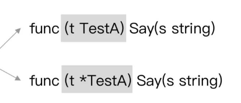
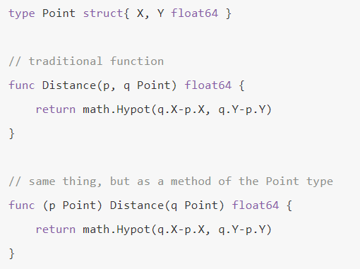

# 接口

## interface的定义与概念

接口（interface）是一种类型，一种抽象的类型。

它不会暴露出它所代表的对象的内部值的结构和这个对象支持的基础操作的集合；它们只会表现出它们自己的方法。也就是说当你有看到一个接口类型的值时，你不知道它是什么，唯一知道的就是可以通过它的方法来做什么。接口做的事情就像是定义一个协议（规则），只要一台机器有洗衣服和甩干的功能，我就称它为洗衣机。不关心属性（数据），只关心行为（方法）。

Go语言提倡面向接口编程。

每个接口由数个方法组成，接口的定义格式如下：

```go
type 接口类型名 interface{
    方法名1( 参数列表1 ) 返回值列表1
    方法名2( 参数列表2 ) 返回值列表2
        …
}
eg：
type writer interface{
    Write([]byte) error
}
//当你看到这个接口类型的值时，你不知道它是什么，
//唯一知道的就是可以通过它的Write方法来做一些事情。
```

## Go interface的原理问题

在 Go 语言中，接口的底层数据结构在运行时一共分为两类结构体（struct），分别是：


- runtime.eface 结构体：表示不包含任何方法的空接口，也称为 empty interface。
- runtime.iface 结构体：表示包含方法的接口。
- 

## 值接收者和指针接收者实现接口的区别



**接口的实现，值类型接收者和指针类型接收者不一样：**

- 以值类型接收者实现接口，类型本身和该类型的指针类型，都实现了该接口；
- 以指针类型接收者实现接口，只有对应的指针类型才被认为实现了接口。

**如果你想使用指针接收者，可以想想是否有以下诉求：**

- 期望接收者直接修改能够直接修改源值。
- 期望在大结构体的情况下，性能更好，可以在理论上避免每次值拷贝，但也会有增加别的开销，需要具体情况具体权衡。

```go
type Mover interface {
	move()
}
type dog struct{}

//值接收者 
func (d dog) move() {
	fmt.Println("狗会动")
}
var wangcai = dog{} // 旺财是dog类型
x = wangcai         // x可以接收dog类型


//指针接收者
func (d *dog) move() {
    fmt.Println("狗会动")
}
x = wangcai         // x不可以接收dog类型
```

## 两个interface 能不能⽐较

- 判断类型是否一样

reflect.TypeOf(a).Kind() == reflect.TypeOf(b).Kind()

- 判断两个interface{}是否相等

reflect.DeepEqual(a, b interface{})

- 将一个interface{}赋值给另一个interface{}

reflect.ValueOf(a).Elem().Set(reflect.ValueOf(b))

## 接⼝是怎么实现的？

## 空接口

空接口 ： 没有定义任何方法的接口。

空接口可以存储任何类型的值

## 类型断言（type assertion）

类型断言是用来从一个接口里面读取数值给一个具体的类型变量。

# 垃圾回收

## Go的垃圾回收机制

垃圾回收本质是一种自动内存管理机制。我们在程序中定义一个变量后，会在内存中开辟相应空间进行存储。当不需要此变量后，需要手动销毁此对象，并释放内存。而这种对不再使用的内存资源进行自动回收的功能即为垃圾回收。Go的垃圾回收机制是一个不断进步的过程。

Go的垃圾回收机制是由最早1.3版本的标记清除法（先停止程序的运行，从根节点（垃圾回收器在标记过程最先检查的对象）出发，标记所有可达目标，再回收未标记目标，但是缺点是在整个GC期间需要将整个程序暂停STW(stop the world)）。

而在1.5版本中，则使用了三色标记法

1）⽩⾊：代表最终需要清理的对象内存块 

2）灰⾊：待处理的内存块 

3）⿊⾊：活跃的内存块

**流程**

1）起初将所有对象都置为⽩⾊

2）扫描出所有的可达（可以搜寻到的）对象，也就是还在使⽤的，不需要清理的对象，标记为灰⾊，放⼊待处 

理队列

3）从队列中提取灰⾊对象，将其引⽤对象标记为灰⾊放⼊队列，将⾃身标记为⿊⾊

4）有专有的锁监视对象内存修改 

5）在完成全部的扫描和标记⼯作之后，剩余的只有⿊⾊和⽩⾊，分别代表活跃对象与回收对象

6）清理所有的⽩⾊对象

这种方法在程序执行的同时进行收集，并不需要暂停整个程序。但是也会有一个缺陷，可能程序中的垃圾产生的速度会大于垃圾收集的速度，这样会导致程序中的垃圾越来越多无法被收集掉。

1.8版本中，取其精华去其糟粕，提出了混合写屏障机制。混合写屏障 = 删除写屏障 + 插入写屏障。

总结：

混合写屏障继承了插入写屏障的优点，起始无需 STW 打快照，直接并发扫描垃圾即可；

混合写屏障继承了删除写屏障的优点，赋值器是黑色赋值器，扫描过一次就不需要扫描了，这样就消除了插入写屏障时期最后 STW 的重新扫描栈；

混合写屏障扫描精度继承了删除写屏障，比插入写屏障更低，随着带来的是 GC 过程全程无 STW；

混合写屏障扫描栈虽然没有 STW，但是扫描某一个具体的栈的时候，还是要停止这个 goroutine 赋值器的工作的哈（针对一个 goroutine 栈来说，是暂停扫的，要么全灰，要么全黑哈，原子状态切换）；

## GC 的触发条件？

**主动触发(手动触发)**，通过调用 runtime.GC 来触发 GC，此调用阻塞式地等待当前 GC 运行完毕。

**被动触发**，分为两种方式：

- 使用系统监控，当超过两分钟没有产生任何 GC 时，强制触发 GC。
- 使用步调（Pacing）算法，其核心思想是控制内存增长的比例,每次内存分配时检查当前内存分配量是否已达到阈值（环境变量 GOGC）：默认 100%，即当内存扩大一倍时启用 GC。

## 内存模型中为什么小对象多了会造成 GC 压力？

通常小对象过多会导致 GC 三色法消耗过多的 CPU。优化思路是，减少对象分配。

# 异常

## go语言触发异常的场景有哪些

- 空指针解析
- 下标越界
- 除数为0
- 调用 panic 函数

## defer

defer函数属延迟执行，延迟到调用者函数执行 return 命令前被执行。多个defer之间按LIFO先进后出顺序执行。

若函数中有多个 defer，其执行顺序为 先进后出，可以理解为栈。

return 会做几件事：

- 给返回值赋值
- 调用 defer 表达式
- 返回给调用函数

若 defer 表达式有返回值，将会被丢弃。

**defer的执行顺序：**多个defer出现的时候，**它是一个“栈”的关系，也就是先进后出**。一个函数中，写在前面的defer会比写在后面的defer调用的晚。

**defer与return谁先谁后 ：return之后的语句先执行，defer后的语句后执行**


## 如何从 panic 中恢复

在一个 defer 延迟执行的函数中调用 recover ，它便能捕捉/中断 panic。

```go
// 错误的 recover 调用示例
func main() {
 recover() // 什么都不会捕捉
 panic("not good") // 发生 panic，主程序退出
 recover() // 不会被执行
 println("ok")
}
 
// 正确的 recover 调用示例
func main() {
 defer func() {
  fmt.Println("recovered: ", recover())
 }()
 panic("not good")
}
```

## Recover捕获异常的时机

recover 必须在 defer 函数中运行。

## 在循环内部执行defer语句会发生啥

defer 在函数退出时才能执行，在 for 执行 defer 会导致资源延迟释放。

```go
func main() {
    for i := 0; i < 5; i++ {
        func() {
            f, err := os.Open("/path/to/file")
            if err != nil {
                log.Fatal(err)
            }
            defer f.Close()
        }()
    }
}
```

# 反射

Go语言提供了一种机制，能够**在运行时更新变量和检查它们的值、调用它们的方法和它们支持的内在操作**，而不需要在编译时就知道这些变量的具体类型。这种机制被称为反射。

反射是由 reflect 包提供的。它定义了两个重要的类型，Type 和 Value。一个 Type 表示一个Go类型。它是一个接口，有许多方法来区分类型以及检查它们的组成部分.

1.获取变量内部信息


2.struct的反射

3.匿名或嵌入字段的反射

4.判断传入的类型是否是我们想要的类型

5.通过反射修改内容

6.通过反射调用方法


# 缓存

go-cache（凯去）put set

# 泛型

泛型的语法: 

**MyType[T1 constraint1 | constraint2, T2 constraint3...] ...** 

MyType可以是函数名, 结构体名, 类型名…

T1, T2…是泛型名, 可以随便取

constraint的意思是约束, 也是泛型中最重要的概念, 接下来会详解constraint

使用 | 可以分隔多个constraint, T满足其中之一即可(如T1可以是constraint1和constraint2中的任何一个)

**Constraint(约束)是什么**

约束的意思是限定范围, constraint的作用就是限定范围, 将T限定在某种范围内

```go
func MyPrintln[T any](a T) {
	fmt.Println(a)
}
func main() {
	MyPrintln(1)
	MyPrintln("小王")
	MyPrintln([]int{3, 2, 1})
    //运行结果:
	//1
	//小王
	//[3 2 1]
}
```

# 函数

## go语言的main函数

main 函数**不能带参数**；main 函数**不能定义返回值**。

main 函数所在的包必须为 main 包；main 函数中可以使用 flag 包来获取和解析命令行参数。

## go语言中局部变量和全局变量的缺省值是什么

全局变量的缺省值是与这个类型相关的零值。

## 函数传参是值类型还是引用类型？

在 Go 语言中只存在值传递，要么是值的副本，要么是指针的副本。无论是值类型的变量还是引用类型的变量亦或是指针类型的变量作为参数传递都会发生值拷贝，开辟新的内存空间。

另外值传递、引用传递和值类型、引用类型是两个不同的概念，不要混淆了。引用类型作为变量传递可以影响到函数外部是因为发生值拷贝后新旧变量指向了相同的内存地址。

## 值接收者和指针接收者的区别？

**方法的接收者:**

- - 值类型，既可以调用值接收者的方法，也可以调用指针接收者的方法；
  - 指针类型，既可以调用指针接收者的方法，也可以调用值接收者的方法。

**但是接口的实现，值类型接收者和指针类型接收者不一样：**

- 以值类型接收者实现接口，类型本身和该类型的指针类型，都实现了该接口；
- 以指针类型接收者实现接口，只有对应的指针类型才被认为实现了接口。

通常我们**使用指针作为方法的接收者**的理由：

- 使用指针方法能够修改接收者指向的值。
- **可以避免在每次调用方法时复制该值，在值的类型为大型结构体时，这样做会更加高效。**

## Golang可变参数

函数方法的参数，**可以是任意多个**，这种我们称之为可以变参数，比如我们常用的fmt.Println()这类函数，可以接收一个可变的参数。

可以变参数，可以是任意多个。我们自己也可以定义可以变参数，可变参数的定义，在类型前加上省略号…即可。

```go
func main() {
 print("1","2","3")
}
func print (a ...interface{}){
 for _,v:=range a{
  fmt.Print(v)
 }
 fmt.Println()
}
```

# 方法

方法声明

在函数声明时，在其名字之前放上一个变量，即是一个方法。这个附加的参数会将该函数附加到这种类型上，即相当于为这种类型定义了一个独占的方法。



附加的参数p，叫做方法的接收器（receiver）。

# 封装

一个对象的变量或者方法如果对调用方是不可见的话，一般就被定义为“封装”。封装有时候也被叫做信息隐藏，同时也是面向对象编程最关键的一个方面。

Go语言只有一种控制可见性的手段：大写首字母的标识符会从定义它们的包中被导出，小写字母的则不会。这种限制包内成员的方式同样适用于struct或者一个类型的方法。