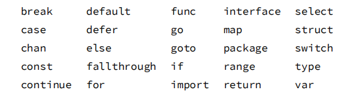
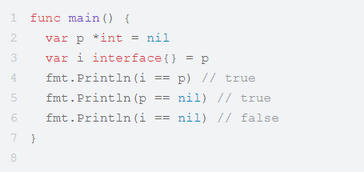
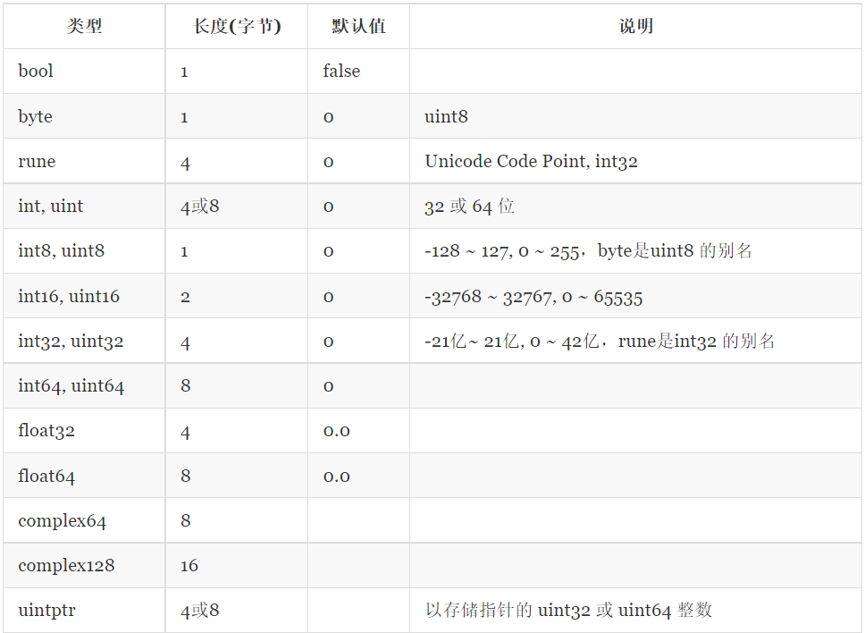
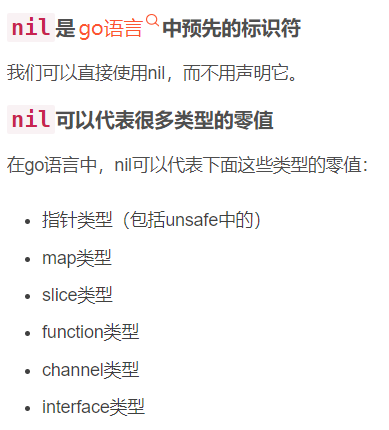
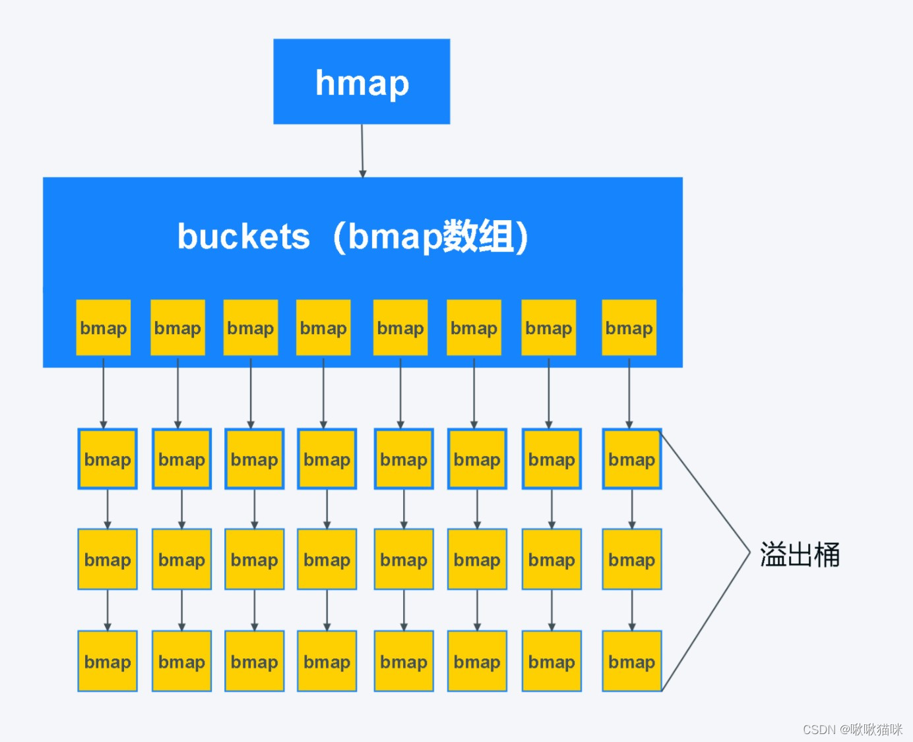
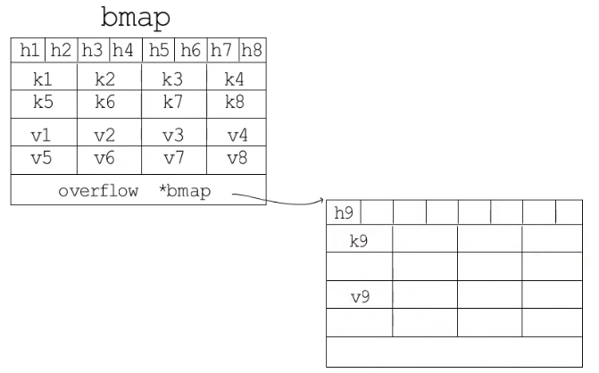

- [基础](#基础)
  - [GO的优点/优越性](#go的优点优越性)
  - [面向对象的三大特性](#面向对象的三大特性)
  - [关键字](#关键字)
  - [两个 Nil 可能不相等吗？](#两个-nil-可能不相等吗)
  - [Go与面向对象问题](#go与面向对象问题)
  - [string 类型的值可以修改吗](#string-类型的值可以修改吗)
  - [哪些类型不支持比较？](#哪些类型不支持比较)
  - [哪些类型的值可以被取地址，哪些不可以被取地址？](#哪些类型的值可以被取地址哪些不可以被取地址)
  - [类型占用字节数](#类型占用字节数)
  - [引用类型](#引用类型)
  - [new 和 make](#new-和-make)
  - [nil是什么](#nil是什么)
- [数组](#数组)
  - [array 类型的值作为函数参数是引⽤传递还是值传递？](#array-类型的值作为函数参数是引传递还是值传递)
- [slice](#slice)
  - [数组和slice的区别](#数组和slice的区别)
  - [零切片、空切⽚、nil切⽚](#零切片空切nil切)
  - [slice深拷⻉和浅拷⻉](#slice深拷和浅拷)
  - [Slice 如何扩容？](#slice-如何扩容)
  - [拷贝大切片一定比小切片代价大吗？](#拷贝大切片一定比小切片代价大吗)
  - [参数传递 切片和切片指针](#参数传递-切片和切片指针)
  - [range遍历切片问题](#range遍历切片问题)
  - [字符串转成byte切片，会发生内存拷贝吗？](#字符串转成byte切片会发生内存拷贝吗)
  - [slice能用“==”判定相等吗？](#slice能用判定相等吗)
- [map](#map)
  - [map 实现原理](#map-实现原理)
  - [map 如何实现顺序读取？](#map-如何实现顺序读取)
  - [map 初始化问题](#map-初始化问题)
  - [map 的扩容机制](#map-的扩容机制)
  - [使⽤range 迭代 map 是有序的吗?](#使range-迭代-map-是有序的吗)
  - [使用值为 nil 的 slice、map会发生啥](#使用值为-nil-的-slicemap会发生啥)
  - [访问 map 中的 key，需要注意啥](#访问-map-中的-key需要注意啥)
  - [slice map 非线性安全问题](#slice-map-非线性安全问题)
  - [如何支持并发读写](#如何支持并发读写)
- [结构体](#结构体)
  - [Struct 能不能比较？](#struct-能不能比较)
  - [结构体嵌入机制和匿名成员](#结构体嵌入机制和匿名成员)
- [JSON格式](#json格式)
  - [JSON 概念](#json-概念)
  - [解析 JSON 数据时，默认将数值当做哪种类型](#解析-json-数据时默认将数值当做哪种类型)
  - [JSON 标准库对 nil slice 和 空 slice 的处理是一致的吗](#json-标准库对-nil-slice-和-空-slice-的处理是一致的吗)
  - [json包里使用的时候，结构体里的变量不加tag能不能正常转成json里的字段？](#json包里使用的时候结构体里的变量不加tag能不能正常转成json里的字段)
- [HTML](#html)
# 基础

## GO的优点/优越性

Go语言是一种**静态编译语言**，但是又具备动态语言开发维护的高效率性，从语法和设计理念比较像**C+python**的结合体。Go有比较多先进的特性，内置了对并发编程的支持，包管理系统、垃圾回收机制等等。还有就是语言成分很干净，只有20多个关键字。

- 简单易学（Go的语法比C还简单, 支持大多数其他语言的特性：封装、继承、多态、反射等）
- 丰富的标准库（Go目前已经内置了大量的库，特别是网络库非常强大）
- 跨平台编译和部署

- - Go代码可直接编译成机器码，不依赖其他库，部署就是扔一个文件上去就完事了. 并且Go代码还可以做到跨平台编译(例如: window系统编译linux的应用)

- 内置强大的工具

- - Go语言里面内置了很多工具链，最好的应该是gofmt工具，自动化格式化代码，能够让团队review变得如此的简单，代码格式一模一样，想不一样都很困难

- 性能优势: Go 极其地快。其性能与 C 或 C++相似。

- - 语言层面支持并发，这个就是Go最大的特色，天生的支持并发，可以充分的利用多核，很容易的使用并发
  - 内置runtime，支持垃圾回收

## 面向对象的三大特性

- 封装

- - 封装是面向对象方法的重要原则，就是把对象的属性和操作（或服务）结合为一个独立的整体，并尽可能隐藏对象的内部实现细节
  - 将类的某些信息隐藏在类的内部，不允许外部程序进行直接的访问调用
  - 通过该类提供的方法实现对隐藏信息的操作和访问
  - 隐藏对象的信息
  - 留出访问的对外接口

- 继承

- - 继承就是子类继承父类的特征和行为，使得子类对象具有父类的实例域和方法，或子类从父类继承方法，使得子类具有父类相同的行为。在父类中拥有私有属性（private修饰），则子类是不能被继承的
  - 子类可以拥有父类的属性和方法
  - 子类可以拥有自己的属性和方法
  - 子类可以重写父类的方法
  - 可以提高代码复用性
  - 可以轻松的定义子类
  - 使设计应用程序变得简单

- 多态

- - 多态是同一个行为具有不同表现形式或形态的能力
  - 消除类型之间的耦合关系，实现低耦合
  - 灵活性、可扩充性、可替换性
  - 体现形式：继承、父类引用指向子类、重写

## 关键字



## 两个 Nil 可能不相等吗？

**Go 中两个 Nil 可能不相等。**

接口(interface) 是对非接口值(例如指针，struct 等)的封装，内部实现包含 2 个字段，类型 T 和 值 V。一个接口等于 nil，当且仅当 T 和 V 处于 unset 状态（T=nil，V is unset）。

**两个接口值比较时，会先比较 T，再比较 V。 接口值与非接口值比较时，会先将非接口值尝试转换为接口值，再比较。**



例子中，将一个 nil 非接口值 p 赋值给接口 i，此时,i 的内部字段为(T=*int, V=nil)，i 与 p 作比较时，将 p 转换为接口后再比较，因此 i == p，p 与 nil 比较，直接比较值，所以 p == nil。

但是当 i 与 nil 比较时，会将 nil 转换为接口(T=nil, V=nil),与 i(T=*int, V=nil)不相等，因此 i != nil。因此 V 为 nil ，但 T 不为 nil 的接口不等于 nil。

## Go与面向对象问题

面向对象：基于对象编程，封装、继承、多态

Go是面向对象的语言吗？

是，也不是。

Go有类型和方法，允许面向对象编程风格，但是没有类型层次，所以Go中的对象比JAVA的更轻巧；

Go的接口

## string 类型的值可以修改吗

不能，尝试使用索引遍历字符串，来更新字符串中的个别字符，是不允许的。

string 类型的值是只读的二进制 byte slice，如果真要修改字符串中的字符，将 string 转为 []byte 修改后，再转为 string 即可。

## 哪些类型不支持比较？

- 映射（map）
- 切片
- 函数
- 包含不可比较字段的结构体类型

- - 元素类型为不可比较类型的数组类型

- 不支持比较的类型不能用做映射类型的键值类型。

请注意：

尽管映射，切片和函数值不支持比较，但是它们的值可以与类型不确定的nil标识符比较。

如果两个接口值的动态类型相同且不可比较，那么在运行时比较这两个接口的值会产生一个恐慌。

## 哪些类型的值可以被取地址，哪些不可以被取地址？

以下的值是不可以寻址的：

- 字符串的字节元素
- 映射元素
- 接口值的动态值（类型断言的结果）
- 常量值
- 字面值
- 声明的包级别函数
- 方法（用做函数值）
- 中间结果值

- - 函数调用
  - 显式值转换
  - 各种操作，不包含指针解引用（dereference）操作，但是包含：

- - - 数据通道接收操作
    - 子字符串操作
    - 子切片操作
    - 加法、减法、乘法、以及除法等等。

请注意：&T{}在Go里是一个语法糖，它是tmp := T{}; (&tmp)的简写形式。 所以&T{}是合法的,并不代表字面值T{}是可寻址的。

以下的值是可寻址的，因此可以被取地址：

变量

可寻址的结构体的字段

可寻址的数组的元素

任意切片的元素（无论是可寻址切片或不可寻址切片）

指针解引用（dereference）操作

## 类型占用字节数



## 引用类型

Go语言中的引用类型有func（函数类型），interface（接口类型），slice（切片类型），map（字典类型），channel（管道类型），*（指针类型）等。

## new 和 make 

用来分配和初始化不同类型的数据, make返回引用类型，new返回指针。

**make 仅用来分配及初始化类型为 slice、map、chan 的数据**，其返回值是所创建类型的本身，而不是新的指针引用。**make 返回引用**，即 Type，new 分配的空间被清零， make 分配空间后，会进行初始。

new 可分配任意类型的数据，**根据传入的类型申请一块内存，返回指向这块内存的指针**，即类型 *Type。

**new 函数也能初始化 make 的三种类型， make 函数的区别、优势是什么呢？**

本质上在于 make 函数在初始化时，会初始化 slice、chan、map 类型的内部数据结构，new 函数并不会。

例如：在 map 类型中，合理的长度（len）和容量（cap）可以提高效率和减少开销。

**更进一步的区别：**

make 函数：

能够分配并初始化类型所需的内存空间和结构，返回引用类型的本身。

具有使用范围的局限性，仅支持 channel、map、slice 三种类型。

具有独特的优势，make 函数会对三种类型的内部数据结构（长度、容量等）赋值。

new 函数：

能够分配类型所需的内存空间，返回指针引用（指向内存的指针）。

可被替代，能够通过字面值快速初始化。

```go
func main() {
    // 返回*int
    a := new(int)
    // 赋值需要解引用
    *a = 2
    // 输出地址
    fmt.Pintln(a)
    // 输出值
    fmt.Println(*a)
    // 涉及到指针类型的时候初始化内存空间需要注意
    b := new(B)
    b.name = "test1"
    // 输出&{test1}
    fmt.Println(b)
    
    var c *B
    // panic
    c.name = "test2"
    fmt.Println(c)
    
    var c B
    c.name = "test2"
    // 输出{test2}
    fmt.Println(c)
}

type B struct {
    name string
}
```

## nil是什么



# 数组

## array 类型的值作为函数参数是引⽤传递还是值传递？

在 C/C++ 中，数组（名）是指针。将数组作为参数传进函数时，相当于传递了数组内存地址的引用，在函数内部会改变该数组的值。
在 Go 中，**数组是值**。作为参数传进函数时，**传递的是数组的原始值拷贝**，此时在函数内部是无法更新该数组的。

# slice

## 数组和slice的区别

数组：数组是固定长度的，不能动态扩容，在编译期就会确定大小。

slice : 轻量级的数据结构，提供了访问数组子序列（或者全部）元素的功能，slice的底层是引用一个数组对象。

一个slice由三个部分构成：指针、长度和容量。

指针指向第一个slice元素对应的底层数组元素的地址（slice的第一个元素并不一定就是数组的第一个元素）

长度对应slice中元素的数目；长度不能超过容量。

容量一般是从slice的开始位置到底层数据的结尾位置。

内置的len和cap函数分别返回slice的长度和容量。

切片可以使用append追加元素，当cap不足时进行动态扩容。

## 零切片、空切⽚、nil切⽚

- 零切片

切片内部数组的元素都是零值或者底层数组的内容就全是 nil 的切片叫做零切片，**使用****make****创建的、长度、容量都不为0的切片**就是零值切片：值是0，有长度有容量

```go
slice := make([]int,5) // 0 0 0 0 0
slice := make([]*int,5) // nil nil nil nil nil
```

- nil切片

nil切片的长度和容量都为0，并且和nil比较的结果为true，采用直接创建切片的方式、new创建切片的方式都可以创建nil切片：指针、长度、容量都为空

```go
var slice []int
var slice = *new([]int)
```

- 空切片

空切片的长度和容量也都为0，但是和nil的比较结果为false，因为所有的空切片的数据指针都指向同一个地址 0xc42003bda0；使用字面量、make可以创建空切片：指针有，长度和容量为空

```go
var slice = []int{}
var slice = make([]int, 0)
```

空切片和nil切片**指向的地址不一样**
nil切片引用数组指针地址为0（没有指向任何实际地址）
空切片有引用数组指针地址，并且是固定的一个值

**Go 中对 nil 的 Slice 和空 Slice 的处理是一致的吗?**

首先 Go 的 JSON 标准库对 nil slice 和 空 slice 的处理是**不一致。**

slice := make([]int,0）：slice 不为 nil，但是 slice 没有值，slice 的底层的空间是空的。

slice := []int{} ：slice 的值是 nil，可用于需要返回 slice 的函数，当函数出现异常的时候，保证函数依然会有 nil 的返回值。

## slice深拷⻉和浅拷⻉ 

在Go语言，切片拷贝有三种方式：

- 使用=操作符拷贝切片，这种就是浅拷贝
- 使用[:]下标的方式复制切片，这种也是浅拷贝
- 使用Go语言的内置函数copy()进行切片拷贝，这种就是深拷贝

深浅拷贝，其实都是进行**复制**，主要区别在于复制出来的新对象和原来的对象，它们的数据发生改变时，是否会相互影响。

简单而言，B 复制 A，如果 A 的数据发生变化，B 也跟着变化，这是浅拷贝。 如果 B 不发生变化，则为深拷贝。深浅拷贝差异的根本原因在于，复制出来的对象与原对象是否会指向同一个地址。

## Slice 如何扩容？

在**使用 append 向 slice 追加元素时**，若 **slice 空间不足则会发生扩容**，扩容会重新分配一块更大的内存，**将原 slice 拷贝到新 slice ，然后返回新 slice**。扩容后再将数据追加进去。

扩容操作只对容量，扩容后的 slice 长度不变，容量变化规则如下：

切片在扩容时会进行内存对齐，这个和内存分配策略相关。

- - 若 slice 容量小于 1024 个元素，那么扩容的时候 slice 的 cap 就翻番，乘以 2；一旦元素个数超过 1024 个元素，增长因子就变成 1.25，即每次增加原来容量的四分之一。
  - 若 slice 容量够用，则将新元素追加进去，slice.len++，返回原 slice
  - 若 slice 容量不够用，将 slice 先扩容，扩容得到新 slice，将新元素追加进新 slice，slice.len++，返回新 slice。

## 拷贝大切片一定比小切片代价大吗？

不是，所有切片的大小相同；三个字段（一个指针 ，两个int）。

切片中的第一个字是指向切片底层数组的指针，这是切片的存储空间

第二个字段是切片的长度，第三个字段是容量。

将一个 slice 变量分配给另一个变量只会复制三个机器字。

所以 拷贝大切片跟小切片的代价应该是一样的。

## 参数传递 切片和切片指针

切片底层就是一个结构体，里面有三个元素：分别表示切片底层数据的地址，切片长度，切片容量。

当切片作为参数传递时，其实就是一个结构体的传递，因为Go语言参数传递只有值传递，传递一个切片就会浅拷贝原切片，但因为底层数据的地址没有变，所以在函数内对切片的修改，也将会影响到函数外的切片。

也有特例，当切片发生了扩容时，函数外的切片指向了一个新的底层数组，所以函数内外不会相互影响，因此可以得出一个结论：当参数直接传递切片时，**如果****指向底层数组的指针被覆盖或者修改****（copy、重分配、append触发扩容），此时函数内部对数据的修改将****不再影响到外部的切片****，代表长度的len和容量cap也均不会被修改**。

切片指针：如果你想修改切片中元素的值，并且更改切片的容量和底层数组，那就使用指针传递。

## range遍历切片问题

使用range遍历切片时会先拷贝一份，然后再遍历拷贝数据。

所以改变遍历中的拷贝数据，不会对原数据产生影响。

## 字符串转成byte切片，会发生内存拷贝吗？

字符串转成切片，会产生拷贝。严格来说，只要是发生类型强转都会发生内存拷贝。

追问：频繁的内存拷贝操作听起来对性能不大友好。有没有什么办法可以在字符串转成切片的时候不用发生拷贝呢？

StringHeader 是字符串在go的底层结构。

**type** StringHeader **struct** {
 Data **uintptr** Len **int**}

SliceHeader 是切片在go的底层结构。

**type** SliceHeader **struct** {
 Data **uintptr** Len **int** Cap **int**}

那么如果想要在底层转换二者，只需要把 StringHeader 的地址强转成 SliceHeader 就行。那么go有个很强的包叫 unsafe 。

1.unsafe.Pointer(&a)方法可以得到变量a的地址。

2.(*reflect.StringHeader)(unsafe.Pointer(&a)) 可以把字符串a转成底层结构的形式。

3.(*[]byte)(unsafe.Pointer(&ssh)) 可以把ssh底层结构体转成byte的切片的指针。

4.再通过 *转为指针指向的实际内容。

## slice能用“==”判定相等吗？

slice和map类型不可比较，只能与零值nil做比较。

# map

## map 实现原理

数组+[链表](https://so.csdn.net/so/search?q=链表&spm=1001.2101.3001.7020)、拉链法

go的map是分bucket和链式结构，低八位找在哪个bucket，高八位找具体在bucket的哪个位置。





## map 如何实现顺序读取？

Go 中 map 如果要实现顺序读取的话，可以先把 map 中的 key，通过 sort 包排序。

## map 初始化问题


map不初始化⻓度和初始化⻓度的区别 

## map 的扩容机制

- **增量扩容, 也叫渐进式扩容，和redis一样**

Go采用的是增量扩容方案，当map开始扩容后，每一次map操作都会触发一部分扩容搬迁工作（每进行一次赋值，会做至少一次搬迁工作）。由hmap中的nevacuate成员记录当前的搬迁进度。                                                                                         

注：在map进行扩容迁移的期间，不会触发第二次扩容。只有在前一个扩容迁移工作完成后，map才能进行下一次扩容操作。

- **扩容触发**

以下两种情况会触发map扩容

（1）存储的键值对数量过多（负载因子已达到当前界限）。

（2）由overflow指针所连接的溢出桶数量过多。

Go的**负载因子界限：6.5**

负载因子 = 哈希表中元素数量 / 桶的数量

**扩容情况一：存储的键值对数量过多**

这种情况下map会进行翻倍扩容。

Go创建一个新的buckets数组，这个buckets数组的容量是旧buckets数组的两倍，并将旧数组的数据逐步迁移至新数组。

旧的buckets数组不会被直接删除，而是会把原来对旧数组的引用去掉，让GC来清除内存。

**扩容情况二：溢出桶数量过多**

如果出现了这种情况，可能是因为哈希表里有过多的空键值对，很多桶的内部出现了空洞（装不满）。这个时候就需要通过map扩容做内存整理。目的就是为了清除bmap桶中空闲的键值对。

这种情况下map扩容步骤与情况一基本相同，只不过扩容后map容量还是原来的大小。Go会创建一个与原buckets数组容量相同的buckets数组，并将旧数组的数据逐步迁移至这个新数组。再去除旧数组的引用，让GC来清除内存。

## 使⽤range 迭代 map 是有序的吗?

无序的。Go 的运行时是有意打乱迭代顺序的，所以你得到的迭代结果可能不一致。但也并不总会打乱，得到连续相同的 5 个迭代结果也是可能的。

## 使用值为 nil 的 [slice](https://so.csdn.net/so/search?q=slice&spm=1001.2101.3001.7020)、map会发生啥

允许对值为 nil 的 slice 添加元素，但对值为 nil 的 map 添加元素，则会造成运行时 panic。

## 访问 map 中的 key，需要注意啥

当访问 map 中不存在的 key 时，Go 则会返回元素对应数据类型的零值，比如 nil、" "、false 和 0，取值操作总有值返回，故不能通过取出来的值，来判断 key 是不是在 map 中。

**检查 key 是否存在可以用 map 直接访问，检查返回的第二个参数即可。**

## slice map 非线性安全问题

map 和 slice 不支持并发读写，故非线性安全

## 如何支持并发读写

map 可以上锁，slice没什么方法，可以放弃用它并发。

**sync.RWMutex**

```go
var counter = struct{
    sync.RWMutex
    m map[string]int
}{m: make(map[string]int)}

要想从变量中中读出数据，则调用读锁：
counter.RLock()
n := counter.m["煎鱼"]
counter.RUnlock()
fmt.Println("煎鱼:", n)

要往变量中写数据，则调用写锁：
counter.Lock()
counter.m["煎鱼"]++
counter.Unlock()
```

# 结构体

## Struct 能不能比较？

相同 struct 类型的可以比较

不同 struct 类型的不可以比较，编译都不过，类型不匹配

## 结构体嵌入机制和匿名成员

Go语言提供的不同寻常的结构体嵌入机制让一个命名的结构体包含另一个结构体类型的匿名成员，这样就可以通过简单的点运算符x.f来访问匿名成员链中嵌套的x.d.e.f成员。

```go
type Circle struct {
    Point
    Radius int
}

type Wheel struct {
    Circle
    Spokes int
}
var w Wheel
w.X = 8            // equivalent to w.Circle.Point.X = 8
w.Y = 8            // equivalent to w.Circle.Point.Y = 8
w.Radius = 5       // equivalent to w.Circle.Radius = 5
w.Spokes = 20
```

# JSON格式

## JSON 概念

JavaScript对象表示法（JSON）是一种用于发送和接收结构化信息的标准协议。

## 解析 JSON 数据时，默认将数值当做哪种类型 

在 encode/decode JSON 数据时，Go 默认会将数值当做 float64 处理。

## JSON 标准库对 nil slice 和 空 slice 的处理是一致的吗

首先 JSON 标准库对 nil slice 和 空 slice 的处理是不一致。


通常错误的用法，会报数组越界的错误，因为只是声明了slice，却没有给实例化的对象。

var slice []int

slice[1] = 0

此时slice的值是nil，这种情况可以用于需要返回slice的函数，当函数出现异常的时候，保证函数依然会有nil的返回值。

empty slice 是指slice不为nil，但是slice没有值，slice的底层的空间是空的，此时的定义如下：

slice := make([]int,0）

slice := []int{}

当我们查询或者处理一个空的列表的时候，这非常有用，它会告诉我们返回的是一个列表，但是列表内没有任何值。

## json包里使用的时候，结构体里的变量不加tag能不能正常转成json里的字段？

如果变量首字母小写，则为private。无论如何不能转，因为取不到反射信息。

如果变量首字母大写，则为public。

- - 不加tag，可以正常转为json里的字段，json内字段名跟结构体内字段原名一致。
  - 加了tag，从struct转json的时候，json的字段名就是tag里的字段名，原字段名已经没用。

# HTML