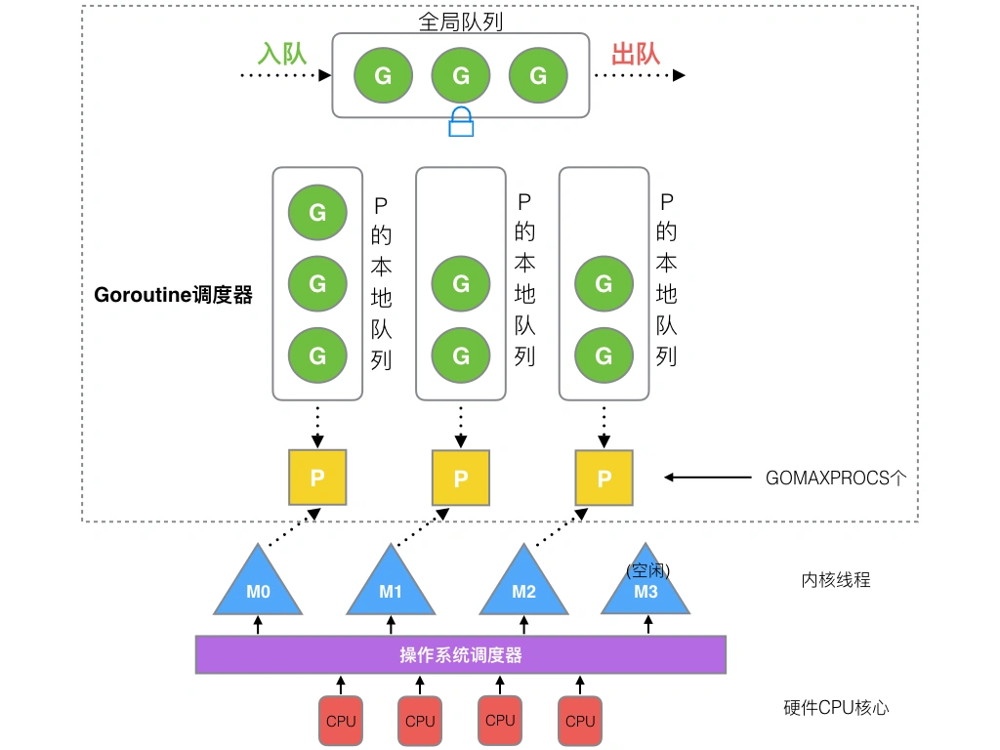
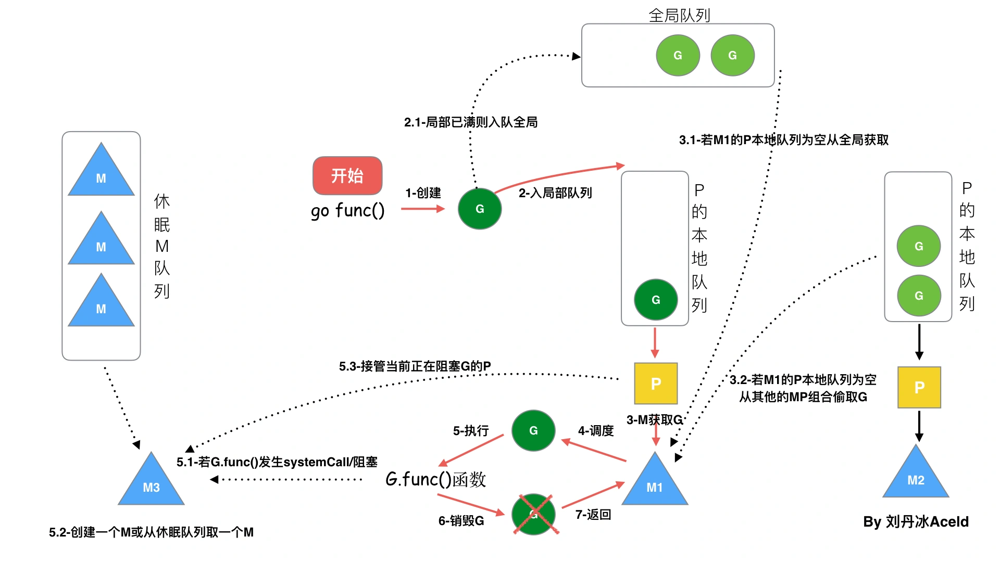
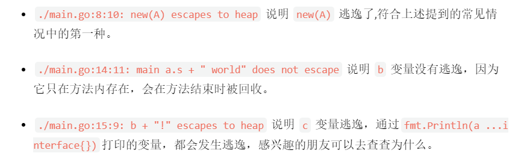

通过通信来共享内存，而不是共享内存来通信。

# 概念

## 协程、线程、进程的区别

**进程 :**

进程是具有一定独立功能的程序，进程是系统资源分配和调度的最小单位。 每个进程都有自己的独立内存空间，不同进程通过进程间通信来通信。由于进程比较重量，占据独立的内存，所以上下文进程间的切换开销（栈、寄存器、虚拟内存、文件句柄等）比较大，但相对比较稳定安全。

**线程 :**

线程是进程的一个实体, 线程是内核态, 而且是 CPU 调度和分派的基本单位,它是比进程更小的能独立运行的基本单位。线程间通信主要通过共享内存，上下文切换很快，资源开销较少，但相比进程不够稳定容易丢失数据。

**协程（Goroutine）:**

协程是一种用户态的轻量级线程，协程的调度完全是由用户来控制的。独立的栈空间，共享堆空间， 协程拥有自己的寄存器上下文和栈。 协程调度切换时，将寄存器上下文和栈保存到其他地方，在切回来的时候，恢复先前保存的寄存器上下文和栈，直接操作栈则基本没有内核切换的开销，可以不加锁的访问全局变量，所以上下文的切换非常快。

## 协程Goroutine 和线程的区别？

- 一个线程可以有多个协程
- 线程、进程都是同步机制，而协程是异步
- 协程可以保留上一次调用时的状态，当过程重入时，相当于进入了上一次的调用状态
- 协程是需要线程来承载运行的，所以协程并不能取代线程，线程是被分割的 CPU 资源，协程是组织好的代码流程

https://www.kancloud.cn/aceld/golang/1958305

# goroutine

## goroutine的概念与使用

在Go语言中，每一个并发的执行单元叫作一个goroutine。

启动goroutine的方式非常简单，只需要在调用的函数（普通函数和匿名函数）前面加上一个go关键字。

```go
func hello() {
    fmt.Println("Hello Goroutine!")
}
func main() {
    go hello() // 启动另外一个goroutine去执行hello函数
    fmt.Println("main goroutine done!")
    time.Sleep(time.Second)
}
```

## GPM 调度系统

**Go调度本质是把大量的goroutine分配到少量线程上去执行，并利用多核并行，实现更强大的并发。**

GPM是Go语言运行时（runtime）层面的实现，是go语言自己实现的一套调度系统。

- G（Goroutine）： 协程，轻量级线程，使用go关键词创建的执行单元。
- M（Machine）：操作系统的**线程**，在 Go 中称为 Machine，数量对应真实的 CPU 数（真正干活的对象）。
- P（Processor）： **处理器**（Go 中定义的一个摡念，非 CPU），包含运行 Go 代码的必要资源，负责Machine与Goroutine的连接，它能提供线程需要的上下文环境，也能分配G到它应该去的线程上执行，有了它，每个G都能得到合理的调用。P的个数是通过runtime.GOMAXPROCS设定（最大256），默认为核心数。



P与M一般也是一一对应的。他们关系是： P管理着一组G挂载在M上运行。当一个G长久阻塞在一个M上时，runtime会新建一个M，阻塞G所在的P会把其他的G 挂载在新建的M上。当旧的G阻塞完成或者认为其已经死掉时回收旧的M。



1、我们通过 go func()来**创建一个goroutine**；

2、有**两个存储G的队列**，一个是**局部调度器P的本地队列**、一个是**全局G队列**。新创建的G会先保存在P的本地队列中，如果P的本地队列已经满了就会保存在全局的队列中；

3、G只能运行在M中，一个**M必须持有一个P，M与P是1：1的关系**。M会从P的本地队列弹出一个可执行状态的G来执行，如果P的本地队列为空，就会想其他的MP组合偷取一个可执行的G来执行；

4、一个M调度G执行的过程是一个循环机制；

5、当M执行某一个G时候如果发生了syscall或则其余阻塞操作，M会阻塞，如果当前有一些G在执行，runtime会把这个线程M从P中摘除(detach)，然后再创建一个新的操作系统的线程(如果有空闲的线程可用就复用空闲线程)来服务于这个P；

6、当M系统调用结束时候，这个G会尝试获取一个空闲的P执行，并放入到这个P的本地队列。如果获取不到P，那么这个线程M变成休眠状态， 加入到空闲线程中，然后这个G会被放入全局队列中。

## Go中的操作系统线程和goroutine的关系：

- 1.一个操作系统线程对应用户态多个goroutine。
- 2.go程序可以同时使用多个操作系统线程。
- 3.goroutine和OS线程是多对多的关系，即m:n。

## 怎么查看 Goroutine 的数量？怎么限制 Goroutine 的数量？

- 在 Golang 中,GOMAXPROCS 中控制的是未被阻塞的所有 Goroutine,可以被 Multiplex 到多少个线程上运行,通过 GOMAXPROCS 可以查看 Goroutine 的数量。
- 使用通道。每次执行的 go 之前向通道写入值，直到通道满的时候就阻塞了。

## 为什么会发生内存泄露？

Goroutine 需要维护执行用户代码的上下文信息，在运行过程中需要消耗一定的内存来保存这类信息，如果一个程序持续不断地产生新的 goroutine，且不结束已经创建的 goroutine 并复用这部分内存，就会造成内存泄漏的现象。

## Goroutine 发生了泄漏如何检测？

可以通过 Go 自带的工具 pprof 或者使用 Gops 去检测诊断当前在系统上运行的 Go 进程的占用的资源。

## 主协程如何等其余协程完再操作？

使用 sync.WaitGroup。WaitGroup，就是用来等待一组操作完成的。WaitGroup 内部实现了一个计数器，用来记录未完成的操作个数。Add()用来添加计数；Done()用来在操作结束时调用，使计数减一；Wait()用来等待所有的操作结束，即计数变为 0，该函数会在计数不为 0 时等待，在计数为 0 时立即返回。

## waitGroup传值会发生什么

```go
// 正常执行
func n(wg *sync.WaitGroup) {
    defer wg.Done()
    fmt.Println("TEST2")
}

// 这时候的wg.Done()没有任何作用，协程执行完成后发生死锁报错，
    //fatal error: all goroutines are asleep - deadlock!
// 在goland中会提示
//'p' passes a lock by the value: type 'sync.WaitGroup' contains 'interface{}' which is 'sync.Locker' 
// 就是这个原因导致waitGroup失效 
func p(wg sync.WaitGroup) {
    defer wg.Done()
    fmt.Println("TEST1")
}
```

# channel

## channel概念与原理

为实现go的并发特性，使用channel在不同的协程单元goroutine之间同步通信。如果说goroutine是Go程序并发的执行体，channel就是它们之间的连接。channel是可以让一个goroutine发送特定值到另一个goroutine的通信机制。

通道像一个传送带或者队列，总是遵循先入先出（First In First Out）的规则，保证收发数据的顺序。每一个通道都是一个具体类型的导管，也就是声明channel的时候需要为其指定元素类型。


channel是一种类型，一种引用类型。使用方法如下：

```go
var ch1 chan int   // 声明一个传递整型的通道
var ch2 chan bool  // 声明一个传递布尔型的通道
var ch3 chan []int // 声明一个传递int切片的通道
创建channel的格式如下：
	make(chan 元素类型, [缓冲大小])
channel的缓冲大小是可选的。
举几个例子：
ch4 := make(chan int)
ch5 := make(chan bool)
ch6 := make(chan []int)
```

通道有发送（send）、接收(receive）和关闭（close）三种操作。

发送和接收都使用<-符号。

```go
定义一个通道：
ch := make(chan int)

发送
将一个值发送到通道中。
ch <- 10 // 把10发送到ch中

接收
从一个通道中接收值。
x := <- ch // 从ch中接收值并赋值给变量x
<-ch       // 从ch中接收值，忽略结果

关闭
我们通过调用内置的close函数来关闭通道。
close(ch)
```

## 常见的channel异常

- 向一个nil channel发送信息会发生什么

- - 永久阻塞导致死锁，会发生fatal error: all goroutines are asleep - deadlock!

- 从一个nil channel接收消息会发生什么

- - 永久阻塞导致死锁，会发生fatal error: all goroutines are asleep - deadlock!

- 以上两种情况的fatal error都是在**所有协程进入阻塞或睡眠状态**才会发生的报错
- 向一个已经关闭的channel发送信息会发生什么

- - 会直接发生panic:panic: send on closed channel

- 从一个已经关闭的channel接收消息会发生什么

- - 可以正常接收值，<-channel中可以返回两个值，第一个为接收到的值，第二个代表是否正常接受数据，如果channel已经关闭，第一个为传输数据类型的零值，第二个为false


## CSP模型（Communicating Sequential Processes）

**CSP模型（依赖channel实现）**

CSP 模型是“以通信的方式来共享内存”，不同于传统的多线程通过共享内存来通信。

用于描述两个独立的并发实体通过共享的通讯 channel (管道)进行通信的并发模型。

## channel 为什么它可以做到线程安全？

Channel 可以理解是一个先进先出的队列，通过管道进行通信,发送一个数据到 Channel 和从 Channel 接收一个数据都是原子性的。不要通过共享内存来通信，而是通过通信来共享内存，前者就是传统的加锁，后者就是 Channel。设计 Channel 的主要目的就是在多任务间传递数据的，本身就是安全的。

## Channel 是同步的还是异步的？

无缓冲的channel是同步的，而有缓冲的channel是非同步。 channel 存在 3 种状态：

1. nil，未初始化的状态，只进行了声明，或者手动赋值为 nil
2. active，正常的 channel，可读或者可写
3. closed，已关闭，千万不要误认为关闭 channel 后，channel 的值是 nil，不是 

## 无缓冲和缓冲通道之间有什么区别？

无缓冲的channel是同步的，而有缓冲的channel是非同步。

无缓冲的通道指的是通道的大小为0，也就是说，这种类型的通道在接收前没有能力保存任何值，它要求发送 goroutine 和接收 goroutine 同时准备好，才可以完成发送和接收操作。

channel无缓冲时，发送阻塞直到数据被接收，接收阻塞直到读到数据。

channel有缓冲时，当缓冲满时发送阻塞，当缓冲空时接收阻塞。

## select

Go的select主要是处理多个channel的操作.  

**为请求设置超时时间**

在 golang 1.7 之前， http 包并没有引入 context 支持，通过 http.Client 向一个坏掉的服务发送请求会导致响应缓慢。类似的场景下，我们可以使用 select 控制服务响应时间。

**完成 channel**

它可以用于保证流水线上每个阶段goroutine 的退出。

**退出 channel** 

在很多场景下，quit channel 和 done channel 是一个概念。在并发程序中，通常 main routine 将任务分给其它 go routine 去完成，而自身只是起到调度作用。这种情况下，main 函数无法知道 其它goroutine 任务是否完成，此时我们需要 quit channel；

**selcet是怎么执行的？**

- select中的case语句必须是一个channel操作
- select中的default子句总是可运行的,速度非常快。
- 如果有多个case都可以运行，select会随机公平地选出一个执行，其他不会执行。
- 如果没有可运行的case语句，且有default语句，那么就会执行default的动作。
- 如果没有可运行的case语句，且没有default语句，select将阻塞，直到某个case通信可以运行

```go
func main() {
    ch1 := make(chan int)
    go testSelect(ch1)
    // 主进程睡眠一秒
    time.Sleep(1 *  time.Millisecond)
    // 发送消息
    ch1<-2
    // 打印消息
    fmt.Println(<-ch1)
    // 睡眠3秒等待触发time out
    time.Sleep(3 * time.Second)
}

// 运行结果
// 1
// timeout
func testSelect(ch1 chan int) {
    // 死循环监听
    for {
        select {
        case <-ch1:
            ch1<- 1
        case <-time.After(2 *time.Second):
            fmt.Println("time out")
        }
    }
}
```

# 并发安全、数据竞态、锁

## 并发安全

对同一变量或内存位置同时进行读写访问的操作，也就是同一个变量可能因为读写的先后完成顺序导致结果不同，这称之数据竞态，出现这种情况的程序往往是不安全不稳定的，这个可以考虑1）WaitGroup等待  2）加锁

## context 结构原理

Context（上下文）是 Golang 应用开发常用的并发控制技术 ，它可以控制一组呈树状结构的 goroutine，每个 goroutine 拥有相同的上下文。

Context 是并发安全的，主要是用于控制多个协程之间的协作、取消和超时控制操作。

```go
type Context interface {

    Deadline() (deadline time.Time, ok bool)

    Done() <-chan struct{}

    Err() error

    Value(key interface{}) interface{}
}
```

Context接口包含四个方法：

- Deadline  返回绑定当前context的**任务被取消的截止时间**；如果没有设定期限，将返回ok == false。
- Done    当绑定当前context的任务被取消时，将返回一个关闭的channel；如果当前context不会被取消，将返回nil。
- Err   如果Done返回的channel没有关闭，将返回nil;如果Done返回的channel已经关闭，将返回非空的值表示任务结束的原因。如果是context被取消，Err将返回Canceled；如果是context超时，Err将返回DeadlineExceeded。
- Value   返回context存储的键值对中当前key对应的值，如果没有对应的key,则返回nil。


 

## 数据竞态

由于go语言天然支持高并发，所以不可避免的可能出现对同一变量或内存位置同时进行读写访问的操作，也就是同一个变量可能因为读写的先后完成顺序导致结果不同。

**解决方法：**

Go（从v1.1开始）具有内置的数据竞争检测器，可以使用它来查明潜在的数据竞争条件。

使用它就像-race在普通的Go命令行工具中添加标志一样简单。

运行时检查竟态的命令：go run -race main.go

构建时检查竟态的命令：go build -race main.go

测试时检查竟态的命令：go test -race main.go

除此以外，还有三种办法可供参考：

1. WaitGroup等待：解决数据竟态的最直接方法是阻止读取访问，直到完成写操作为止
2. 用channel阻塞等待
3. 返回channel通道
4. 使用互斥锁

通常来说，使用WaitGroup可以以最少的麻烦解决问题，但使用时需要小心，必须保证Add和Done方法出现的次数一致，最后调用Wait等待添加的任务都执行完毕。如果Add和Done数量不一致，就会一直阻塞程序，无限制地消耗内存等资源，直到资源耗尽服务宕机。以上解决数据竟态的几种方法背后的核心原则是防止对同一变量或内存位置同时进行读写访问。

## Mutex互斥锁 rwmutex读写锁 sync包

互斥锁：

能够保证同一时间有且只有一个goroutine进入临界区，其他的goroutine则在等待锁；

当互斥锁释放后，等待的goroutine才可以获取锁进入临界区，多个goroutine同时等待一个锁时，唤醒的策略是随机的。

RWMutex读写互斥锁：

　　读写锁分为两种：读锁和写锁。

当一个goroutine获取读锁之后，其他的goroutine如果是获取读锁会继续获得锁，如果是获取写锁就会等待；

当一个goroutine获取写锁之后，其他的goroutine无论是获取读锁还是写锁都会等待。

- 读锁RLock() ，我开始读了，你们也可以来读，但是谁都别写
- 写锁Lock() ，我要写了，所有人注意，别做任何操作

## 读写锁或者互斥锁读的时候能写吗?

Go中读写锁包括读锁和写锁，多个读线程可以同时访问共享数据；写线程必须等待所有读线程都释放锁以后，才能取得锁；同样的，读线程必须等待写线程释放锁后，才能取得锁，也就是说读写锁要确保的是如下互斥关系，可以同时读，但是读-写，写-写都是互斥的。

## 除了加 Mutex 锁外还有哪些方式安全读写共享变量？

Go 中 Goroutine 可以通过 Channel 进行安全读写共享变量。

## 内存逃逸

golang程序变量会携带有一组校验数据，编译器用来做逃逸分析，用来证明它的整个生命周期是否在运行时完全可知（变量的作用域有没有跑出函数范围）。如果变量**通过**了这些**校验（没有跑出）**，它就可以在**栈上分配**。否则就说它**逃逸** 了，必须在**堆上分配**。

**逃逸规则**

我们其实都知道一个普遍的规则，就是**如果变量需要使用堆空间，那么他就应该进行逃逸**。

一般我们**给一个引用类对象中的引用类成员进行赋值，可能出现逃逸现象**。可以理解为访问一个引用对象实际上底层就是通过一个指针来间接的访问了，但如果再访问里面的引用成员就会有第二次间接访问，这样操作这部分对象的话，极大可能会出现逃逸的现象。Go语言中的引用类型有func（函数类型），interface（接口类型），slice（切片类型），map（字典类型），channel（管道类型），*（指针类型）等。

能引起变量逃逸到堆上的典型情况：

1. 在方法内把局部变量指针返回 局部变量原本应该在栈中分配，在栈中回收。但是由于返回时被外部引用，因此其生命周期大于栈，则溢出。
2. 发送指针或带有指针的值到 channel 中。 在编译时，是没有办法知道哪个 goroutine 会在 channel 上接收数据。所以编译器没法知道变量什么时候才会被释放。
3. 在一个切片上存储指针或带指针的值。 一个典型的例子就是 []*string 。这会导致切片的内容逃逸。尽管其后面的数组可能是在栈上分配的，但其引用的值一定是在堆上。
4. slice 的背后数组被重新分配了，因为 append 时可能会超出其容量( cap )。 slice 初始化的地方在编译时是可以知道的，它最开始会在栈上分配。如果切片背后的存储要基于运行时的数据进行扩充，就会在堆上分配。
5. 在 interface 类型上调用方法。 在 interface 类型上调用方法都是动态调度的 —— 方法的真正实现只能在运行时知道。想像一个 io.Reader 类型的变量 r , 调用 r.Read(b) 会使得 r 的值和切片b 的背后存储都逃逸掉，所以会在堆上分配。

通过 go build -gcflags=-m 查看逃逸的情况。