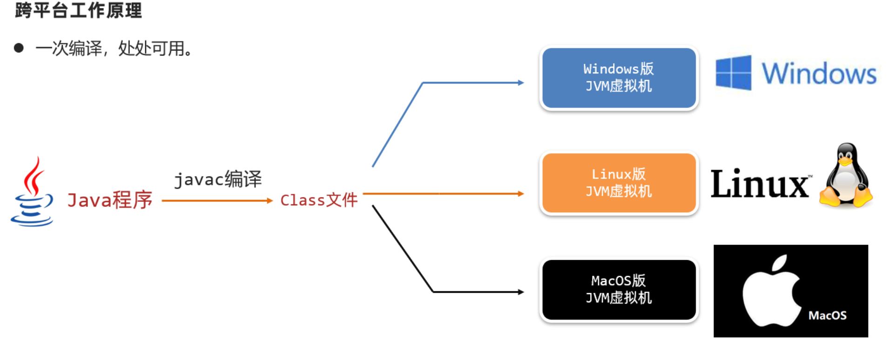
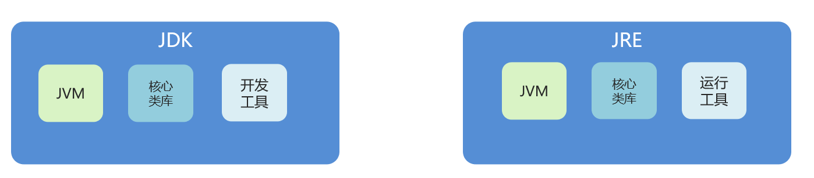

## 基本概念



### JRE和JDK



JVM（Java Virtual Machine），Java虚拟机

JRE（Java Runtime Environment），Java运行环境，包含了JVM和Java的核心类库（Java API）

**JDK（Java Development Kit）称为Java开发工具，包含了JRE和开发工具**

总结：我们只需安装JDK即可，它包含了java的运行环境和虚拟机。

## 数据类型

**基本类型** ：

| 数据类型 | 关键字  | 内存占用 |                 取值范围                  |
| :------: | :-----: | :------: | :---------------------------------------: |
|   整数   |  byte   |    1     |    负的2的7次方 ~ 2的7次方-1(-128~127)    |
|          |  short  |    2     | 负的2的15次方 ~ 2的15次方-1(-32768~32767) |
|          |   int   |    4     |        负的2的31次方 ~ 2的31次方-1        |
|          |  long   |    8     |        负的2的63次方 ~ 2的63次方-1        |
|  浮点数  |  float  |    4     |        1.401298e-45 ~ 3.402823e+38        |
|          | double  |    8     |      4.9000000e-324 ~ 1.797693e+308       |
|   字符   |  char   |    2     |                  0-65535                  |
|   布尔   | boolean |    1     |                true，false                |

​	每个基本类型都有对应的**包装类型**：

​				Byte、Integer、Short、Long、Double、Float、Character、Boolean;

​	使用包装类型合理的场景有： 

- 作为集合中的元素、键和值 

- 泛型，必须使用包装类型，如 List list ， OptionalInt rpcResult()

- 反射方法调用需使用包装类型，例如在Method.invoke,MethodHandle.invoke中 

- POJO类的字段、RPC方法的返回值和参数等可能要序列化的且可能缺失值的场景中


**引用类型**


## 程序流程控制


## 方法

### 方法的通用格式

* 格式：

  ```java
  public static 返回值类型 方法名(参数) {
     方法体; 
     return 数据 ;
  }
  ```

* 解释：

  * public static 	修饰符 

    返回值类型	方法操作完毕之后返回的数据的数据类型

    ​			如果方法操作完毕，没有数据返回，这里写void，而且方法体中一般不写return

     方法名		调用方法时候使用的标识

     参数		由数据类型和变量名组成，多个参数之间用逗号隔开

     方法体		完成功能的代码块

     return		如果方法操作完毕，有数据返回，用于把数据返回给调用者

* 定义方法时，要做到两个明确

  * 明确返回值类型：主要是明确方法操作完毕之后是否有数据返回，如果没有，写void；如果有，写对应的数据类型
  * 明确参数：主要是明确参数的类型和数量

* 调用方法时的注意：

  * void类型的方法，直接调用即可
  * 非void类型的方法，推荐用变量接收调用

### 方法重载

* 方法重载概念

  方法重载指同一个类中定义的多个方法之间的关系，满足下列条件的多个方法相互构成重载

  * 多个方法在同一个类中
  * 多个方法具有相同的方法名
  * 多个方法的参数不相同，类型不同或者数量不同

* 注意：

  * 重载仅对应方法的定义，与方法的调用无关，调用方式参照标准格式
  * 重载仅针对同一个类中方法的名称与参数进行识别，与返回值无关，换句话说不能通过返回值来判定两个方法是否相互构成重载

* 正确范例：

  ```java
  public class MethodDemo {
  	public static void fn(int a) {
      	//方法体
      }
      public static int fn(double a) {
      	//方法体
      }
  }
  
  public class MethodDemo {
  	public static float fn(int a) {
      	//方法体
      }
      public static int fn(int a , int b) {
      	//方法体
      }
  }
  ```

## 面向对象

### 类

类的组成是由属性和行为两部分组成

* 属性：在类中通过成员变量来体现（类中方法外的变量）
* 行为：在类中通过成员方法来体现（和前面的方法相比去掉static关键字即可）

类的定义步骤：

①定义类

②编写类的成员变量

③编写类的成员方法

```java
public class 类名 {
	// 成员变量
	变量1的数据类型 变量1；
	变量2的数据类型 变量2;
	…
	// 成员方法
	方法1;
	方法2;	
}
```

### 对象

* 创建对象的格式：
  * 类名 对象名 = new 类名();
* 调用成员的格式：
  * 对象名.成员变量
  * 对象名.成员方法();
* 示例代码

```java
/*
    创建对象
        格式：类名 对象名 = new 类名();
        范例：Phone p = new Phone();

    使用对象
        1：使用成员变量
            格式：对象名.变量名
            范例：p.brand
        2：使用成员方法
            格式：对象名.方法名()
            范例：p.call()
 */
public class PhoneDemo {
    public static void main(String[] args) {
        //创建对象
        Phone p = new Phone();

        //使用成员变量
        System.out.println(p.brand);
        System.out.println(p.price);

        //使用成员方法
        p.call();
        p.sendMessage();
    }
}
```

### 封装

1. 封装概述
   是面向对象三大特征之一（封装，继承，多态）

   **对象代表什么，就得封装对应的数据，并提供数据对应的行为** 

2. 封装代码实现
   将类的某些信息隐藏在类内部，不允许外部程序直接访问，而是通过该类提供的方法来实现对隐藏信息的操作和访问
   成员变量private，提供对应的getXxx()/setXxx()方法

#### private关键字

private是一个修饰符，可以用来修饰成员（成员变量，成员方法）

* 被private修饰的成员，只能在本类进行访问，针对private修饰的成员变量，如果需要被其他类使用，提供相应的操作
  * 提供“get变量名()”方法，用于获取成员变量的值，方法用public修饰
  * 提供“set变量名(参数)”方法，用于设置成员变量的值，方法用public修饰

#### this关键字

* this修饰的变量用于指代成员变量，其主要作用是（区分局部变量和成员变量的重名问题）
  * 方法的形参如果与成员变量同名，不带this修饰的变量指的是形参，而不是成员变量
  * 方法的形参没有与成员变量同名，不带this修饰的变量指的是成员变量

### 构造方法

构造方法是一种特殊的方法

* 作用：创建对象   Student stu = **new Student();**

* 格式：

  public class 类名{

  ​        修饰符 类名( 参数 ) {

  ​        }

  }

* 功能：主要是完成对象数据的初始化

**构造方法的注意事项**

* 构造方法的创建

如果没有定义构造方法，系统将给出一个默认的无参数构造方法
如果定义了构造方法，系统将不再提供默认的构造方法

* 构造方法的重载

如果自定义了带参构造方法，还要使用无参数构造方法，就必须再写一个无参数构造方法

* 推荐的使用方式

无论是否使用，都手工书写无参数构造方法

* 重要功能！

可以使用带参构造，为成员变量进行初始化

### 标准类制作

① 类名需要见名知意

② 成员变量使用private修饰

③ 提供至少两个构造方法 

* 无参构造方法
* 带全部参数的构造方法

④ get和set方法 

​	提供每一个成员变量对应的setXxx()/getXxx()

⑤ 如果还有其他行为，也需要写上

```java
/*
    学生类
 */
class Student {
    private String name;
    private int age;

    public Student() {}

    public Student(String name) {
        this.name = name;
    }

    public Student(int age) {
        this.age = age;
    }

    public Student(String name,int age) {
        this.name = name;
        this.age = age;
    }

    public void show() {
        System.out.println(name + "," + age);
    }
}
```

### static

**static修饰成员变量**

成员变量： 

- 静态成员变量 **static修饰** 只有一份，**被所有对象共享**  **类.变量** 访问
- 实例成员变量  无static修饰，属于每个对象，必须用 **对象名.变量** 访问

内存原理：

​	 静态成员变量放在堆内存的类静态变量区，而实例成员变量放在new出来的对象的堆内存中，不同对象的实例成员变量不存储在同一片空间。

**static修饰成员方法**

成员方法：

- ​	静态成员方法 static修饰  归属于类，可以被共享访问 ，建议类名访问。（同一个类中访问静态方法可以省略类名）
- ​    实例成员方法 归属于对象，**只能**用对象触发访问  对象. 实例方法 

使用场景：

​	 表示对象自己的行为，且方法中需要访问成员变量，必须申请为实例方法；如果方法是执行一个共用功能为目的，可以申请成静态方法。

### 继承extends  

extends  继承后直接使用父类的属性和方法

```java
class 父类 {
	//子类们的相同特征（共性属性、共性方法）放在父类中定义
}
class 子类 extends 父类 {
	//子类独有的属性和方法定义在子类自己里面
    //子类不能继承父类的构造器
    //子类可以共享父类的静态成员
    //子类访问成员就近原则：先找子类，再找父类，都没有报错
}
```

- Java 只支持单继承，即一个子类只能继承一个父类 （为了防止歧义和混乱）。
- Object类是所有Java类的祖宗类。

**方法重写**：子类和父类中出现了一样的方法声明，称子类的方法是重写

- ​	使用场景： 子类需要父类的功能，但是父类这个功能不完全满足子类的需求
- ​	@Override 重写注释
- ​	重写的方法要和父类的方法的名称、形参列表一样
- ​	私有方法不能被重写


### Package

- 相同包的类可以直接访问，不同包的类要导包
- 类名冲突，可以选一个用全名访问


### 权限修饰符

- private - > 缺省  - > protected  - > public 
- 成员变量一般私有，方法一般公开


### final

绝育修饰符

- 修饰类，类是最终类，不能被继承
- 修饰方法，方法不能被重写
- 修饰变量，代表该变量被第一次赋值后不能再次被赋值


### 枚举enum

特殊类，用来表示一组常量

```java
enum Color 
{ 
    RED, GREEN, BLUE; 
} 
```

**values(), ordinal() 和 valueOf()** 方法位于 java.lang.Enum 类中：

- values() 返回枚举类中所有的值。
- ordinal()方法可以找到每个枚举常量的索引，就像数组索引一样。
- valueOf()方法返回指定字符串值的枚举常量。


### 抽象类abstract 

用abstract 修饰，是父类的一个不完全的设计图，父类知道子类一定会做的行为，但是每个子类的行为实现不同，父类把这种行为定义为抽象形式，具体实现交给子类自己完成。

```java
public abstract class Employee
{
   private String name;
   private String address;
   private int number;
   
   public abstract double computePay();

}
```

设计模式中的**模板方法模式**就是经典应用：


### 接口Interface

```java
//声明：
[可见度] interface 接口名称 [extends 其他的接口名] {
        // 声明变量
        // 抽象方法
}
//实现： 接口是用来被类实现（implements）的
修饰符 class 实现类名 implements 接口名称1，接口名称2，...{
    
}
```

本质是一种规范，约定必须要做某件事情

接口中的成员变量只能是 **public static final** 类型的

**Java8 新增的接口特性**

- 默认方法 ： 在方法名前加**default**关键字实现默认方法

- 静态默认：Java 8 的另一个特性是**接口可以声明（并且可以提供实现）静态方法**

```java
public interface Vehicle {
    //默认方法
    default void print(){
      System.out.println("我是一辆车!");
   }
    // 静态方法
   static void blowHorn(){
      System.out.println("按喇叭!!!");
   }
}
//接口的静态方法必须提部分本身的接口名来调用
```


### 多态

当继承、重写、父类引用指向子类对象：**Parent p = new Child();** 三个情况存在时会出现多态。

多态中成员访问特点：

- ​	方法调用：编译看左边，运行看右边；
- ​	变量调用：编译看左边，运行也看左边；


### 内部类

类中类，内部类寄生在宿主外部类

```java
public class 外部类名{
	//内部类
	public class 内部类名{
		//内部类可以访问外部类成员，包括私有成员
	}
} 
```

- 静态内部类

- 成员内部类

- 局部内部类

- **匿名内部类**

  不提供类名直接实例化，实现一个类中包含另一个类，使代码更加简洁。（类和类之间）

  ```java
  //定义一个匿名类
  object1 a = new object1(){
      public void work(){
          //
      }
  };
  a.work();
  ```


## 常用api

### String

创建对象的方式：

	1. string name = “ xxx”; （存在堆内存常量(公共)池，相同的只存在一个）  
	
	  	2. new 构造器得到字符串对象 （存在堆内存上）

**String常用API**

- 判断字符串内容  
  - == 是判断字符串的地址的，字符串判断内容相等要使用 **equals** ：Str1.equals( Str2 )

###  Object 


## 容器

### ArrayList

集合，可以改变长度，元素可重复，带索引


## 多线程并发


## Java 8 新特性

###  Lambda 表达式

​	别名：闭包  Java 8 重要特性  作用：**把函数作为参数传递到方法中**  简化匿名类的代码写法

 语法格式：

```java
(parameters) -> expression
或
(parameters) ->{ statements; }
```

### 方法引用

用一对冒号  **::** 


### Stream


### Optional 类


