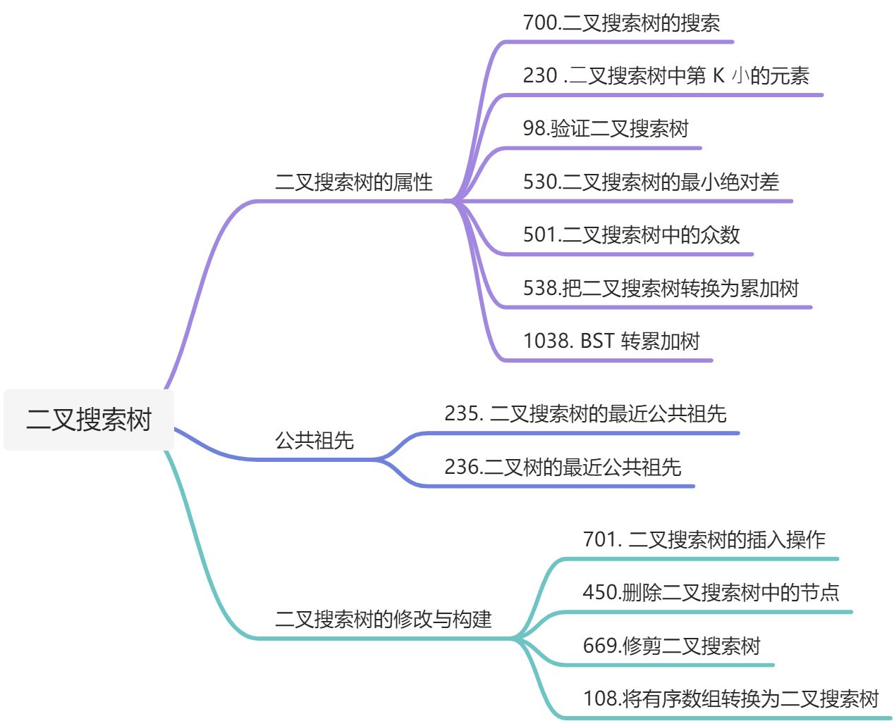
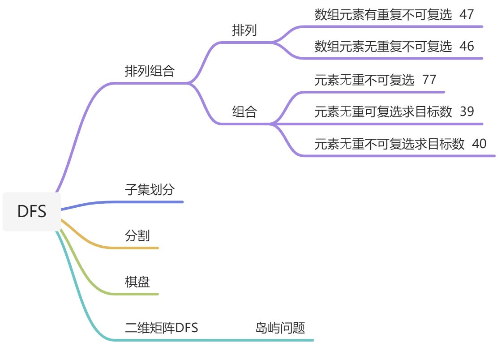

# 排序算法

## **插入排序** 

插入排序：每一趟将一个待排序记录按其关键字的大小插入到已排好序的一组记录的适当位置上，直到所有待排序记录全部插入为止。 

排序算法稳定。时间复杂度 O(n²)，空间复杂度 O(1)。 

```go
func InsertionSort(nums []int) []int {
	n := len(nums)
	preindex, current := 0, 0
	for i := 0; i < n; i++ {
		preindex = i - 1
		current = nums[i]
		for preindex >= 0 && nums[preindex] > current {
			nums[preindex+1] = nums[preindex]
			preindex--
		}
		nums[preindex+1] = current
	}
	return nums
}
```

## 选择排序（Selection Sort）

选择排序(Selection-sort)是一种简单直观的排序算法。它的工作原理：首先在未排序序列中找到最小（大）元素，存放到排序序列的起始位置，然后，再从剩余未排序元素中继续寻找最小（大）元素，然后放到已排序序列的末尾。以此类推，直到所有元素均排序完毕。 

```plsql
func selectionSort(nums []int) []int {
	n := len(nums)
	mimIndex, temp := 0, 0
	for i := 0; i < n; i++ {
		mimIndex = i
		for j := i + 1; j < n; j++ {
			if nums[j] < nums[mimIndex] {
				mimIndex = j
			}
		}
		temp = nums[i]
		nums[i] = nums[mimIndex]
		nums[mimIndex] = temp
	}
	return nums
}
```

## **希尔排序** 

希尔排序：把记录按下标的一定增量分组，对每组进行直接插入排序，每次排序后减小增量，当增量减至 1 时排序完毕。

排序算法不稳定。时间复杂度 O(nlogn)，空间复杂度 O(1)。 

```go
func ShellSort(nums []int) []int {
	n := len(nums)
	//d 为步长
	for d := n / 2; d > 0; d = d / 2 {
		for i := d; i < n; i++ {
			j := i
			current := nums[i]
			//如果后面小于前面,交换前后
			for j-d >= 0 && current < nums[j-d] {
				nums[j] = nums[j-d]
				j = j - d
			}
			nums[j] = current
		}
	}
	return nums
}
```

## **直接选择排序** 

直接选择排序：每次在未排序序列中找到最小元素，和未排序序列的第一个元素交换位置，再在剩余未排序序列中重复该操作直到所有元素排序完毕。 

排序算法不稳定。时间复杂度 O(n²)，空间复杂度 O(1)。 

## 堆排序 

堆排序：将待排序数组看作一个树状数组，建立一个二叉树堆。通过对这种数据结构进行每个元素的插入，完成排序工作。 

排序算法不稳定，时间复杂度 O(nlogn)，空间复杂度 O(1)。 

## **冒泡排序** 

冒泡排序：比较相邻的元素，如果第一个比第二个大就进行交换，对每一对相邻元素做同样的工作。 

排序算法稳定，时间复杂度 O(n²)，空间复杂度 O(1)。 

```plsql
func bubbleSort(nums []int) []int {
	n := len(nums)
	for i := 0; i < n-1; i++ {
		for j := 0; j < n-1-i; j++ {
			if nums[j] > nums[j+1] {
				temp := nums[j+1]
				nums[j+1] = nums[j]
				nums[j] = temp
			}
		}
	}
	return nums
}
```

## 快速排序 

快速排序：随机选择一个基准元素，通过一趟排序将要排序的数据分割成独立的两部分，一部分全部小于等于基准元素，一部分全部大于等于基准元素，再按此方法递归对这两部分数据进行快速排序。 

排序算法不稳定，时间复杂度 O(nlogn)，空间复杂度 O(logn)。 

```plsql
func quickSort(nums []int, low int, high int) []int {
    mid := getIndex(nums, low, high)
    if low < high {
        quickSort(nums, low, mid-1)
    }
    if high > low {
        quickSort(nums, mid+1, high)
    }
    return nums
}
func getIndex(nums []int, low int, high int) int {
    p := nums[low]
    for low < high {
        for low < high && p <= nums[high] {
            high--
        }
        nums[low] = nums[high]
        for low < high && p > nums[low] {
            low++
        }
        nums[high] = nums[low]
    }
    nums[low] = p
    return low
}
```

## 归并排序 

归并排序：将待排序序列分成两部分，然后对两部分分别递归排序，最后进行合并。 

排序算法稳定，时间复杂度都为 O(nlogn)，空间复杂度为 O(n)。 

```go
func MergeSort(nums []int, low int, high int) {
	if low >= high {
		return
	}
	mid := (low + high) / 2
	//左半段
	MergeSort(nums, low, mid)
	//右半段
	MergeSort(nums, mid+1, high)
	Merge(nums, low, mid, high)
}

func Merge(nums []int, low int, mid int, high int) {
	var tempNums []int
	var s1, s2 = low, mid + 1
	for s1 <= mid && s2 <= high {
		//将s1和s2指向的数中较小的那个存进tempNums中
		if nums[s1] > nums[s2] {
			tempNums = append(tempNums, nums[s2])
			s2++
		} else {
			tempNums = append(tempNums, nums[s1])
			s1++
		}
	}
	//如果有一半没读完,就把没读完的那段一直存到临时数组后方
	if s1 <= mid {
		tempNums = append(tempNums, nums[s1:mid+1]...)
	}
	if s2 <= high {
		tempNums = append(tempNums, nums[s2:high+1]...)
	}
	//将临时数组中整理好的部分存回原数组
	for pos, item := range tempNums {
	}
}
```

# 数据结构

## 数组/链表

### 前缀和

\303. 区域和检索 - 数组不可变（中等） 

\304. ⼆维区域和检索 - 矩阵不可变（中等） 

\560. 和为K的⼦数组（中等） 

**前缀和主要适⽤的场景是原始数组不会被修改的情况下，频繁查询某个区间的累加和的情况。**

要计算一个数组（i，j）之间的总和，例如nums := []int{3,5,2,-2,4,1}, 常规思路是，从第i个数加到第j个数，计算总和。但是如果需要反复调用计算，那每次查询的时间复杂度为O(N). 前缀和的核⼼思路是我们 new ⼀个新的数组 preSum 出来，preSum[i] 记录 nums[0..i-1] 的累加和：如求（2，5）则preSum[6]-preSum[2], 时间复杂度O(1).


**和为 k 的⼦数组**


**方法一：先计算数组前缀和，穷举所有子数组，找出符合条件个数；**时间复杂度 O(N^2) 空间复杂度 O(N)，并不是最优的解法。

**方法二：直接记录下有⼏个** **preSum[j]** **和** **preSum[i] - k** **相等，直接更新结果，就避免了内层** 

**的 for 循环。**我们可以⽤**哈希表**，在记录前缀和的同时记录该前缀和出现的次数。


### 差分数组

\370. 区间加法（中等） 

\1109. 航班预订统计（中等） 

\1094. 拼⻋（中等） 

**差分数组的主要适⽤场景是频繁对原始数组的某个区间的元素进⾏增减。** 


```go
//构造差分数组
diff := make([]int,len(nums))
diff[0] = nums[0]
for i:=1;i<len(nums);i++{
    diff[i] = nums[i] - nums[i-1]
}
//一顿操作，对区间内加加减减
//对nums[i...j]之间加3，只要在差分数组diff[i]+=3,diff[j+1]-=3 注意j+1超出界限问题，j+1超界限，不减
//操作完了把diff数组还原

resnum := make([]int,len(diff))
resnum[0] = diff[0]
for i:=0;i<len(diff);i++{
    resnum[i] = resnum[i-1] +diff[i]
}
```

### 双指针

**数组双指针**

**26. 删除有序数组中的重复项** 

**83. 删除排序链表中的重复元素**

**27. 移除元素**

**283. 移动零**

**167. 两数之和 II - 输⼊有序数组** 

**344. 反转字符串**

**5. 最长回文子串**

**链表双指针**

1. **合并两个有序链表** 

双指针分别指向两个链表表头，比较P1,P2,把较小的接到新链表，移动指针，继续比较；这个算法的逻辑类似于「拉拉链」，l1, l2 类似于拉链两侧的锯⻮，指针 p 就好像拉链的拉索，将两个有序链表合并。 

1. **合并K个升序链表**

合并 k 个有序链表的逻辑类似合并两个有序链表，难点在于，如何快速得到 k 个节点中的最⼩节点，接到结 

果链表上？ 用优先级队列（⼆叉堆），把链表节点放⼊⼀个最⼩堆，就可以每次获得 k 个节点中的最⼩节点。

1. **环形链表**
2. **环形链表 II**
3. **链表的中间结点**
4. **删除链表的倒数第 N 个结点**
5. **相交链表**

### 二分查找

二分查找的前提是数组有序，难点在于定四个区间点。

```go
func search(nums []int,target int) int{
    low,high := 0, len(nums)-1
    for low<=high{
        mid := (high - low)/2 +low
        if nums[mid] == target{
            //找到，返回下标
            return mid
        }else if nums[mid]>target{
            //大于目标值，找左区间
            high = mid - 1
        }else{
            //小于目标值，找右区间
            low = mid + 1
        }
    }
    //没找到
    return -1
}
```

### 滑动窗口


### 

## 队列/栈

### 括号题

### LRU

## 树

### 二叉树

⼆叉树题⽬的难点在于如何通过题⽬的要求思考出每⼀个节点需要做什么。


**二叉树的遍历方式：** 

**深度优先遍历**：想往深走，遇到叶节点再往回走。前中后指的是中间节点的位置。

1. 1. 前序遍历（递归法，迭代法）中左右    计算二叉树的深度
   2. 中序遍历（递归法，迭代法）左中右
   3. 后序遍历（递归法，迭代法）左右中    计算二叉树的高度

**广度优先遍历**：从左到右一层一层的去遍历二叉树。

- - 层次遍历（迭代法）

```go
type TreeNode struct {
	Val   int
	Left  *TreeNode
	Right *TreeNode
}

//前序遍历二叉树
func preorderTraversal(root *TreeNode) []int {
	var res []int
	var preorder func(node *TreeNode)
	preorder = func(node *TreeNode) {
		if node == nil {
			return
		}
		res = append(res, node.Val)
		preorder(node.Left)
		preorder(node.Right)
	}
	preorder(root)
	return res
}

//中序遍历
func inorderTraversal(root *TreeNode) []int {
	var res []int
	var inorder func(node *TreeNode)
	inorder = func(node *TreeNode) {
		if node == nil {
			return
		}
		inorder(node.Left)
		res = append(res, node.Val)
		inorder(node.Right)
	}
	inorder(root)
	return res
}

//后序遍历
func postorderTraversal(root *TreeNode) []int {
	var res []int
	var postorder func(node *TreeNode)
	postorder = func(node *TreeNode) {
		if node == nil {
			return
		}
		postorder(node.Left)
		postorder(node.Right)
		res = append(res, node.Val)
	}
	postorder(root)
	return res
}

//层序遍历
func levelOrder(root *TreeNode) [][]int {
	var res [][]int
	if root == nil {
		return res
	}
	//树类型切片,q[0] = root
	q := []*TreeNode{root}
	//从上向下遍历
	for i := 0; len(q) > 0; i++ {
		res = append(res, []int{})
		var p []*TreeNode
		//从左到右遍历
		for j := 0; j < len(q); j++ {
			node := q[j]
			res[i] = append(res[i], node.Val)
			if node.Left != nil {
				p = append(p, node.Left)
			}
			if node.Right != nil {
				p = append(p, node.Right)
			}
		}
		q = p
	}
	return res
}
```


**二叉树的序列化：**

\297. 二叉树的序列化与反序列化


### 二叉搜索树

**二叉搜索树是⼀个有序树**：（中序遍历结果是有序的）

- 若它的左⼦树不空，则左⼦树上所有结点的值均⼩于它的根结点的值； 
- 若它的右⼦树不空，则右⼦树上所有结点的值均⼤于它的根结点的值； 
- 它的左、右⼦树也分别为⼆叉排序树。

**平衡二叉搜索树** 

平衡⼆叉搜索树：⼜被称为AVL（Adelson-Velsky and Landis）树，且具有以下性质：它是⼀棵空树或 

它的左右两个⼦树的⾼度差的绝对值不超过1，并且左右两个⼦树都是⼀棵平衡⼆叉树。



## 图

### 拓扑排列

### 二分图判定

### Union-Find(并查集) 

### 最小生成树

# 暴力搜索

## DFS/回溯算法

回溯算法其实就是我们常说的 DFS 算法，本质上就是⼀种暴⼒穷举算法。 解决⼀个回溯问题，实际上就是⼀个决策树的遍历过程，需要思考 3 个问题： 

1、路径：也就是已经做出的选择。 

2、选择列表：也就是你当前可以做的选择。 

3、结束条件：也就是到达决策树底层，⽆法再做选择的条件。

```go
func backtrack(nums []int, start int, target int) {
    //结束条件
    if trackSum == target {
        res = append(res, append([]int{}, track...))
        return
    }
    if trackSum > target {
        return
    }
    for i := start; i < len(nums); i++ {
        //剪枝
        if i > start && nums[i] == nums[i-1] {
            continue
        }
        //做选择
        track = append(track, nums[i])
        trackSum += nums[i]
        //递归
        backtrack(nums, i+1, target)
        //撤销选择
        track = track[:len(track)-1]
        trackSum -= nums[i]
    }
}
```

### 



## BFS


# 动态规划

⾸先，**动态规划问题的⼀般形式就是求最值**。**求解动态规划的核⼼问题是穷举**。因为要求最值，肯定要把所有可⾏的答案穷举出来，然后在其中找最值呗。 

⾸先，动态规划的穷举有点特别，因为这类问题存在「**重叠⼦问题**」，如果暴⼒穷举的话效率会极其低下， 所以需要「备忘录」或者「DP table」来优化穷举过程，避免不必要的计算。 

⽽且，动态规划问题⼀定会具备「**最优⼦结构**」，才能通过⼦问题的最值得到原问题的最值。

另外，虽然动态规划的核⼼思想就是穷举求最值，但是问题可以千变万化，穷举所有可⾏解其实并不是⼀件 容易的事，只有列出正确的「**状态转移⽅程**」，才能正确地穷举。 

**明确 base case -> 明确「状态」-> 明确「选择」 -> 定义 dp 数组/函数的含义**


# 数学相关

## 凸包问题

常见的凸包算法有多种： Jarvis 算法、 Graham 算法、 Andrew 算法