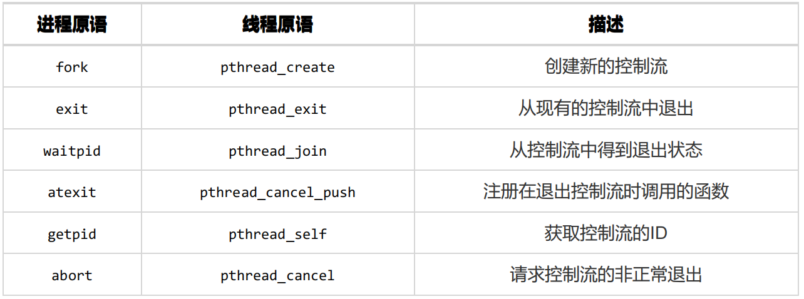

# 操作系统概述

## 什么是操作系统？请简要概述 

- 本质上是一个运行在计算机上的软件程序 ，用于管理计算机硬件和软件资源。 
- 它屏蔽了硬件层的复杂性。 操作系统就像是硬件使用的负责人，统筹着各种相关事项。
- 操作系统的**内核**（Kernel）是操作系统的核心部分，它负责**系统的内存管理，硬件设备的管理，文件系统的管理以及应用程序的管理**。 内核是连接应用程序和硬件的桥梁，决定着系统的性能和稳定性。

## 操作系统有哪些分类？ 

操作系统常规可分为批处理操作系统、分时操作系统、实时操作系统。 

若一个操作系统兼顾批操作和分时的功能，则称该系统为通用操作系统。 

常见的通用操作系统有：Windows、Linux、MacOS等。 

## 操作系统的基本特性（四大特征） 

并发(Concurrence)—最基本的特征！ 

并行性是指两个或多个事件在同一时刻发生；
并发性是指两个或多个事件在同一时间间隔内发生 

共享(Sharing)
共享是指系统中的资源可供内存中多个并发执行的进程(线程)共同使用 

虚拟(Virtual) 
操作系统中的所谓“虚拟”，是指通过某种技术把一个物理实体变为若干个逻辑上的对应物 

异步性(Asynchronism)
在多道程序环境下，多个进程是以“停停走走”的方式运行

## 内核态与用户态

根据进程访问资源的特点，我们可以把进程在系统上的运行分为两个级别：

- 用户态(user mode) : 用户态运行的进程可以直接读取用户程序的数据。
- 内核态(kernel mode):可以简单的理解系统态运行的进程或程序几乎可以访问计算机的任何资源，不受限制。

## 如何实现内核态和用户态的切换？ 

处理器从用户态切换到内核态的方法有三种：系统调用、异常和外部中断。 
1. 系统调用是操作系统的最小功能单位，是操作系统提供的用户接口，系统调用本身是一种软中断。 
2. 异常，也叫做内中断，是由错误引起的，如文件损坏、缺页故障等。 
3. 外部中断，是通过两根信号线来通知处理器外设的状态变化，是硬中断。 

## 并发和并行的区别 

1. 并发（concurrency）：打麻将的出牌。指宏观上看起来两个程序在同时运行，比如说在单核cpu上的多任务。但是从微观上看两个程序的指令是交织着运行的，指令之间交错执行，在单个周期内只运行了一个指令。这种并发并不能提高计算机的性能，只能提高效率（如降低某个进程的相应时间）。 
2. 并行（parallelism）：打麻将的洗牌。指严格物理意义上的同时运行，比如多核cpu，两个程序分别运行在两个核上，两者之间互不影响，单个周期内每个程序都运行了自己的指令，也就是运行了两条指令。这样说来并行的确提高了计算机的效率。所以现在的cpu都是往多核方面发展。 

# 进程管理

## 什么是进程

进程是资源分配的基本单位，是独立运行的基本单位。 

进程的经典定义就是一个执行中程序的实例。系统中的每个程序都运行在某个进程的上下文（context）中。 

上下文是由程序正确运行所需的状态组成的。这个状态包括存放在内存中的程序的代码和数据，它的栈、通用目的寄存器的内容、程序计数器、环境变量以及打开文件描述符的集合。 

进程一般由以下的部分组成： 

\1. 进程控制块PCB，是进程存在的唯一标志，包含进程标识符PID，进程当前状态，程序和数据地址，进程优先级、CPU现场保护区（用于进程切换），占有的资源清单等。 

\2. 程序段 

\3. 数据段 

JVM中线程私有部分为：虚拟机栈，本地方法栈，程序计数器。

## 什么是线程？ 

\1. 线程是进程划分的任务，是一个进程内可调度的实体，是CPU调度的基本单位，实现进程内部的并发。 

\2. 线程是操作系统可识别的最小执行和调度单位。每个线程都独自占用一个虚拟处理器：独自的寄存器组、指令计数器和处理器状态。 

\3. 同一个进程的不同线程之间共享同一地址空间。

## 简述线程和进程的区别和联系 

\1. 一个线程只能属于一个进程，而一个进程可以有多个线程，但至少有一个线程。线程依赖于进程而存在。 

\2. 进程在执行过程中拥有独立的地址空间，而多个线程共享进程的地址空间。

\3. 进程是资源分配的最小单位，线程是CPU调度的最小单位。 

\4. 通信：由于同一进程中的多个线程具有相同的地址空间，所以线程的同步和通信实现比较容易。进程间通信则更复杂一些（7种进程通信方式）。

\5. 进程编程调试简单，但是创建销毁开销大；线程执行开销小，切换速度快，但是编程调试相对复杂。 

\6. 进程间不会相互影响；一个进程内某个线程挂掉将导致整个进程挂掉。 

## 进程的基本操作

1. 进程的创建：fork()
2. 回收子进程
3. 加载并运行程序
4. 进程终止

## 进程的状态与状态转换 

进程在运行时有三种基本状态：就绪态、运行态和阻塞态。

\1. 运行（running）态：进程占有处理器正在运行的状态。进程已获得CPU，其程序正在执行。在单处理机系统中，只有一个进程处于执行状态； 在多处理机系统中，则有多个进程处于执行状态。 

2.就绪（ready）态：进程具备运行条件，等待系统分配处理器以便运行的状态。 当进程已分配到除CPU以外的所有必要资源后，只要再获得CPU，便可立即执行，进程这时的状态称为就绪状态。在一个系统中处于就绪状态的进程可能有多个，通常将它们排成一个队列，称为就绪队列。 

3.阻塞（wait）态：又称等待态或睡眠态，指进程不具备运行条件，正在等待某个时间完成的状态。 

各状态之间的转换： 

1. 就绪→执行 处于就绪状态的进程，当进程调度程序为之分配了处理机后，该进程便由就绪状态转变成执行状态。 

2. 执行→就绪 处于执行状态的进程在其执行过程中，因分配给它的一个时间片已用完而不得不让出处理机，于是进程从执行状态转变成就绪状态。 

3. 执行→阻塞 正在执行的进程因等待某种事件发生而无法继续执行时，便从执行状态变成阻塞状态。 

4. 阻塞→就绪 处于阻塞状态的进程，若其等待的事件已经发生，于是进程由阻塞状态转变为就绪状态。

## 简述进程间通信方法 

1. **管道/匿名管道(Pipes)** ：用于具有亲缘关系的父子进程间或者兄弟进程之间的通信。
2. **有名管道(Names Pipes**) : 匿名管道由于没有名字，只能用于亲缘关系的进程间通信。为了克服这个缺点，提出了有名管道。有名管道严格遵循先进先出(first in first out)。有名管道以磁盘文件的方式存在，可以实现本机任意两个进程通信。
3. **信号(Signal)** ：信号是一种比较复杂的通信方式，用于通知接收进程某个事件已经发生；
4. **消息队列(Message Queuing)** ：消息队列可以实现消息的随机查询, 消息不一定要以先进先出的次序读取,也可以按消息的类型读取。消息队列克服了信号承载信息量少，管道只能承载无格式字节流以及缓冲区大小受限等缺点。
5. **信号量(Semaphores)** ：信号量是一个计数器，用于多进程对共享数据的访问，主要用于解决与同步相关的问题并避免竞争条件。
6. **共享内存(Shared memory)** ：使得多个进程可以访问同一块内存空间，不同进程可以及时看到对方进程中对共享内存中数据的更新。这种方式需要依靠某种同步操作，如互斥锁和信号量等。可以说这是最有用的进程间通信方式。
7. **套接字(Sockets)** : 用于在客户端和服务器之间通过网络进行通信。

## Sockets

Socket又称之为“套接字”，是系统提供的用于网络通信的方法。它的实质并不是一种协议，没有规定计算机应当怎么样传递消息，只是给程序员提供了一个发送消息的接口，程序员使用这个接口提供的方法，发送与接收消息。

Socket描述了一个IP、端口对。它简化了程序员的操作，知道对方的IP以及PORT就可以给对方发送消息，再由服务器端来处理发送的这些消息。所以，Socket一定包含了通信的双方，即客户端（Client）与服务端（server）。

**Socket的通信过程**

每一个应用或者说服务都有一个端口。比如DNS的端口号53，http的端口号80都是对应一个应用或者服务的端口。我们能由DNS请求到查询信息，是因为DNS服务器时时刻刻都在监听53端口，当收到我们的查询请求以后，就能够返回我们想要的IP信息。所以，从程序设计上来讲，应该包含以下步骤：

（1）服务端利用Socket监听端口；

（2）客户端发起连接；

（3）服务端返回信息，建立连接，开始通信；

（4）客户端，服务端断开连接。

**Socket原理**

Socket是通讯的根本，是支持TCP/IP协议的网络通信的基本操作单元。它是网络通信过程中端点的抽象表示，包含进行网络通信必须的五种信息：连接使用的协议，本地主机地址的IP地址，本地进程的协议端口，远地主机的IP地址，远地进程的协议端口。

应用层通过传输层进行数据通信时，TCP会遇到同时为多个应用程序进程提供并发服务的问题。多个TCP连接或多个应用程序进程可能需要通过同一个TCP协议端口传输数据。为了区别不同的应用程序和连接，许多计算机操作系统为应用程序与TCP/IP协议交互提供了Socket接口。应用层可以和传输层通过Socket接口，区分来自不同应用程序进程或网络连接的通信，实现数据传输的并发服务。

**Socket连接**

建立Socket连接至少需要一对套接字，其中一个运行于客户端，称为ClientSocket，另一个运行于服务器端，称为ServerSocket。

套接字之间的连接过程分为三个步骤：

（1）服务器监听：服务器端套接字并不定位具体的客户端套接字，而是处于等待连接的状态，实时监控网络状态，等待客户端的连接请求

（2）客户端请求：指客户端的套接字提出连接请求，要连接的目标是服务器端的套接字。为此，客户端的套接字必须首先描述它要连接的服务器的套接字，指出服务器端套接字的地址和端口号，然后就向服务器端套接字提出连接请求

（3）连接确认：当服务器端套接字监听到或者说接收到客户端套接字的连接请求时，就响应客户端套接字的请求，建立一个新的线程，把服务器端套接字的描述发给客户端，一旦客户端确认了此描述，双方就正式建立连接。而服务器端套接字继续处于监听状态，继续接收其他客户端套接字的连接请求

Socket-TCP

Socket传输的是字节流，Async*Socke封装的库以NSData的形式传输。*

## 进程如何通过管道进行通信

管道是用于血缘关系的进程间通信。

调用pipe系统函数创建一个管道。管道其实是个内核缓冲区， 由两个文件描述符引用，一个表示读端，一个表示写端，数据从管道的写端流入管道，从读端流出。 其实是内核利用一个环形队列借助内核缓冲区实现的。

管道的局限性： 

\1. 数据自己读不能自己写。 

\2. 数据一旦被读走，便不在管道中存在，不可反复读取。 

\3. 由于管道采用半双工通信方式。因此，数据只能在一个方向上流动。 

\4. 只能在有公共祖先的进程间使用管道。 

## 进程如何通过共享内存通信？ 

它使得多个进程可以访问同一块内存空间，不同进程可以及时看到对方进程中对共享内存中数据得更新。这种方式需要依靠某种同步操作，如互斥锁和信号量等。 

特点： 

\1. 共享内存是最快的一种IPC，因为进程是直接对内存进行操作来实现通信，避免了数据在用户空间和内核空间来回拷贝。 

\2. 因为多个进程可以同时操作，所以需要进行同步处理。 

\3. 信号量和共享内存通常结合在一起使用，信号量用来同步对共享内存的访问。 

## 线程同步的方法 

两个或多个共享关键资源的线程并发执行修改同一数据时，需要使用一些线程同步的方法来解决这些问题。 

线程同步的方法： 

\1. **互斥锁** ：只有拥有互斥对象的线程才有访问公共资源的权限。因为互斥对象只有一个，所以可以保证公共资源不会被多个线程同时访问。

\2. **条件变量** ：条件变量是用来等待的。条件变量用来自动阻塞一个线程，直到某特殊情况发生为止。

\3. **信号量** ：它允许同一时刻多个线程访问同一资源，但是需要控制同一时刻访问此资源的最大线程数量。

## 进程同步的方法 

进程是具有不同的地址空间的，两个进程是不能感知到对方的存在的。如果需要多个进程来协同完成一些任务，那多个进程就要对同一个内核资源进行操作，进程间处于竞争关系。使用进程的互斥协调各个进程对资源的竞争占用。进程互斥指若干个进程要使用同一共享资源时，任何时刻最多允许一个进程去使用，其他要使用该资源的进程必须等待，直到占有资源的进程释放该资源。 

当多个进程协同完成一些任务时，不同进程的执行进度不一致，这便产生了进程的同步问题。需要操作系统干预，在特定的同步点对所有进程进行同步，这种协作进程之间相互等待对方消息或信号的协调关系称为进程同步。进程互斥本质上也是一种进程同步。 

进程的同步方法： 

\1. 互斥锁 

\2. 读写锁 

\3. 条件变量

\4. 记录锁(record locking) 

\5. 信号量 

\6. 屏障（barrier） 

## 进程同步与线程同步有什么区别 

进程之间地址空间不同，不能感知对方的存在，同步时需要将锁放在多进程共享的空间。而线程之间共享同一地址空间，同步时把锁放在所属的同一进程空间即可。 

## 进程调度算法 

- 先到先服务(FCFS)调度算法 : 从就绪队列中选择一个最先进入该队列的进程为之分配资源，使它立即执行并一直执行到完成或发生某事件而被阻塞放弃占用 CPU 时再重新调度。
- 短作业优先(SJF)的调度算法 : 从就绪队列中选出一个估计运行时间最短的进程为之分配资源，使它立即执行并一直执行到完成或发生某事件而被阻塞放弃占用 CPU 时再重新调度。
- 时间片轮转调度算法 : 每个进程被分配一个时间段，作为它的时间片，即该进程允许运行的时间。
- 多级反馈队列调度算法 ：前面介绍的几种进程调度的算法都有一定的局限性。如短进程优先的调度算法，仅照顾了短进程而忽略了长进程 。多级反馈队列调度算法既能使高优先级的作业得到响应又能使短作业（进程）迅速完成。因而它是目前被公认的一种较好的进程调度算法，UNIX 操作系统采取的便是这种调度算法。
- 优先级调度 ： 为每个流程分配优先级，首先执行具有最高优先级的进程，依此类推。具有相同优先级的进程以 FCFS 方式执行。可以根据内存要求，时间要求或任何其他资源要求来确定优先级。
- 高响应比优先调度算法
- 多级队列调度算法

## 进程调度的时机

\1. 当前运行的进程运行结束。 

\2. 当前运行的进程由于某种原因阻塞。 

\3. 执行完系统调用等系统程序后返回用户进程。 

\4. 在使用抢占调度的系统中，具有更高优先级的进程就绪时。 

\5. 分时系统中，分给当前进程的时间片用完。 

## 不能进行进程调度的情况 

\1. 在中断处理程序执行时。 

\2. 在操作系统的内核程序临界区内。 

\3. 其它需要完全屏蔽中断的原子操作过程中。 

## 进程调度策略的基本设计指标 

\1. CPU利用率 

\2. 系统吞吐率，即单位时间内CPU完成的作业的数量。 

\3. 响应时间。 

\4. 周转时间。是指作业从提交到完成的时间间隔。从每个作业的角度看，完成每个作业的时间也是很关键：

平均周转时间 

带权周转时间 

平均带权周转时间 

## 什么是孤儿进程？僵尸进程? 

\1. 孤儿进程： 父进程退出，子进程还在运行的这些子进程都是孤儿进程，孤儿进程将被init进程（1号进程）所收养，并由init进程对他们完成状态收集工作。 

2。 僵尸进程： 进程使用fork创建子进程，如果子进程退出，而父进程并没有调用wait 获waitpid 获取子进程的状态信息，那么子进程的进程描述符仍然保存在系统中的这些进程是僵尸进程。 

## 为什么需要线程？

线程产生的原因：进程可以使多个程序能并发执行，以提高资源的利用率和系统的吞吐量；但是其具有一些缺点： 

\1. 进程在同一时刻只能做一个任务，很多时候不能充分利用CPU资源。 

\2. 进程在执行的过程中如果发生阻塞，整个进程就会挂起，即使进程中其它任务不依赖于等待的资源，进程仍会被阻塞。 

引入线程就是为了解决以上进程的不足，线程具有以下的优点： 

\1. 从资源上来讲，开辟一个线程所需要的资源要远小于一个进程。 

\2. 从切换效率上来讲，运行于一个进程中的多个线程，它们之间使用相同的地址空间，而且线程间彼此切换所需时间也远远小于进程间切换所需要的时间（这种时间的差异主要由于缓存的大量未命中导致）。 

\3. 从通信机制上来讲，线程间方便的通信机制。对不同进程来说，它们具有独立的地址空间，要进行数据的传递只能通过进程间通信的方式进行。线程则不然，属于同一个进程的不同线程之间共享同一地址空间，所以一个线程的数据可以被其它线程感知，线程间可以直接读写进程数据段（如全局变量）来进行通信（需要一些同步措施）。 

## 进程和线程的基本API

进程API以Unix系统为例，线程相关的API属于Posix线程(Pthreads)标准接口。

## 多线程模型 

\1. 多对一模型。将多个用户级线程映射到一个内核级线程上。该模型下，线程在用户空间进行管理，效率较高。缺点就是一个线程阻塞，整个进程内的所有线程都会阻塞。几乎没有系统继续使用这个模型。 

\2. 一对一模型。将内核线程与用户线程一一对应。优点是一个线程阻塞时，不会影响到其它线程的执行。该模型具有更好的并发性。缺点是内核线程数量一般有上限，会限制用户线程的数量。更多的内核线程数目也给线程切换带来额外的负担。linux和Windows操作系统家族都是使用一对一模型。 

\3. 多对多模型。将多个用户级线程映射到多个内核级线程上。结合了多对一模型和一对一模型的特点。 

## 什么是信号 

一个信号就是一条小消息，它通知进程系统中发生了一个某种类型的事件。 Linux 系统上支持的30 种不同类型的信号。 每种信号类型都对应于某种系统事件。低层的硬件异常是由内核异常处理程序处理的，正常情况下，对用户进程而言是不可见的。信号提供了一种机制，通知用户进程发生了这些异常。 

发送信号：内核通过更新目的进程上下文中的某个状态，发送（递送）一个信号给目的进程。发送信号可以有如下两种原因： 内核检测到一个系统事件，比如除零错误或者子进程终止；—个进程调用了kill 函数， 显式地要求内核发送一个信号给目的进程。一个进程可以发送信号给它自己。

接收信号：当目的进程被内核强迫以某种方式对信号的发送做出反应时，它就接收了信号。进程可以忽略这个信号，终止或者通过执行一个称为信号处理程序(signal handler)的用户层函数捕获这个信号。

## 如何编写正确且安全的信号处理函数 

\1. 处理程序要尽可能简单。 避免麻烦的最好方法是保持处理程序尽可能小和简单。例如，处理程序可能只是简单地设置全局标志并立即返回；所有与接收信号相关的处理都由主程序执行，它周期性地检查(并重置)这个标志。 

\2. 在处理程序中只调用异步信号安全的函数。 所谓异步信号安全的函数(或简称安全的函数)能够被信号处理程序安全地调用，原因有二：要么它是可重入的(例如只访问局部变量），要么它不能被信号处理程序中断。 

\3. 保存和恢复errno。 许多Linux 异步信号安全的函数都会在出错返回时设置errno在处理程序中调用这样的函数可能会干扰主程序中其他依赖于分。解决方法是在进人处理程序时把errno 保存在一个局部变量中，在处理程序返回前恢复它。注意，只有在处理程序要返回时才有此必要。如果处理程序调用_exit终止该进程，那么就不需要这样做了。 

\4. 阻塞所有的信号，保护对共享全局数据结构的访问。 如果处理程序和主程序或其他处理程序共享一个全局数据结构，那么在访问(读或者写)该数据结构时，你的处理程序和主程序应该暂时阻塞所有的信号。这条规则的原因是从主程序访问一个数据结构d 通常需要一系列的指令，如果指令序列被访问d 的处理程序中断，那么处理程序可能会发现d 的状态不一致，得到不可预知的结果。在访问d时暂时阻塞信号保证了处理程序不会中断该指令序列。 

\5. 用volatile 声明全局变量。 考虑一个处理程序和一个main 函数，它们共享一个全局变量g 。处理程序更新g，main 周期性地读g， 对于一个优化编译器而言，main 中g的值看上去从来没有变化过，因此使用缓存在寄存器中g 的副本来满足对g 的每次引用是很安全的。如果这样，main 函数可能永远都无法看到处理程序更新过的值。可以用volatile 类型限定符来定义一个变量，告诉编译器不要缓存这个变量。例如：volatile 限定符强迫编译器毎次在代码中引用g时，都要从内存中读取g的值。一般来说，和其他所有共享数据结构一样，应该暂时阻塞信号，保护每次对全局变量的访问。 

volatile int g; 

\6. 用sig_atomic_t声明标志。在常见的处理程序设计中，处理程序会写全局标志来记录收到了信号。 主程序周期性地读这个标志，响应信号，再清除该标志。对于通过这种方式来共享的标志，C 提供一种整型数据类型sig_atomic_t对它的读和写保证会是原子的（不可中断的）。 

\7. 信号的一个与直觉不符的方面是未处理的信号是不排队的。因为 pending 位向量中每种类型的信号只对应有一位，所以每种类型最多只能有一个未处理的信号。关键思想是如果存在一个未处理的信号就表明至少有一个信号到达了。

## 什么是写时复制？ 

写时复制，顾名思义，就是写入时复制。当多个进程仅仅是要读取一个共同文件时，这个文件就不需要被复制。每个进程只有保存一个指向这个文件的指针就可以。只要没有进程要去修改这个文件，那每个进程就存在着这样的幻觉：它独占那个资源。从而就避免了复制带来的负担。

如果一个进程要修改资源，那么就会复制这个资源，并把复制的那份提供给进程。 这个进程就可以修改复制后的资源，同时其他的进程仍然共享那份没有修改过的资源。这就是写入时复制。

写时复制是种惰性算法，尽量推迟代价高昂的操作，直到必要的时刻才会去执。如果进程从来就不需要修改资源，则不需要进行复制。 

## 优先级反转是什么？如何解决 

由于多进程共享资源，具有最高优先权的进程被低优先级进程阻塞，反而使具有中优先级的进程先于高优先级的进程执行，导致系统的崩溃。这就是所谓的优先级反转(Priority Inversion)。

其实, 优先级反转是在高优级(假设为A)的任务要访问一个被低优先级任务(假设为C)占有的资源时,被阻塞.而此时又有优先级高于占有资源的任务(C)而低于被阻塞的任务(A)的优先级的任务(假设为B)时,于是,占有资源的任务就被挂起(占有的资源仍为它占有),因为占有资源的任务优先级很低,所以,它可能一直被另外的任务挂起.而它占有的资源也就一直不能释放,这样,引起任务A一直没办法执行.而比它优先低的任务却可以执行。 

目前解决优先级反转有许多种方法。其中普遍使用的有2种方法：

\1. 优先级继承：指将低优先级任务的优先级提升到等待它所占有的资源的最高优先级任务的优先级.当高优先级任务由于等待资源而被阻塞时,此时资源的拥有者的优先级将会自动被提升。 

\2. 优先级天花板：指将申请某资源的任务的优先级提升到可能访问该资源的所有任务中最高优先级任务的优先级.(这个优先级称为该资源的优先级天花板)。 

## 死锁是怎样产生的？ 

死锁是指两个或两个以上进程在执行过程中，因争夺资源而造成的下相互等待的现象。 

产生死锁需要满足下面四个条件： 

\1. 互斥条件：资源 处于非共享模式，一次只有一个进程可以使用。如果另一进程申请该资源，那么必须等待直到该资源被释放为止。

\2. 占有并等待条件：进程获得一定的资源后，又对其他资源发出请求，但是该资源可能被其他进程占有，此时请求阻塞，但该进程不会释放自己已经占有的资源。 

\3. 非抢占条件：进程已获得的资源，在未完成使用之前，不可被剥夺，只能在使用后自己释放。 

\4. 循环等待条件：进程发生死锁后，必然存在一个进程 资源之间的环形链。 

## 如何解决死锁问题？

解决死锁的方法即破坏产生死锁的四个必要条件之一，主要方法如下: 

\1. 资源一次性分配，这样就不会再有请求了（破坏请求条件）。 

\2. 只要有一个资源得不到分配，也不给这个进程分配其他的资源（破坏占有并等待条件）。 

\3. 可抢占资源：即当进程新的资源未得到满足时，释放已占有的资源，从而破坏不可抢占的条件。 

\4. 资源有序分配法：系统给每类资源赋予一个序号，每个进程按编号递增的请求资源，释放则相反，从而破坏环路等待的条件。

# 内存管理

## 内存管理主要是做什么？

操作系统的内存管理主要负责内存的分配与回收（malloc 函数：申请内存，free 函数：释放内存），另外地址转换也就是将逻辑地址转换成相应的物理地址等功能也是操作系统内存管理做的事情。

## 内存管理有哪几种方式?

简单分为连续分配管理方式和非连续分配管理方式这两种。连续分配管理方式是指为一个用户程序分配一个连续的内存空间，常见的如 块式管理 。同样地，非连续分配管理方式允许一个程序使用的内存分布在离散或者说不相邻的内存中，常见的如页式管理 和 段式管理。

- **块式管理** ： 远古时代的计算机操系统的内存管理方式。将内存分为几个固定大小的块，每个块中只包含一个进程。如果程序运行需要内存的话，操作系统就分配给它一块，如果程序运行只需要很小的空间的话，分配的这块内存很大一部分几乎被浪费了。这些在每个块中未被利用的空间，我们称之为碎片。
- **页式管理** ：把主存分为大小相等且固定的一页一页的形式，页较小，相对相比于块式管理的划分力度更大，提高了内存利用率，减少了碎片。页式管理通过页表对应逻辑地址和物理地址。
- **段式管理** ： 页式管理虽然提高了内存利用率，但是页式管理其中的页实际并无任何实际意义。 段式管理把主存分为一段段的，段是有实际意义的，每个段定义了一组逻辑信息，例如,有主程序段 MAIN、子程序段 X、数据段 D 及栈段 S 等。 段式管理通过段表对应逻辑地址和物理地址。

简单来说：页是物理单位，段是逻辑单位。分页可以有效提高内存利用率，分段可以更好满足用户需求。

**段页式管理机制** 。段页式管理机制结合了段式管理和页式管理的优点。简单来说段页式管理机制就是把主存先分成若干段，每个段又分成若干页，也就是说 段页式管理机制 中段与段之间以及段的内部的都是离散的。

## 快表和多级页表

在分页内存管理中，很重要的两点是：
- 虚拟地址到物理地址的转换要快。
- 解决虚拟地址空间大，页表也会很大的问题。

**快表**
快表也称为页表高速缓存。其会存储一定数量的页表项，以此加快虚拟地址到物理地址的映射速度。 
为了解决虚拟地址到物理地址的转换速度，操作系统在 页表方案 基础之上引入了 快表 来加速虚拟地址到物理地址的转换。我们可以把快表理解为一种特殊的高速缓冲存储器（Cache），其中的内容是页表的一部分或者全部内容。作为页表的 Cache，它的作用与页表相似，但是提高了访问速率。由于采用页表做地址转换，读写内存数据时 CPU 要访问两次主存。有了快表，有时只要访问一次高速缓冲存储器，一次主存，这样可加速查找并提高指令执行速度。
使用快表之后的地址转换流程是这样的：
1. 根据虚拟地址中的页号查快表；
2. 如果该页在快表中，直接从快表中读取相应的物理地址；
3. 如果该页不在快表中，就访问内存中的页表，再从页表中得到物理地址，同时将页表中的该映射表项添加到快表中；
4. 当快表填满后，又要登记新页时，就按照一定的淘汰策略淘汰掉快表中的一个页。

多级页表
引入多级页表的主要目的是为了避免把全部页表一直放在内存中占用过多空间，特别是那些根本就不需要的页表就不需要保留在内存中。多级页表属于时间换空间的典型场景。

多级页表用于减少内存的占用。以二级页表为例，虚拟地址被分为DIR,PAGE和offset三部分，通过顶级页表和DIR，寻找到该二级页表的起始位置，再通过二级页表的起始位置和PAGE，找到页物理地址，最后加上页偏移，即可得到最终的物理地址。 

## 分页机制和分段机制的共同点和区别

共同点 ：

- 分页机制和分段机制都是为了提高内存利用率，减少内存碎片。
- 页和段都是离散存储的，所以两者都是离散分配内存的方式。但是，每个页和段中的内存是连续的。

区别 ：

- 页的大小是固定的，由操作系统决定；而段的大小不固定，取决于我们当前运行的程序。
- 分页仅仅是为了满足操作系统内存管理的需求，而段是逻辑信息的单位，在程序中可以体现为代码段，数据段，能够更好满足用户的需要。

## 什么是虚拟地址，什么是物理地址？ 

虚拟地址（逻辑地址），虚拟地址由虚拟页号和页偏移两部分组成。 

物理地址指的是真实物理内存中地址，更具体一点来说就是内存地址寄存器中的地址。物理地址是内存单元真正的地址。

当处理器读取或写入内存位置时，它会使用虚拟地址。 在读取或写入操作过程中，处理器会将虚拟地址转换为物理地址。

## 简述虚拟地址到物理地址转化过程 

虚拟地址由虚拟页号和页偏移两部分组成。 

通过虚拟地址的页面号，首先在快表中查询是否有该映射，查询不成功，在页表中找到该页对应的物理地址。 

然后通过页物理地址+页偏移，得到真实的物理地址。

## 为什么要引入虚拟地址空间？ 

如果没有虚拟地址空间，程序直接访问和操作的就是物理内存 ，但是这可能会导致一些问题：

- 用户程序可以访问任意内存，寻址内存的每个字节，这样就很容易（有意或者无意）破坏操作系统，造成操作系统崩溃。
- 想要同时运行多个程序特别困难，比如你想同时运行一个微信和一个 QQ 音乐都不行。为什么呢？举个简单的例子：微信在运行的时候给内存地址 1xxx 赋值后，QQ 音乐也同样给内存地址 1xxx 赋值，那么 QQ 音乐对内存的赋值就会覆盖微信之前所赋的值，这就造成了微信这个程序就会崩溃。

**总结来说：如果直接把物理地址暴露出来的话会带来严重问题，比如可能对操作系统造成伤害以及给同时运行多个程序造成困难。**

通过虚拟地址访问内存有以下优势：
- 程序可以使用一系列相邻的虚拟地址来访问物理内存中不相邻的大内存缓冲区。
- 程序可以使用一系列虚拟地址来访问大于可用物理内存的内存缓冲区。当物理内存的供应量变小时，内存管理器会将物理内存页（通常大小为 4 KB）保存到磁盘文件。数据或代码页会根据需要在物理内存与磁盘之间移动。
- 不同进程使用的虚拟地址彼此隔离。一个进程中的代码无法更改正在由另一进程或操作系统使用的物理内存。

## MMU 

MMU即内存管理单元，该硬件负责处理虚拟地址到物理地址的转化工作。快表也存储在MMU上。 

## 什么是虚拟内存(Virtual Memory)?

为了更加有效地管理内存并且少出错，现代系统提供了一种对主存的抽象概念，叫做虚拟内存(VM)。

虚拟内存是硬件异常、硬件地址翻译、主存、磁盘文件和内核软件的完美交互，它为每个进程提供了一个大的、一致的和私有的地址空间，它让每个进程产生了一种自己在独享主存的错觉（每个进程拥有一片连续完整的内存空间）。这样会更加有效地管理内存并减少出错。虚拟内存的重要意义是它定义了一个连续的虚拟地址空间，并且把内存扩展到硬盘空间。

通过一个很清晰的机制，虚拟内存提供了三个重要的能力： 

\1. 它将主存看成是一个存储在磁盘上的地址空间的高速缓存，在主存中只保存活动区域，并根据需要在磁盘和主存之间来回传送数据，通过这种方式，它高效地使用了主存。 

\2. 它为每个进程提供了一致的地址空间，从而简化了内存管理。 

\3. 它保护了每个进程的地址空间不被其他进程破坏。 

## 虚拟内存技术的实现

虚拟内存的实现需要建立在离散分配的内存管理方式的基础上。 虚拟内存的实现有以下三种方式：

1. 请求分页存储管理 ：建立在分页管理之上，为了支持虚拟存储器功能而增加了请求调页功能和页面置换功能。请求分页是目前最常用的一种实现虚拟存储器的方法。请求分页存储管理系统中，在作业开始运行之前，仅装入当前要执行的部分段即可运行。假如在作业运行的过程中发现要访问的页面不在内存，则由处理器通知操作系统按照对应的页面置换算法将相应的页面调入到主存，同时操作系统也可以将暂时不用的页面置换到外存中。
2. 请求分段存储管理 ：建立在分段存储管理之上，增加了请求调段功能、分段置换功能。请求分段储存管理方式就如同请求分页储存管理方式一样，在作业开始运行之前，仅装入当前要执行的部分段即可运行；在执行过程中，可使用请求调入中断动态装入要访问但又不在内存的程序段；当内存空间已满，而又需要装入新的段时，根据置换功能适当调出某个段，以便腾出空间而装入新的段。
3. 请求段页式存储管理

## 常见的页面置换算法 

当访问一个内存中不存在的页，并且内存已满，则需要从内存中调出一个页或将数据送至磁盘对换区， 替换一个页，这种现象叫做缺页置换。

当前操作系统最常采用的缺页置换算法如下： 

**先进先出(FIFO)算法：** 

思路：置换最先调入内存的页面，即置换在内存中驻留时间最久的页面。 

实现：按照进入内存的先后次序排列成队列，从队尾进入，从队首删除。 

特点：实现简单；性能较差，调出的页面可能是经常访问的 

**最近最少使用（ LRU ）算法:** 

思路： 置换最近一段时间以来最长时间未访问过的页面。根据程序局部性原理，刚被访问的页面，可能马上又要被访问；而较长时间内没有被访问的页面，可能最近不会被访问。

实现：缺页时，计算内存中每个逻辑页面的上一次访问时间，选择上一次使用到当前时间最长的页面 。

特点：可能达到最优的效果，维护这样的访问链表开销比较大 

当前最常采用的就是 LRU 算法。 

**最不常用算法（ Least Frequently Used, LFU ）**

思路：缺页时，置换访问次数最少的页面 

实现：每个页面设置一个访问计数，访问页面时，访问计数加1，缺页时，置换计数最小的页面 

特点：算法开销大，开始时频繁使用，但以后不使用的页面很难置换 

**OPT 页面置换算法（最佳页面置换算法）** 

最佳(Optimal, OPT)置换算法所选择的被淘汰页面将是以后永不使用的，或者是在最长时间内不再被访问的页面,这样可以保证获得最低的缺页率。但由于人们目前无法预知进程在内存下的若千页面中哪个是未来最长时间内不再被访问的，因而该算法无法实现。一般作为衡量其他置换算法的方法。

# 输入输出（I/O）管理

## IO的五种模型

阻塞IO、非阻塞IO、多路复用IO、信号驱动IO以及异步IO

**阻塞IO模型**

最传统的一种IO模型，即在读写数据过程中会发生阻塞现象。

当用户线程发出IO请求之后，内核会去查看数据是否就绪，如果没有就绪就会等待数据就绪，而用户线程就会处于阻塞状态，用户线程交出CPU。当数据就绪之后，内核会将数据拷贝到用户线程，并返回结果给用户线程，用户线程才解除block状态。

**非阻塞IO模型**

当用户线程发起一个read操作后，并不需要等待，而是马上就得到了一个结果。如果结果是一个error时，它就知道数据还没有准备好，于是它可以再次发送read操作。一旦内核中的数据准备好了，并且又再次收到了用户线程的请求，那么它马上就将数据拷贝到了用户线程，然后返回。

所以事实上，在非阻塞IO模型中，用户线程需要不断地询问内核数据是否就绪，也就说非阻塞IO不会交出CPU，而会一直占用CPU。

**信号驱动IO模型**

在信号驱动IO模型中，当用户线程发起一个IO请求操作，会给对应的socket注册一个信号函数，然后用户线程会继续执行，当内核数据就绪时会发送一个信号给用户线程，用户线程接收到信号之后，便在信号函数中调用IO读写操作来进行实际的IO请求操作。这个一般用于UDP中，对TCP套接口几乎是没用的，原因是该信号产生得过于频繁，并且该信号的出现并没有告诉我们发生了什么事情

**异步IO模型**

异步IO模型才是最理想的IO模型，在异步IO模型中，当用户线程发起read操作之后，立刻就可以开始去做其它的事。而另一方面，从内核的角度，当它受到一个asynchronous read之后，它会立刻返回，说明read请求已经成功发起了，因此不会对用户线程产生任何block。然后，内核会等待数据准备完成，然后将数据拷贝到用户线程，当这一切都完成之后，内核会给用户线程发送一个信号，告诉它read操作完成了。也就说用户线程完全不需要关心实际的整个IO操作是如何进行的，只需要先发起一个请求，当接收内核返回的成功信号时表示IO操作已经完成，可以直接去使用数据了。

## IO多路复用

服务器需要同时处理多个客户端的连接和io请求，这个时候用多线程会导致频繁的cpu上下文切换，代价比较高。iO多路复用就是用单个进程/线程就可以同时处理多个IO请求。

IO多路复用是指内核一旦发现进程指定的一个或者多个IO条件准备读取，它就通知该进程。IO多路复用适用如下场合：

　　（1）当客户处理多个描述字时（一般是交互式输入和网络套接口），必须使用I/O复用。

　　（2）当一个客户同时处理多个套接口时，而这种情况是可能的，但很少出现。

　　（3）如果一个TCP服务器既要处理监听套接口，又要处理已连接套接口，一般也要用到I/O复用。

　　（4）如果一个服务器即要处理TCP，又要处理UDP，一般要使用I/O复用。

　　（5）如果一个服务器要处理多个服务或多个协议，一般要使用I/O复用。

　　与多进程和多线程技术相比，I/O多路复用技术的**最大优势是系统开销小，系统不必创建进程/线程，也不必维护这些进程/线程，从而大大减小了系统的开销。**

 在多路复用IO模型中，会有一个线程不断去轮询多个socket的状态，只有当socket真正有读写事件时，才真正调用实际的IO读写操作。因为在多路复用IO模型中，只需要使用一个线程就可以管理多个socket，系统不需要建立新的进程或者线程，也不必维护这些线程和进程，并且只有在真正有socket读写事件进行时，才会使用IO资源，所以它大大减少了资源占用。

## select poll epoll 

select，poll，epoll都是IO多路复用的机制。I/O多路复用就通过一种机制，可以监视多个描述符，一旦某个描述符就绪（一般是读就绪或者写就绪），能够通知程序进行相应的读写操作。但select，poll，epoll本质上都是同步I/O，因为他们都需要在读写事件就绪后自己负责进行读写，也就是说这个读写过程是阻塞的，而异步I/O则无需自己负责进行读写，异步I/O的实现会负责把数据从内核拷贝到用户空间。

**Select:**

收到所有输入的文件描述符，返回哪些文件有新数据。 

其可以设置为阻塞或者非阻塞状态，底层采用1024位bitmap做实现，因此有文件描述符上限数。 

该函数准许进程指示内核等待多个事件中的任何一个发送，并只在有一个或多个事件发生或经历一段指定的时间后才唤醒。

select的几大缺点：

（1）每次调用select，都需要把fd集合从用户态拷贝到内核态，这个开销在fd很多时会很大

（2）同时每次调用select都需要在内核遍历传递进来的所有fd，这个开销在fd很多时也很大

（3）select支持的文件描述符数量太小了，默认是1024

**Poll:**

与select相似，通过链表代替了之前select的数据结构，使得其没有上限限制。 

**epoll**
　　epoll是对select和poll的改进，。采用一个文件描述符管理多个输入的文件描述符，采用事件回调的方式，提高了程序运行效率。 