## Go的输入输出问题

```go
fmt.Println()//换行输出
fmt.Print()//不换行输出
fmt.Println("%d is Man", timer)
fmt.Printf("%d is Man", timer)
%d is Man 1529049077 // println输出结果
1529049077 is Man // printf输出结果
func main() {
    input := bufio.NewScanner(os.Stdin)//初始化一个扫表对象
    for input.Scan() {//扫描输入内容
        line := input.Text()//把输入内容转换为字符串
        fmt.Println(line)//输出到标准输出
    }
    
    in := bufio.NewReader(os.Stdin)
for {
    r, _, err := in.ReadRune()
    if err == io.EOF {
        break // finished reading
    }
    if err != nil {
        return fmt.Errorf("read failed:%v", err)
    }
    // ...use r…
}
}
```

### bufio包

它在io的基础上提供了缓存功能。在具备了缓存功能后，bufio可以比较方便地提供ReadLine之类的操作。

io操作本身的效率并不低，低的是频繁的访问本地磁盘的文件。所以bufio就提供了缓冲区(分配一块内存)，读和写都先在缓冲区中，最后再读写文件，来降低访问本地磁盘的次数，从而提高效率。

简单的说就是，把文件读取进缓冲（内存）之后再读取的时候就可以避免文件系统的io 从而提高速度。同理，在进行写操作时，先把文件写入缓冲（内存），然后由缓冲写入文件系统。

```go
通用方法 已测试版本 背下 
package main
import (
    "bufio"
    "fmt"
    "os"
    "strconv"
    "strings"
)
func main() {
    //Stdin、Stdout 和 Stderr 是指向标准输入、标准输出和标准错误文件描述符的打开文件。
    input := bufio.NewScanner(os.Stdin)
    for input.Scan() {
        //下标为字符串按分隔符分割后索引的字符位置
        //每次循环读入一行，并按行将一行数据按分隔进行读入，十分方便
        //可能会带来一些额外的开销，但作为一种通用的方式也是懒人福音了
        temp, _ := strconv.Atoi(strings.Split(input.Text(), " ")[0])
        //中间处理部分
        fmt.Println(temp) //输出到标准输出
    }
}
```


## Go常用命令简介

- go get：获取远程包(需提前安装git或hg)
- go run：直接运行程序
- go build：测试编译，检查是否有编译错误
- go fmt：格式化源码(部分IDE保存时自动调用)
- go install：编译包文件并编译整个程序
- go test：运行测试文件
- go doc：查看文档(CHM手册)

## defer

//全局变量防止力扣背刺的方法
defer func(){
res =[][]string{}
}()


在调用普通函数或方法前加上关键字defer，就完成了defer所需要的语法。当执行到该条语句时，函数和参数表达式得到计算，但直到包含该defer语句的函数执行完毕时，defer后的函数才会被执行，不论包含defer语句的函数是通过return正常结束，还是由于panic导致的异常结束。你可以在一个函数中执行多条defer语句，它们的执行顺序与声明顺序相反。

defer语句经常被用于处理成对的操作，如打开、关闭、连接、断开连接、加锁、释放锁。通过defer机制，不论函数逻辑多复杂，都能保证在任何执行路径下，资源被释放。

## 数据类型

### 最大值 res :=math.MaxInt64

### 判断是不是数字

unicode.IsDigit

### byte

import "bytes" bytes包实现了操作[]byte的常用函数。

比较两个字节

Compare函数返回一个整数表示两个[]byte切片按字典序比较的结果（类同C的strcmp）。如果a==b返回0；如果a<b返回-1；否则返回+1。nil参数视为空切片。

```go
var a, b []byte
if bytes.Compare(a, b) < 0 {
    // a less b
}
```

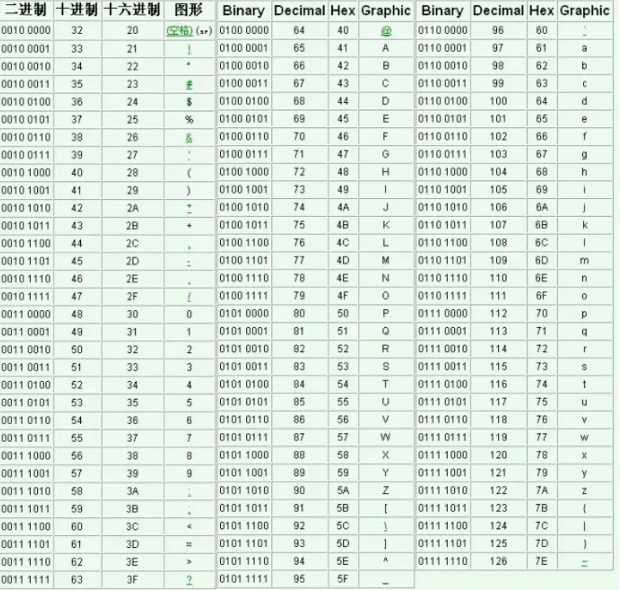

### 字符串

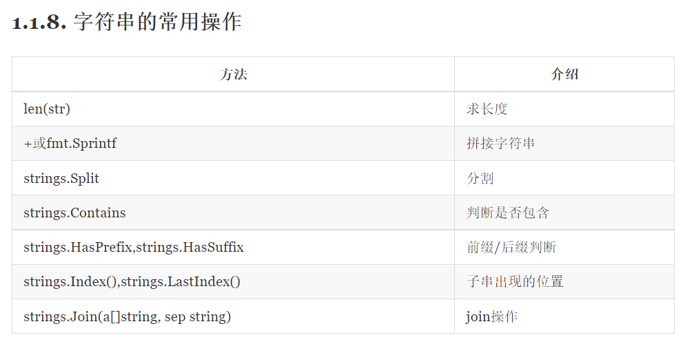

字符串可以这样比较

s1[i]==s2[i]

```plsql
strings包
字符串检索

strings.Contains(str,substr string) bool
判断字符串str是否包含子串substr

strings.ContainsAny(str,substr string) bool
判断字符串str是否包含子串substr中的任何一个字符

strings.Count(str,substr string) int
返回字符串str包含substr的个数

strings.HasPrefix(str,substr string) bool
判断str是否有前缀字符串substr

strings.HasSuffix(str,substr string) bool
判断str是否有后缀字符串substr

strings.Index(str,substr string) int
返回字符串substr首次在str中出现的位置

strings.IndexByte(str string,c byte) int
返回字符c首次在str中出现的位置

strings.LastIndex(str,substr string) int
返回字符串substr最后一次在str中出现的位置

strings.LastIndexByte(str string,c byte) int
返回字符c最后一次在str中出现的位置

字符串分割
strings.Fields(str string) []string
将字符串str以空白字符串分割，返回一个切片

strings.FieldsFunc(str string,f func(rune) bool) []string
将字符串str以满足f(r) == true的字符分割，返回一个切片

strings.Split(str string,sep string)[]string
将字符串str以sep字符串分割，返回一个切片

strings.SplitN(str string, sep string, n int) []string
将字符串str以sep字符串分割，分成n串，返回一个切片
strings.SplitN("a,b,c", ",", 2) //["a" "b,c"]

strings.SplitAfter(str,sep string)[]string
将字符串str以sep字符串分割,分割后最后附上sep，返回一个切片

strings.SplitAfterN(str,sep string,n int)[]string
将字符串str以sep字符串分割,分割后最后附上sep，返回一个切片,决定返回的切片数

大小写转换
strings.Title(str string) string
将字符串str每个单词首字母大学返回

strings.ToLower(str string) string
将字符串全部小写返回

strings.ToUpper(str string) string
将字符串全部大写返回

修建字符串
strings.Trim(str,cutset string)string
将字符串str首尾包含在cutset中的任一字符去掉返回

strings.TrimSpace(str string)string
将字符串str首尾的空白去掉返回

比较字符串
strings.Compare(str1,str2 string) int
按照字典序比较字符串大小
-1 str1 < str2
0  str1 == str2
1  str1 > str2

strings.Repeat(str string,n int) string
将字符串重复n次

strings.Replace(str,old,new string,n int) string
将字符串中的n个old字符串替换为new字符，当n小于0时，替换所有old

strings.Join(a []string,b string) string
将a中所有字符串连接成一个字符串，并以b作为分隔符
```

### Go 语言切片(Slice)

Go 语言切片是对数组的抽象。

Go 数组的长度不可改变，在特定场景中这样的集合就不太适用，Go 中提供了一种灵活，功能强悍的内置类型切片("动态数组")，与数组相比切片的长度是不固定的，可以追加元素，在追加时可能使切片的容量增大。

#### 定义切片

var nums[]int

切片不需要说明长度。

或使用 make() 函数来创建切片:

slice1 := make([]int, len)

也可以指定容量，其中 capacity 为可选参数。

make([]T, length, capacity)

这里 len 是数组的长度并且也是切片的初始长度。

#### 切片初始化

一个切片在未初始化之前默认为 nil，长度为 0

s :=[] int {1,2,3 } 

直接初始化切片，[] 表示是切片类型，{1,2,3} 初始化值依次是 1,2,3，其 cap=len=3。

s := arr[:] 

初始化切片 s，是数组 arr 的引用。

s := arr[startIndex:endIndex] 

将 arr 中从下标 startIndex 到 endIndex-1 下的元素创建为一个新的切片。

s := arr[startIndex:] 

默认 endIndex 时将表示一直到arr的最后一个元素。

s := arr[:endIndex] 

默认 startIndex 时将表示从 arr 的第一个元素开始。

s1 := s[startIndex:endIndex] 

通过切片 s 初始化切片 s1。

s :=make([]int,len,cap) 

#### 删除切片尾部：

a=[]int{1,2,3}

a=a[:len(a)-1]//删除尾部1个元素

a=a[:len(a)-N]//删除尾部N个元素

#### 删除开头的元素：

a=[]int{1,2,3}a=a[1:]//删除开头1个元素

a=a[N:]//删除开头N个元素

a=append(a[:0],a[1:]...)//删除开头1个元素

a=append(a[:0],a[N:]...)//删除开头N个元素

#### 删除中间的元素

a=[]int{1,2,3,...}

a=append(a[:i],a[i+1:]...)//删除中间1个元素

a=append(a[:i],a[i+N:]...)//删除中间N个元素

a=a[:i+copy(a[i:],a[i+1:])]//删除中间1个元素

a=a[:i+copy(a[i:],a[i+N:])]//删除中间N个元素


通过内置函数 **make()** 初始化切片**s**，**[]int** 标识为其元素类型为 int 的切片。

#### len() 和 cap() 函数

切片是可索引的，并且可以由 len() 方法获取长度。 

切片提供了计算容量的方法 cap() 可以测量切片最长可以达到多少。

#### append() 和 copy() 函数

拷贝切片的 copy 方法

向切片追加新元素的 append 方法。

  /* 允许追加空切片 */  numbers = append(numbers, 0)  printSlice(numbers)
  /* 向切片添加一个元素 */  numbers = append(numbers, 1)  printSlice(numbers)
  /* 同时添加多个元素 */  numbers = append(numbers, 2,3,4)  printSlice(numbers)
  /* 创建切片 numbers1 是之前切片的两倍容量*/  numbers1 := make([]int, len(numbers), (cap(numbers))*2)
  /* 拷贝 numbers 的内容到 numbers1 */  copy(numbers1,numbers)  printSlice(numbers1) 

测试一个slice是否是空的，使用len(s) == 0来判断，而不应该用s == nil来判断

### 二维数组

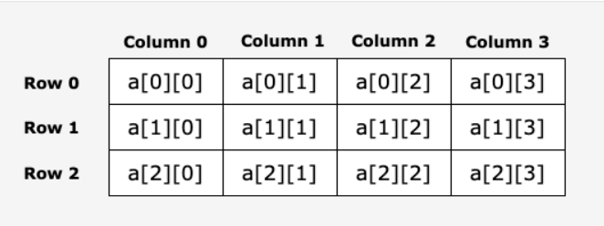

求二维数组行与列

row:= len(matrix)

Column := len(matrix[0])

声明

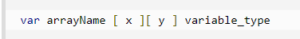

ariable_type 为 Go 语言的数据类型，arrayName 为数组名，二维数组可认为是一个表格，x 为行，y 为列

```go
//如果m,n是输入数或不确定数，用这种方法初始化固定长度的二维数组
//想要 [m][n]
dp := make([][]int, m)
for i := range dp {
    dp[i] = make([]int, n)
}
// 想要 [n][k+1][2]
dp := make([][][2]int, n)
for i := 0; i < n; i++ {
	dp[i] = make([][2]int, k+1)
}
```

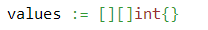

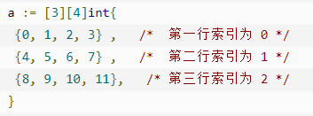

二维数组里加一维数组

```plsql
var res [][]int
var track []int
res = append(res, append([]int{}, track...))
```

### Go中 的类型转换

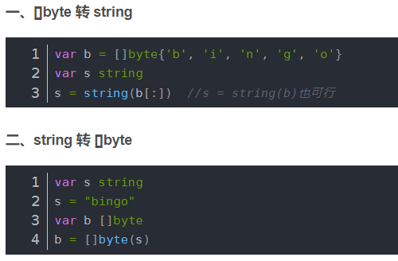


### 位运算

```go
func OnesCount(x uint) int 
计算二进制中1的个数
```

**A : 60 0011 1100**

**B:  13 0000 1101**

**&：有0为0**

| : **相或，有1为1，双0才0**  A| B : 0011 1101

^: **相异为1**  A^B: 0011 0001

<< : A<<2  **左移**两位 1111 0000 

\>>:  A>>2  **右移**两位  0000 1111

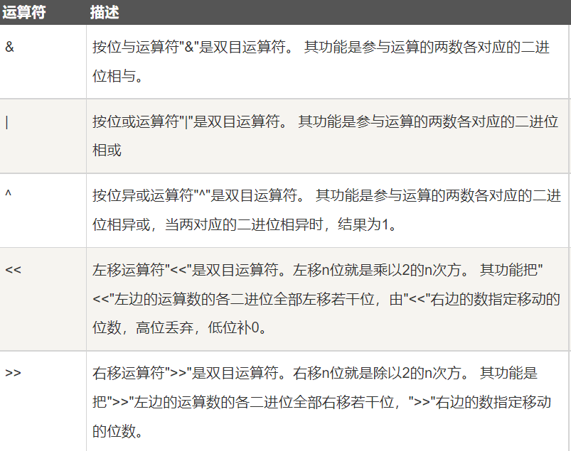

## 循环语句

### for

Go 语言的 For 循环有 3 种形式，只有其中的一种使用分号。


和 C 语言的 for 一样：

```go
for init; condition; post { }
和 C 的 while 一样：

for condition { }
和 C 的 for(;;) 一样：

for { }
```

for 循环的 range 格式可以对 slice、map、数组、字符串等进行迭代循环。格式如下：

```go
for key, value := range oldMap {
    newMap[key] = value
}
```

###  switch

```go
Go 编程语言中 switch 语句的语法如下：

func main() {
   /* 定义局部变量 */
   var grade string = "B"
   var marks int = 90

   switch marks {
      case 90: grade = "A"
      case 80: grade = "B"
      case 50,60,70 : grade = "C"
      default: grade = "D"  
   }

   switch {
      case grade == "A" :
         fmt.Printf("优秀!\n" )    
      case grade == "B", grade == "C" :
         fmt.Printf("良好\n" )      
      case grade == "D" :
         fmt.Printf("及格\n" )      
      case grade == "F":
         fmt.Printf("不及格\n" )
      default:
         fmt.Printf("差\n" );
   }
   fmt.Printf("你的等级是 %s\n", grade );      
}
```

### select 

是 Go 中的一个控制结构，类似于用于通信的 switch 语句。每个 case 必须是一个通信操作，要么是发送要么是接收。

select 随机执行一个可运行的 case。如果没有 case 可运行，它将阻塞，直到有 case 可运行。一个默认的子句应该总是可运行的。

```go
select {
    case communication clause  :
       statement(s);      
    case communication clause  :
       statement(s);
    /* 你可以定义任意数量的 case */
    default : /* 可选 */
       statement(s);
}
eg：

var c1, c2, c3 chan int
   var i1, i2 int
   select {
      case i1 = <-c1:
         fmt.Printf("received ", i1, " from c1\n")
      case c2 <- i2:
         fmt.Printf("sent ", i2, " to c2\n")
      case i3, ok := (<-c3):  // same as: i3, ok := <-c3
         if ok {
            fmt.Printf("received ", i3, " from c3\n")
         } else {
            fmt.Printf("c3 is closed\n")
         }
      default:
         fmt.Printf("no communication\n")
   }    
```

### goto 

```go
goto label;
..
.
label: statement;
```

## 排序相关

**sort函数的用法**

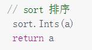

sort.Ints(x)//默认升序


fmt.Println(sort.IntsAreSorted(x))


sort.Sort(sort.Reverse(sort.IntSlice(x)))//降序


type IntSlice []int

 

func (s IntSlice) Len() int { return len(s) }

 

func (s IntSlice) Swap(i, j int){ s[i], s[j] = s[j], s[i] }

 

func (s IntSlice) Less(i, j int) bool { return s[i] < s[j] }


sort.Sort(IntSlice(nums))

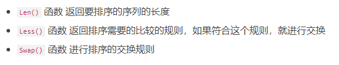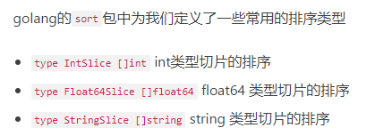

切片排序

​    //排序，实现比较方法即可

​    sort.Slice(ageList, func(i, j int) bool {

​        return ageList[i] < ageList[j]//排序依据：前者小于后者，即增序排列

​    })

## 二分查找

**sort.SearchInts(nums, target)**


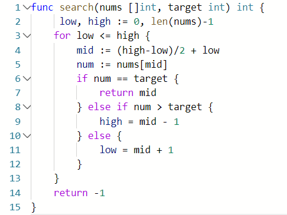

## 


## range用法

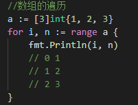

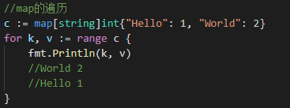

## 函数返回多个值

```go
func swap(x, y string) (string, string) {
   return y, x
}

func main() {
   a, b := swap("Google", "Runoob")
   fmt.Println(a, b)
}
```

# 数据结构

## 栈、队列

栈：后进先出（LIFO-last in first out）:最后插入的元素最先出来。

队列：先进先出（FIFO-first in first out）:最先插入的元素最先出来

简易版：

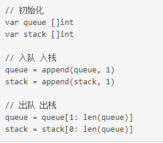

防止内存泄露版：

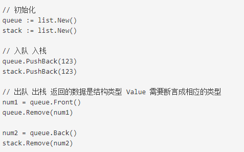

## 链表

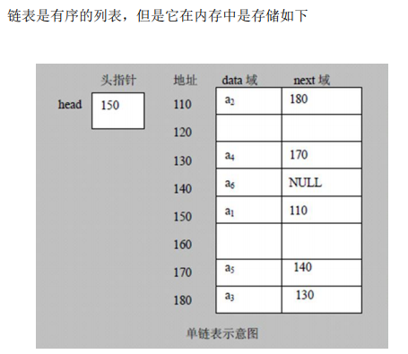

创建

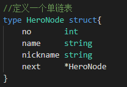


插入

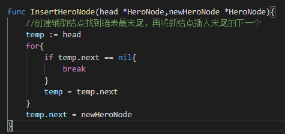

删除

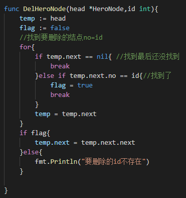

## 树

```go
//定义二叉树节点
type TreeNode struct {
	Val int
	Left *TreeNode
	Right *TreeNode
}
func main() {
	//创建一颗树
	root := &TreeNode{
  	Val: 6,
    Left: nil,
    Right: nil,
  }
}
//前序遍历二叉树
func preorderTraversal(root *TreeNode) []int {
    var res []int
    var preorder func(node *TreeNode)
	preorder = func(node *TreeNode) {
		if node == nil {
			return
		}
        res = append(res, node.Val)
		preorder(node.Left)
		preorder(node.Right)
	}
	preorder(root)
	return res
}
//中序遍历
func inorderTraversal(root *TreeNode) []int {
    var res []int
    var inorder func(node *TreeNode)
	inorder = func(node *TreeNode) {
		if node == nil {
			return
		}
		inorder(node.Left)
		res = append(res, node.Val)
		inorder(node.Right)
	}
	inorder(root)
	return res
}
//后序遍历
func postorderTraversal(root *TreeNode) []int {
    var res []int
    var postorder func(node *TreeNode)
	postorder = func(node *TreeNode) {
		if node == nil {
			return
		}
		postorder(node.Left)
		postorder(node.Right)
        res = append(res, node.Val)
	}
	postorder(root)
	return res
}
```

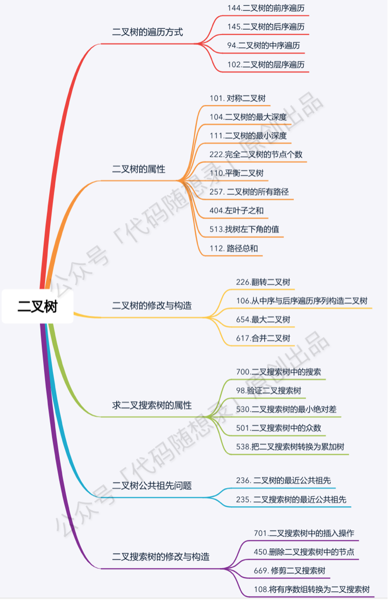

## 哈希表

哈希表是一种数据结构，它使用哈希函数组织数据，以支持快速插入和搜索。

哈希表的原理

哈希表的关键思想是使用哈希函数将键映射到存储桶。更确切地说，

当我们插入一个新的键时，哈希函数将决定该键应该分配到哪个桶中，并将该键存储在相应的桶中；当我们想要搜索一个键时，哈希表将使用相同的哈希函数来查找对应的桶，并只在特定的桶中进行搜索。

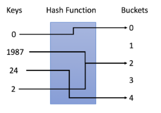

键、哈希函数、桶

理想情况下，完美的哈希函数将是键和桶之间的一对一映射。然而，在大多数情况下，哈希函数并不完美，它需要在桶的数量和桶的容量之间进行权衡。

### Map的用法

```go
内置的make函数可以创建一个map：
ages := make(map[string]int)
或
ages := map[string]int{
    "alice":   31,
    "charlie": 34,
}
或
ages := make(map[string]int)
ages["alice"] = 31
ages["charlie"] = 34


Map中的元素通过key对应的下标语法访问：
ages["alice"] = 32
fmt.Println(ages["alice"]) // "32"

使用内置的delete函数可以删除元素：
delete(ages, "alice") // remove element ages["alice"]

遍历map中全部的key/value
for name, age := range ages {
    fmt.Printf("%s\t%d\n", name, age)
}
```

### map的排序

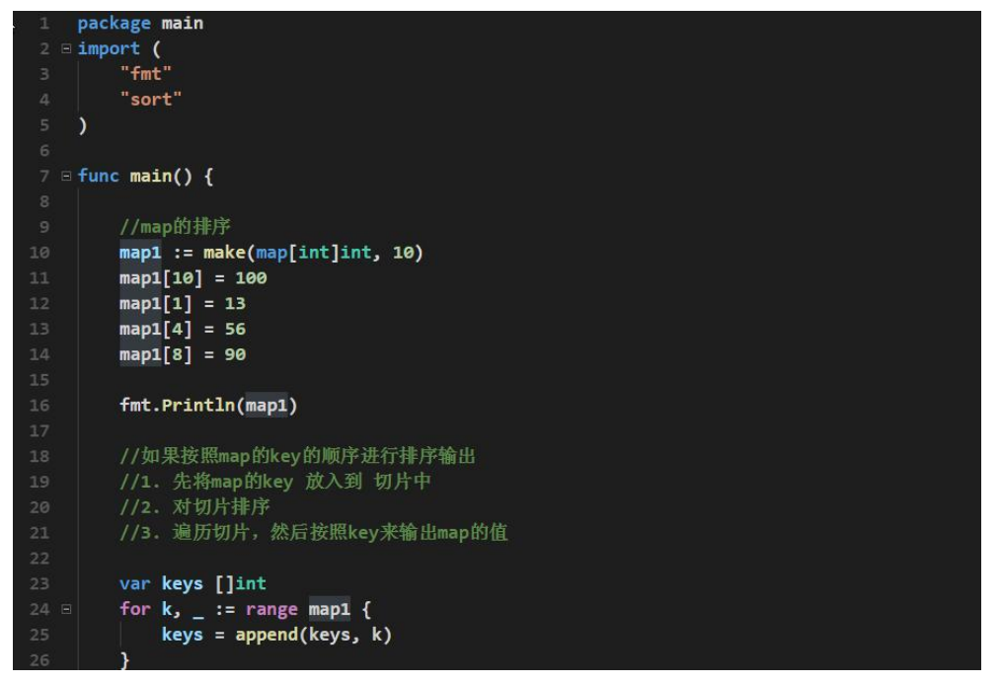


对map[string]int 排序 输出

```go
import "sort"
ages := map[string]int{
    "alice":   31,
    "charlie": 34,
}

var names []string
//创建一个新的字符串切片读取
for name := range ages {
    names = append(names, name)
}
//读取后排序
sort.Strings(names)
//再遍历输出
for _, name := range names {
    fmt.Printf("%s\t%d\n", name, ages[name])
}
```