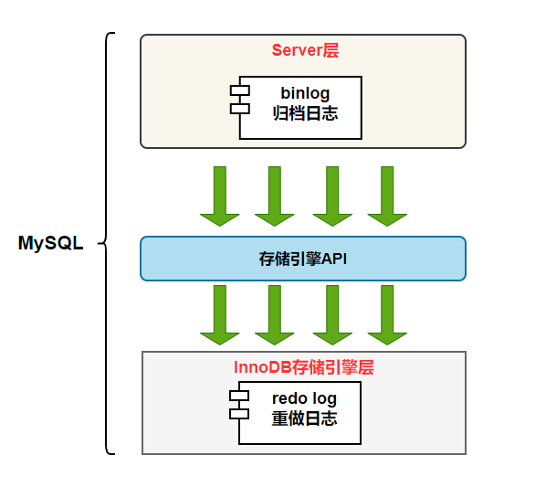
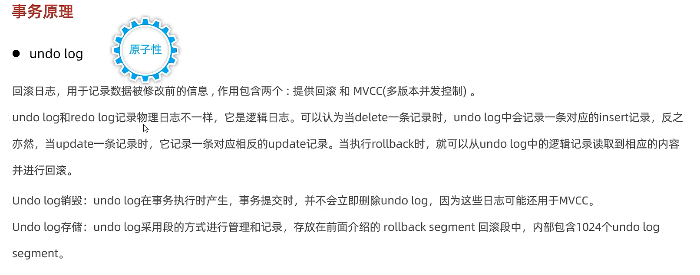
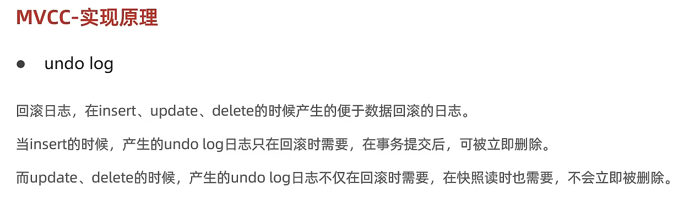

MySQL InnoDB 引擎使用 redo log(重做日志) 保证事务的持久性，使用 undo log(回滚日志) 来保证事务的原子性。

MySQL数据库的数据备份、主备、主主、主从都离不开binlog，需要依靠binlog来同步数据，保证数据一致性。

- [日志的种类](#日志的种类)
- [redo log](#redo-log)
  - [redo log与原理](#redo-log与原理)
  - [redo log 的刷盘策略](#redo-log-的刷盘策略)
- [binlog](#binlog)
  - [binlog概念](#binlog概念)
  - [binlog记录格式](#binlog记录格式)
  - [主从复制binlog格式有哪几种？有什么区别？](#主从复制binlog格式有哪几种有什么区别)
  - [MySQL的主从延迟](#mysql的主从延迟)
- [undo log](#undo-log)

# 日志的种类

MySQL 日志 主要包括错误日志、查询日志、慢查询日志、事务日志、二进制日志几大类。其中，比较重要的还要属二进制日志 binlog（归档日志）和事务日志 redo log（重做日志）和 undo log（回滚日志）。

# redo log 

## redo log与原理

redo log（重做日志）是InnoDB存储引擎独有的，是物理日志，记录内容是“在某个数据页上做了什么修改”，它让MySQL拥有了崩溃恢复能力。 

比如 MySQL 实例挂了或宕机了，重启时，InnoDB存储引擎会使用redo log恢复数据，保证数据的持久性与完整性。

MySQL 中数据是以页为单位，你查询一条记录，会从硬盘把一页的数据加载出来，加载出来的数据叫数据页，会放入到 Buffer Pool 中。

后续的查询都是先从 Buffer Pool 中找，没有命中再去硬盘加载，减少硬盘 IO 开销，提升性能。

更新表数据的时候，也是如此，发现 Buffer Pool 里存在要更新的数据，就直接在 Buffer Pool 里更新。

然后会把“在某个数据页上做了什么修改”记录到重做日志缓存（redo log buffer）里，接着刷盘到 redo log 文件里。

##  redo log 的刷盘策略

InnoDB 存储引擎为 redo log 的刷盘策略提供了 innodb_flush_log_at_trx_commit 参数，它支持三种策略：

- **0** ：设置为 0 的时候，表示每次事务提交时不进行刷盘操作
- **1** ：设置为 1 的时候，表示每次事务提交时都将进行刷盘操作（默认值）
- **2** ：设置为 2 的时候，表示每次事务提交时都只把 redo log buffer 内容写入 page cache

innodb_flush_log_at_trx_commit 参数默认为 1 ，也就是说当事务提交时会调用 fsync 对 redo log 进行刷盘

另外，InnoDB 存储引擎有一个后台线程，每隔1 秒，就会把 redo log buffer 中的内容写到文件系统缓存（page cache），然后调用 fsync 刷盘。
 

# binlog

## binlog概念

二进制日志、归档日志

binlog 是逻辑日志，记录内容是语句的原始逻辑，类似于“给 ID=2 这一行的 c 字段加 1”，属于MySQL Server 层。不管用什么存储引擎，只要发生了表数据更新，都会产生 binlog 日志。

MySQL数据库的**数据备份、主备、主主、主从**都离不开binlog，需要依靠binlog来同步数据，保证数据一致性。binlog会记录所有涉及更新数据的逻辑操作，并且是顺序写。

## binlog记录格式

binlog 日志有三种格式，可以通过binlog_format参数指定。

- **statement**
- **row**
- **mixed**

## 主从复制binlog格式有哪几种？有什么区别？

①STATEMENT，基于语句的日志记录，把所有写操作的sql语句写入 binlog （默认）

②ROW，基于行的日志记录，把每一行的改变写入binlog，假设一条sql语句影响100万行，从节点需要执行100万次，效率低。

优点：可以复制所有更改，这是最安全的复制形式。

③MIXED，混合模式，如果 sql 里有函数，自动切换到 ROW 模式，如果 sql 里没有会造成主从复制不一致的函数，那么就使用STATEMENT模式。（存在问题：解决不了系统变量问题，例如@@host name，主从的主机名不一致）

交叉连接（cross join）：显示两张表所有记录一一对应，没有匹配关系进行筛选，也被称为：笛卡尔积。

## MySQL的主从延迟

**主从同步延迟的原因**

一个服务器开放Ｎ个链接给客户端来连接的，这样有会有大并发的更新操作, 但是从服务器的里面读取binlog的线程仅有一个，当某个SQL在从服务器上执行的时间稍长或者由于某 个SQL要进行锁表就会导致，主服务器的SQL大量积压，未被同步到从服务器里。这就导致了主从不一致， 也就是主从延迟。

**常见优化方案：**

（1）业务可以接受，系统不优化；

（2）强制读主，高可用主库，用缓存提高读性能；

（3）在cache里记录哪些记录发生过写请求，来决定读主还是读从。

# undo log

提供回滚和MVCC

我们知道如果想要保证事务的原子性，就需要在异常发生时，对已经执行的操作进行**回滚**，在 MySQL 中，恢复机制是通过 **回滚日志（undo log）** 实现的，所有事务进行的修改都会先记录到这个回滚日志中，然后再执行相关的操作。如果执行过程中遇到异常的话，我们直接利用 **回滚日志** 中的信息将数据回滚到修改之前的样子即可！并且，回滚日志会先于数据持久化到磁盘上。这样就保证了即使遇到数据库突然宕机等情况，当用户再次启动数据库的时候，数据库还能够通过查询回滚日志来回滚将之前未完成的事务。

另外，MVCC 的实现依赖于：**隐藏字段、Read View、undo log**。在内部实现中，InnoDB 通过数据行的 DB_TRX_ID 和 Read View 来判断数据的可见性，如不可见，则通过数据行的 DB_ROLL_PTR 找到 undo log 中的历史版本。每个事务读到的数据版本可能是不一样的，在同一个事务中，用户只能看到该事务创建 Read View 之前已经提交的修改和该事务本身做的修改。

