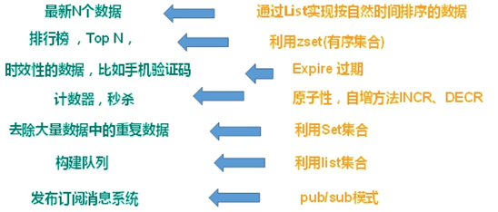

# NoSQL数据库

## 基本概念

NoSQL(NoSQL = Not Only SQL )，意即“不仅仅是SQL”，泛指非关系型的数据库

**NoSQL特点**

1.非关系型数据库，不依赖业务逻辑数据库存储，以简单key-value存储。增加了数据库的扩展能力，远超sql的性能。
2.不遵循SQL标准
3.不支持ACID

**适用于** 高并发读写、海量数据读写、数据可扩展

**不适用于** 事务存储、复杂数据库

**NoSQL优点**

1.缓存数据库，完全在内存中，速度快，数据结构简单

2.减少io操作，数据库和表拆分，虽然破坏业务逻辑，即外加一个缓存数据库，提高数据库速度，也可以用专门的存储方式，以及针对不同的数据结构存储

## 常见的NoSQL数据库

**Memcache**

数据都在内存中，一般不持久化，key-value模式，支持类型单一，一般是作为缓存数据库辅助持久化的数据库。

**Redis**

几乎覆盖了Memcached的绝大部分功能 。数据都在内存中，支持持久化，主要用作备份恢复 ，除了支持简单的key-value模式，还支持多种数据结构的存储，比如 list、set、hash、zset等，一般是作为缓存数据库辅助持久化的数据库。

**MongoDB**

高性能、开源、模式自由的文档型数据库。**主要解决海量数据的访问效率问题**。

数据都在内存中， 如果内存不足，把不常用的数据保存到硬盘，虽然是key-value模式，但是对value（尤其是json）提供了丰富的查询功能，支持二进制数据及大型对象。可以根据数据的特点替代RDBMS ，成为独立的数据库。或者配合RDBMS，存储特定的数据。

## Redis 和 Memcached 的区别和共同点

现在公司一般都是用 Redis 来实现缓存。

**共同点** ：

1. 都是基于内存的数据库，一般都用来当做缓存使用。
2. 都有过期策略。
3. 两者的性能都非常高。

**区别** ：

1. **Redis 支持更丰富的数据类型（支持更复杂的应用场景）**。Redis 不仅仅支持简单的 k/v 类型的数据，同时还提供 list，set，zset，hash 等数据结构的存储。Memcached 只支持最简单的 k/v 数据类型。
2. **Redis 支持数据的持久化，可以将内存中的数据保持在磁盘中，重启的时候可以再次加载进行使用,而 Memcached 把数据全部存在内存之中。**
3. **Redis 有灾难恢复机制。** 因为可以把缓存中的数据持久化到磁盘上。
4. **Redis 在服务器内存使用完之后，可以将不用的数据放到磁盘上。但是，Memcached 在服务器内存使用完之后，就会直接报异常。**
5. **Memcached 没有原生的集群模式，需要依靠客户端来实现往集群中分片写入数据；但是 Redis 目前是原生支持 cluster 模式的。**
6. **Memcached 是多线程，非阻塞 IO 复用的网络模型；Redis 使用单线程的多路 IO 复用模型。** （Redis 6.0 引入了多线程 IO ）
7. **Redis 支持发布订阅模型、Lua 脚本、事务等功能，而 Memcached 不支持。并且，Redis 支持更多的编程语言。**
8. **Memcached 过期数据的删除策略只用了惰性删除，而 Redis 同时使用了惰性删除与定期删除。**

# Redis概述

## Redis 简介

**Redis 是一个C 语言开发的内存数据库**，读写速度非常快，常用来做缓存。

另外，**Redis 除了做缓存之外，也经常用来做分布式锁，甚至是消息队列。**

**Redis 提供了多种数据类型来支持不同的业务场景。Redis 还支持事务 、持久化、Lua 脚本、多种集群方案。**

- Redis 是一个开源的 key-value 存储系统。
- 和 Memcached 类似，它支持存储的 value 类型相对更多，包括 string (字符串)、list (链表)、set (集合)、zset (sorted set –有序集合) 和 hash（哈希类型）。
- 这些数据类型都支持 push/pop、add/remove 及取交集并集和差集及更丰富的操作，而且这些操作都是原子性的。
- 在此基础上，Redis 支持各种不同方式的排序。
- 与 memcached 一样，为了保证效率，数据都是缓存在内存中。
- 区别的是 Redis 会周期性的把更新的数据写入磁盘或者把修改操作写入追加的记录文件。
- 并且在此基础上实现了 master-slave (主从) 同步。

**Redis 使用的是单线程 + 多路 IO 复用技术：**

所谓的多路io复用，定义如下：

1. 使用一个线程来检查多个文件描述符（Socket）的就绪状态（比如调用 select 和 poll 函数，传入多个文件描述符）
2. 如果有一个文件描述符就绪，则返回，否则阻塞直到超时。
3. 得到就绪状态后进行真正的操作可以在同一个线程里执行，也可以启动线程执行（比如使用线程池）

** 串行  vs  多线程 + 锁（memcached）  vs  **单线程 + 多路 IO 复用 (Redis)****（与 Memcache 三点不同：支持多数据类型，支持持久化，单线程 + 多路 IO 复用）

## 应用场景

分布式缓存主要解决的是单机缓存的容量受服务器限制并且无法保存通用信息的问题。因为，本地缓存只在当前服务里有效，比如如果你部署了两个相同的服务，他们两者之间的缓存数据是无法共同的。

配合关系型数据库做高速缓存

- 高频次，热门访问的数据，降低数据库 IO。
- 分布式架构，做 session 共享。

多样的数据结构存储持久化数据

# Redis数据类型

## 字符串

## List

## set

## Hash

## Zset

# 发布与订阅

# 事务、锁机制秒杀

# 持久化RDB

# 持久化AOF

# 主从复制

# 集群

# 应用问题

# 多线程

# 分布式缓存常见的技术选型方案有哪些？

**Memcached（很少有人使用）** 和 **Redis**。

# 

# 缓存数据的处理流程是怎样的？

简单来说就是:

1. 如果用户请求的数据在缓存中就直接返回。
2. 缓存中不存在的话就看数据库中是否存在。
3. 数据库中存在的话就更新缓存中的数据。
4. 数据库中不存在的话就返回空数据

# 为什么要用 Redis/为什么要用缓存？

简单，来说使用缓存主要是为了提升用户体验以及应对更多的用户。

下面我们主要从“高性能”和“高并发”这两点来看待这个问题。

**高性能** ：

对照上面 👆 我画的图。我们设想这样的场景：

假如用户第一次访问数据库中的某些数据的话，这个过程是比较慢，毕竟是从硬盘中读取的。但是，如果说，用户访问的数据属于高频数据并且不会经常改变的话，那么我们就可以很放心地将该用户访问的数据存在缓存中。

**这样有什么好处呢？** 那就是保证用户下一次再访问这些数据的时候就可以直接从缓存中获取了。操作缓存就是直接操作内存，所以速度相当快。

不过，要保持数据库和缓存中的数据的一致性。 如果数据库中的对应数据改变的之后，同步改变缓存中相应的数据即可！

**高并发：**

一般像 MySQL 这类的数据库的 QPS 大概都在 1w 左右（4 核 8g） ，但是使用 Redis 缓存之后很容易达到 10w+，甚至最高能达到 30w+（就单机 redis 的情况，redis 集群的话会更高）。

QPS（Query Per Second）：服务器每秒可以执行的查询次数；

由此可见，直接操作缓存能够承受的数据库请求数量是远远大于直接访问数据库的，所以我们可以考虑把数据库中的部分数据转移到缓存中去，这样用户的一部分请求会直接到缓存这里而不用经过数据库。进而，我们也就提高了系统整体的并发。

# Redis 除了做缓存，还能做什么？

- **分布式锁** ： 通过 Redis 来做分布式锁是一种比较常见的方式。通常情况下，我们都是基于 Redisson 来实现分布式锁。相关阅读：[《分布式锁中的王者方案 - Redisson》](https://gitee.com/link?target=https%3A%2F%2Fmp.weixin.qq.com%2Fs%2FCbnPRfvq4m1sqo2uKI6qQw)。
- **限流** ：一般是通过 Redis + Lua 脚本的方式来实现限流。相关阅读：[《我司用了 6 年的 Redis 分布式限流器，可以说是非常厉害了！》](https://gitee.com/link?target=https%3A%2F%2Fmp.weixin.qq.com%2Fs%2FkyFAWH3mVNJvurQDt4vchA)。
- **消息队列** ：Redis 自带的 list 数据结构可以作为一个简单的队列使用。Redis5.0 中增加的 Stream 类型的数据结构更加适合用来做消息队列。它比较类似于 Kafka，有主题和消费组的概念，支持消息持久化以及 ACK 机制。
- **复杂业务场景** ：通过 Redis 以及 Redis 扩展（比如 Redisson）提供的数据结构，我们可以很方便地完成很多复杂的业务场景比如通过 bitmap 统计活跃用户、通过 sorted set 维护排行榜。
- ......