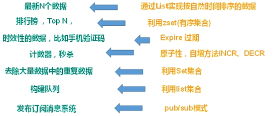

# 基本概念

## NoSQL
NoSQL(NoSQL = Not Only SQL )，意即“不仅仅是SQL”，泛指非关系型的数据库
**NoSQL特点**
1.非关系型数据库，不依赖业务逻辑数据库存储，以简单key-value存储。增加了数据库的扩展能力，远超sql的性能。
2.不遵循SQL标准
3.不支持ACID
**适用于** 高并发读写、海量数据读写、数据可扩展
**不适用于** 事务存储、复杂数据库

**NoSQL优点**

1.缓存数据库，完全在内存中，速度快，数据结构简单

2.减少io操作，数据库和表拆分，虽然破坏业务逻辑，即外加一个缓存数据库，提高数据库速度，也可以用专门的存储方式，以及针对不同的数据结构存储

## 常见的NoSQL数据库

**Memcache**

数据都在内存中，一般不持久化，key-value模式，支持类型单一，一般是作为缓存数据库辅助持久化的数据库。

**Redis**

几乎覆盖了Memcached的绝大部分功能 。数据都在内存中，支持持久化，主要用作备份恢复 ，除了支持简单的key-value模式，还支持多种数据结构的存储，比如 list、set、hash、zset等，一般是作为缓存数据库辅助持久化的数据库。

**MongoDB**

高性能、开源、模式自由的文档型数据库。**主要解决海量数据的访问效率问题**。

数据都在内存中， 如果内存不足，把不常用的数据保存到硬盘，虽然是key-value模式，但是对value（尤其是json）提供了丰富的查询功能，支持二进制数据及大型对象。可以根据数据的特点替代RDBMS ，成为独立的数据库。或者配合RDBMS，存储特定的数据。

## Redis 和 Memcached 的区别和共同点

现在公司一般都是用 Redis 来实现缓存。

**共同点** ：

1. 都是基于内存的数据库，一般都用来当做缓存使用。
2. 都有过期策略。
3. 两者的性能都非常高。

**区别** ：

1. **Redis 支持更丰富的数据类型（支持更复杂的应用场景）**。Redis 不仅仅支持简单的 k/v 类型的数据，同时还提供 list，set，zset，hash 等数据结构的存储。Memcached 只支持最简单的 k/v 数据类型。
2. **Redis 支持数据的持久化，可以将内存中的数据保持在磁盘中，重启的时候可以再次加载进行使用,而 Memcached 把数据全部存在内存之中。**
3. **Redis 有灾难恢复机制。** 因为可以把缓存中的数据持久化到磁盘上。
4. **Redis 在服务器内存使用完之后，可以将不用的数据放到磁盘上。但是，Memcached 在服务器内存使用完之后，就会直接报异常。**
5. **Memcached 没有原生的集群模式，需要依靠客户端来实现往集群中分片写入数据；但是 Redis 目前是原生支持 cluster 模式的。**
6. **Memcached 是多线程，非阻塞 IO 复用的网络模型；Redis 使用单线程的多路 IO 复用模型。** （Redis 6.0 引入了多线程 IO ）
7. **Redis 支持发布订阅模型、Lua 脚本、事务等功能，而 Memcached 不支持。并且，Redis 支持更多的编程语言。**
8. **Memcached 过期数据的删除策略只用了惰性删除，而 Redis 同时使用了惰性删除与定期删除。**

## 什么情况下使用redis
1. 针对热点数据进行缓存
2. 对于特定限时数据的存放
3. 针对带热点权值数据的排序list
4. 分布式锁
## redis与memcache的区别
1. redis处理网络请求采用单线程模型，而memcache采用多线程异步IO的方式
2. redis支持数据持久化，memcache不支持
3. redis支持的数据格式比memcache更多

## Redis 简介

**Redis 是一个C 语言开发的内存数据库**，读写速度非常快，常用来做缓存。

另外，**Redis 除了做缓存之外，也经常用来做分布式锁，甚至是消息队列。**

**Redis 提供了多种数据类型来支持不同的业务场景。Redis 还支持事务 、持久化、Lua 脚本、多种集群方案。**

- Redis 是一个开源的 key-value 存储系统。
- 和 Memcached 类似，它支持存储的 value 类型相对更多，包括 string (字符串)、list (链表)、set (集合)、zset (sorted set –有序集合) 和 hash（哈希类型）。
- 这些数据类型都支持 push/pop、add/remove 及取交集并集和差集及更丰富的操作，而且这些操作都是原子性的。
- 在此基础上，Redis 支持各种不同方式的排序。
- 与 memcached 一样，为了保证效率，数据都是缓存在内存中。
- 区别的是 Redis 会周期性的把更新的数据写入磁盘或者把修改操作写入追加的记录文件。
- 并且在此基础上实现了 master-slave (主从) 同步。

## Redis快的原因
1. redis是基于内存的数据库，内存数据读取存储效率远高于硬盘型
2. redis采用多路复用技术通过采用epoll的非阻塞IO，提升了效率

**Redis 使用的是单线程 + 多路 IO 复用技术：**

所谓的多路io复用，定义如下：

1. 使用一个线程来检查多个文件描述符（Socket）的就绪状态（比如调用 select 和 poll 函数，传入多个文件描述符）
2. 如果有一个文件描述符就绪，则返回，否则阻塞直到超时。
3. 得到就绪状态后进行真正的操作可以在同一个线程里执行，也可以启动线程执行（比如使用线程池）

** 串行  vs  多线程 + 锁（memcached）  vs  **单线程 + 多路 IO 复用 (Redis)****（与 Memcache 三点不同：支持多数据类型，支持持久化，单线程 + 多路 IO 复用）

## 应用场景

分布式缓存主要解决的是单机缓存的容量受服务器限制并且无法保存通用信息的问题。因为，本地缓存只在当前服务里有效，比如如果你部署了两个相同的服务，他们两者之间的缓存数据是无法共同的。

配合关系型数据库做高速缓存

- 高频次，热门访问的数据，降低数据库 IO。
- 分布式架构，做 session 共享。

多样的数据结构存储持久化数据

# 数据类型
## Redis数据类型
String：字符串类型，最简单的类型
Hash：类似于Map的一种结构。
List：有序列表。
Set: 无序集合。
ZSet：带权值的无序集合，即每个ZSet元素还另有一个数字代表权值，集合通过权值进行排序。
## Redis基本数据类型实现原理
字符串：采用类似数组的形式存储
list：采用双向链表进行具体实现
hash:采用hashtable或者ziplist进行具体实现
集合：采用intset或hashtable存储
有序集合：采用ziplist或skiplist+hashtable实现

# 持久化
## 简述Redis的RDB
RDB即将当前数据生成快照，并保存于硬盘中。可以通过手动命令，也可以设置自动触发。
## 简述Redis的save命令
save命令是redis手动触发RDB过程的命令。使用该命令后，服务器阻塞，直到RDB过程完成后终止。
该过程占用内存较多。
## 简述Redis的bgsave命令
bgsave命令不阻塞主进程（严格意义上也不是完全不阻塞，详看下面过程），该命令fork一个子进程用
于执行RDB过程。其具体过程为：
1. 判断此时有没有子进程用于RDB，有的话直接返回。
2. redis进行fork子进程过程，此时父进程处于阻塞状态。
3. 子进程创建RDB文件，完成后返回给父进程
## 简述Redis自动触发RDB机制
1. 通过配置文件，设置一定时间后自动执行RDB
2. 如采用主从复制过程，会自动执行RDB
3. Redis执行shutdown时，在未开启AOF后会执行RDB
## 简述Redis的AOF
AOF通过日志，对数据的写入修改操作进行记录。这种持久化方式实时性更好。通过配置文件打开
AOF。
## 简述AOF的持久化策略
1. always。每执行一次数据修改命令就将其命令写入到磁盘日志文件上。
2. everysec。每秒将命令写入到磁盘日志文件上。
3. no。不主动设置，由操作系统决定什么时候写入到磁盘日志文件上。
## 简述AOF的重写
随着客户端不断进行操作，AOF对应的文件也越来越大。redis提供了bgrewriteaof函数，针对目前数据
库中数据，在不读取原有AOF文件的基础上，重写了一个新的AOF文件，减少文件大小。
## RDB与AOF优缺点比较
AOF占用的文件体积比RDB大。一般来说利用AOF备份对系统的消耗比RDB低。对于备份时出现系统故
障，RDB数据可能会全丢，但AOF只会损失一部分。
RDB恢复速度比AOF低。

# 缓存相关

## 缓存穿透、缓存雪崩、缓存击穿

**缓存穿透**

缓存穿透指缓存和数据库均没有需要查询的数据，攻击者不断发送这种请求，造成数据库短时间内承受大量请求而崩掉。

**穿透的解决方法**

1. 接口层增加校验，如用户鉴权校验，id做基础校验，id<=0的直接拦截; 
2. 从缓存取不到的数据，在数据库中也没有取到，这时也可以将key-value对写为key-null，缓存有 效时间可以设置短点，如30秒(设置太长会导致正常情况也没法使用)。这样可以防止攻击用户 反复用同一个id暴力攻击；
3. 采用布隆过滤器，将所有可能存在的数据哈希到一个足够大的 bitmap 中，一个一定不存在的数据 会被这个 bitmap 拦截掉，从而避免了对底层存储系统的查询压力。

**缓存雪崩**

缓存雪崩指缓存中一大批数据到过期时间，而从缓存中删除。但该批数据查询数据量巨大，查询全部走数据库，造成数据库压力过大而崩掉。

**雪崩的解决方法**

1. 缓存数据设置随机过期时间，防止同一时间大量数据过期。
2. 设置热点数据永远不过期。
3. 对于集群部署的情况，将热点数据均与分布在不同缓存中。
     给每一个缓存数据增加相应的缓存标记，记录缓存是否失效，如果缓存标记失效，则更新数据缓存。
     缓存预热
     互斥锁

**缓存击穿**

缓存击穿指缓存中没有数据，但数据库中有该数据。一般这种情况指特定数据的缓存时间到期，但由于并发用户访问该数据特别多，因此去数据库去取数据，引起数据库访问压力过大。

和缓存雪崩不同的是，缓存击穿指并发查同一条数据，缓存雪崩是不同数据都过期了，很多数据都查不到从而查数据库。

**解决方案**

1. 设置热点数据永远不过期。

2. 加互斥锁

## Redis淘汰机制
1. noeviction：默认禁止驱逐数据。内存不够使用时，对申请内存的命令报错。
2. volatile-lru：从设置了过期时间的数据集中淘汰最近没使用的数据。
3. volatile-ttl：从设置了过期时间的数据集中淘汰即将要过期的数据。
4. volatile-random：从设置了过期时间的数据中随机淘汰数据。
5. allkeys-lru：淘汰最近没使用的数据。
6. allkeys-random：随机淘汰数据。

## Redis过期策略
1. 定期删除，redis默认是每100ms就随机抽取一些设置了过期时间的key，并检查其是否过期，如果
过期就删除。因此该删除策略并不会删除所有的过期key。
2. 惰性删除，在客户端需要获取某个key时，redis将首先进行检查，若该key设置了过期时间并已经过
期就会删除。
实际上redis结合上述两种手段结合起来，保证删除过期的key。

# 线程模型

## Redis单线程原理
首先必须明确，Redis单线程指的是网络请求模块使用了一个线程，其他模块仍用了多个线程。并不
是一个线程完成了所有功能。
原理上，其采用了利用epoll的多路复用特性，因此可以采用单线程处理其网络请求。

**Redis 使用的是单线程 + 多路 IO 复用技术：**

所谓的多路io复用，定义如下：

1. 使用一个线程来检查多个文件描述符（Socket）的就绪状态（比如调用 select 和 poll 函数，传入多个文件描述符）
2. 如果有一个文件描述符就绪，则返回，否则阻塞直到超时。
3. 得到就绪状态后进行真正的操作可以在同一个线程里执行，也可以启动线程执行（比如使用线程池）

** 串行  vs  多线程 + 锁（memcached）  vs  **单线程 + 多路 IO 复用 (Redis)****（与 Memcache 三点不同：支持多数据类型，支持持久化，单线程 + 多路 IO 复用）

# 集群

## Redis有哪些集群部署方式
1. 主从复制
2. 哨兵模式
3. Cluster集群模式
## 简述主从复制模式
在主从复制中，有主库（Master）节点和从库（Slave）节点两个角色。
从节点服务启动会连接主库，并向主库发送SYNC命令。
主节点收到同步命令，启动持久化工作，工作执行完成后，主节点将传送整个数据库文件到从库，从节
点接收到数据库文件数据之后将数据进行加载。此后，主节点继续将所有已经收集到的修改命令，和新
的修改命令依次传送给从节点，从节点依次执行，从而达到最终的数据同步。
通过这种方式，可以使写操作作用于主库，而读操作作用于从库，从而达到读写分离。
## 简述哨兵模式
哨兵模式监控redis集群中Master的工作的状态。在Master主服务器宕机时，从slave中选择新机器当作
master，保证系统高可用。
每个哨兵每10秒向主服务器，slave和其他哨兵发送ping。
客户端通过哨兵，由哨兵提供可供服务的redis master节点。
哨兵只需要配master节点，会自动寻找其对应的slave节点。
监控同一master节点的哨兵会自动互联，组成哨兵网络，当任一哨兵发现master连接不上，即开会投
票，投票半数以上决定Master下线，并从slave节点中选取master节点。
## cluster集群
cluster提出了虚拟槽的概念。
1. redis cluster默认有16384个槽，在集群搭建的时候，需要给节点分配哈希槽尽可能相同数量虚拟
槽。
2. 如果目前redis执行set操作，redis先对这个key经过CRC16 hash运算，并把结果对16384取余，得
到槽编号。
3. 根据槽编号，寻找到其对应的redis节点，在节点上执行hash命令。
4. 如果此时执行get操作，节点先验证该key对应的槽编号是不是归本节点管，如果是则保存数据。如
果不是，则发送正确节点编号给客户端。

