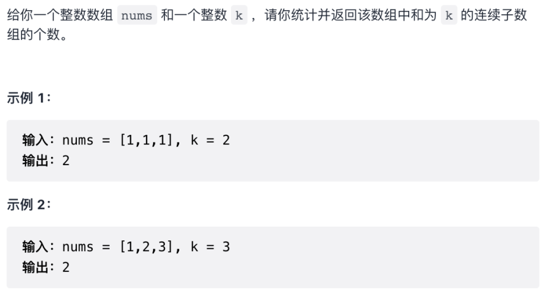
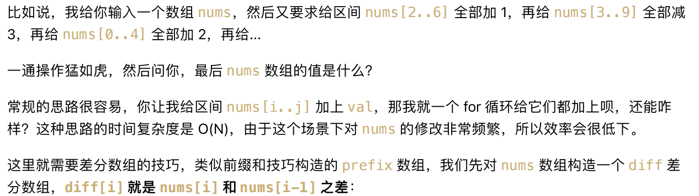
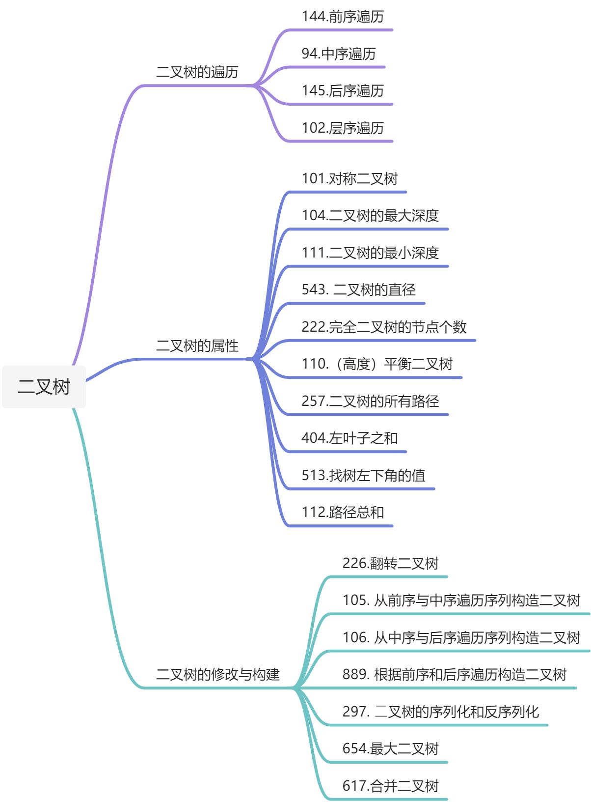
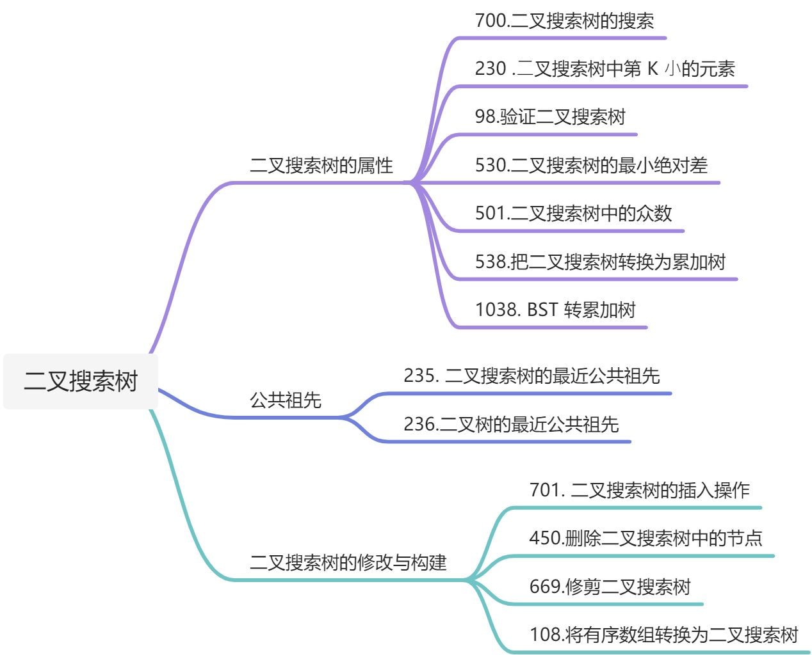
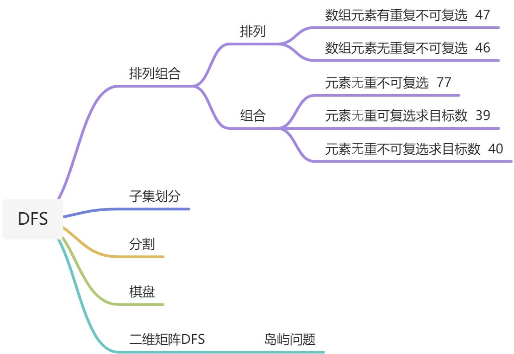
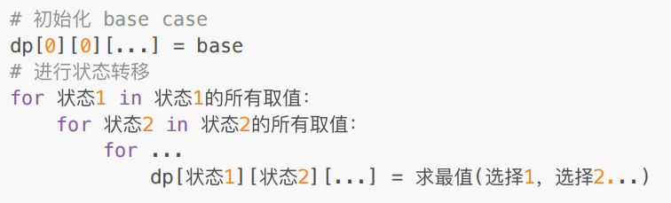

# 数组
## 前缀和

\303. 区域和检索 - 数组不可变（中等） 
\304. ⼆维区域和检索 - 矩阵不可变（中等） 
\560. 和为K的⼦数组（中等） 

**前缀和主要适⽤的场景是原始数组不会被修改的情况下，频繁查询某个区间的累加和的情况。**

要计算一个数组（i，j）之间的总和，例如nums := []int{3,5,2,-2,4,1}, 常规思路是，从第i个数加到第j个数，计算总和。但是如果需要反复调用计算，那每次查询的时间复杂度为O(N). 前缀和的核⼼思路是我们 new ⼀个新的数组 preSum 出来，preSum[i] 记录 nums[0..i-1] 的累加和：如求（2，5）则preSum[6]-preSum[2], 时间复杂度O(1).


**和为 k 的⼦数组**



**方法一：先计算数组前缀和，穷举所有子数组，找出符合条件个数；**时间复杂度 O(N^2) 空间复杂度 O(N)，并不是最优的解法。

**方法二：直接记录下有⼏个** **preSum[j]** **和** **preSum[i] - k** **相等，直接更新结果，就避免了内层** 

**的 for 循环。我们可以⽤哈希表**，在记录前缀和的同时记录该前缀和出现的次数。

## 差分数组

\370. 区间加法（中等） 

\1109. 航班预订统计（中等） 

\1094. 拼⻋（中等） 

**差分数组的主要适⽤场景是频繁对原始数组的某个区间的元素进⾏增减。** 



```go
//构造差分数组
diff := make([]int,len(nums))
diff[0] = nums[0]
for i:=1;i<len(nums);i++{
    diff[i] = nums[i] - nums[i-1]
}
//一顿操作，对区间内加加减减
//对nums[i...j]之间加3，只要在差分数组diff[i]+=3,diff[j+1]-=3 注意j+1超出界限问题，j+1超界限，不减
//操作完了把diff数组还原

resnum := make([]int,len(diff))
resnum[0] = diff[0]
for i:=0;i<len(diff);i++{
    resnum[i] = resnum[i-1] +diff[i]
}
```


## 二分查找

二分查找的前提是数组有序，难点在于定四个区间点。

```java
public int BinarySearch(int[] nums,int target){
   	 int high = nums.length - 1;
   	 int low = 0;
     while(low <= high){
       int mid = (high - low)/2 + low;
       if(nums[mid] == target){
         //找到了
         return mid;
       }else if(nums[mid] > target ){
         //大于目标值，找左区间
         high = mid - 1;
       }else{
         //小于目标值，找右区间
         low = mid + 1;
       }
     }
    //没找到
    return -1;
}
```

## 滑动窗口

时间复杂度: O(N)
```JAVA
/* 滑动窗口算法框架 */
void slidingWindow(string s) {
    HashMap<char, int> window = new HashMap<>();
    
    int left = 0, right = 0;
    while (right < s.length() {
        // c 是将移入窗口的字符
	    char c = s.charAt(right);
        // 增大窗口
        right++;
        // 进行窗口内数据的一系列更新
        ...

        /*** debug 输出的位置 ***/
        printf("window: [%d, %d)\n", left, right);
        /********************/
        
        // 判断左侧窗口是否要收缩
        while (window needs shrink) {
            // d 是将移出窗口的字符
            char d = s.charAt(left);
            // 缩小窗口
            left++;
            // 进行窗口内数据的一系列更新
            ...
        }
    }
}

```
**其中两处 `...` 表示的更新窗口数据的地方，直接往里面填就行了**。
而且，这两个 `...` 处的操作分别是扩大和缩小窗口的更新操作，它们操作是完全对称的。


# 队列/栈

## 括号题

## LUR

# 双指针

**数组双指针**

**26. 删除有序数组中的重复项** 

**83. 删除排序链表中的重复元素**

**27. 移除元素**

**283. 移动零**

**167. 两数之和 II - 输⼊有序数组** 

**344. 反转字符串**

**5. 最长回文子串**

**链表双指针**

1. **合并两个有序链表** 

双指针分别指向两个链表表头，比较P1,P2,把较小的接到新链表，移动指针，继续比较；这个算法的逻辑类似于「拉拉链」，l1, l2 类似于拉链两侧的锯⻮，指针 p 就好像拉链的拉索，将两个有序链表合并。 

1. **合并K个升序链表**

合并 k 个有序链表的逻辑类似合并两个有序链表，难点在于，如何快速得到 k 个节点中的最⼩节点，接到结 

果链表上？ 用优先级队列（⼆叉堆），把链表节点放⼊⼀个最⼩堆，就可以每次获得 k 个节点中的最⼩节点。

1. **环形链表**
2. **环形链表 II**
3. **链表的中间结点**
4. **删除链表的倒数第 N 个结点**
5. **相交链表**

# 字符串

# 树

## 二叉树

⼆叉树题⽬的难点在于如何通过题⽬的要求思考出每⼀个节点需要做什么。



**二叉树的遍历方式：** 

**深度优先遍历**：想往深走，遇到叶节点再往回走。前中后指的是中间节点的位置。

1. 1. 前序遍历（递归法，迭代法）中左右    计算二叉树的深度
   2. 中序遍历（递归法，迭代法）左中右
   3. 后序遍历（递归法，迭代法）左右中    计算二叉树的高度

**广度优先遍历**：从左到右一层一层的去遍历二叉树。

- - 层次遍历（迭代法）

```java
// 前序遍历·递归·LC144_二叉树的前序遍历
class Solution {
    public List<Integer> preorderTraversal(TreeNode root) {
        List<Integer> result = new ArrayList<Integer>();
        preorder(root, result);
        return result;
    }

    public void preorder(TreeNode root, List<Integer> result) {
        if (root == null) {
            return;
        }
        result.add(root.val);
        preorder(root.left, result);
        preorder(root.right, result);
    }
}
// 中序遍历·递归·LC94_二叉树的中序遍历
class Solution {
    public List<Integer> inorderTraversal(TreeNode root) {
        List<Integer> res = new ArrayList<>();
        inorder(root, res);
        return res;
    }

    void inorder(TreeNode root, List<Integer> list) {
        if (root == null) {
            return;
        }
        inorder(root.left, list);
        list.add(root.val);             // 注意这一句
        inorder(root.right, list);
    }
}
// 后序遍历·递归·LC145_二叉树的后序遍历
class Solution {
    public List<Integer> postorderTraversal(TreeNode root) {
        List<Integer> res = new ArrayList<>();
        postorder(root, res);
        return res;
    }

    void postorder(TreeNode root, List<Integer> list) {
        if (root == null) {
            return;
        }
        postorder(root.left, list);
        postorder(root.right, list);
        list.add(root.val);             // 注意这一句
    }
}

// 102.二叉树的层序遍历
class Solution {
    public List<List<Integer>> resList = new ArrayList<List<Integer>>();

    public List<List<Integer>> levelOrder(TreeNode root) {
        //checkFun01(root,0);
        checkFun02(root);

        return resList;
    }

    //DFS--递归方式
    public void checkFun01(TreeNode node, Integer deep) {
        if (node == null) return;
        deep++;

        if (resList.size() < deep) {
            //当层级增加时，list的Item也增加，利用list的索引值进行层级界定
            List<Integer> item = new ArrayList<Integer>();
            resList.add(item);
        }
        resList.get(deep - 1).add(node.val);

        checkFun01(node.left, deep);
        checkFun01(node.right, deep);
    }

    //BFS--迭代方式--借助队列
    public void checkFun02(TreeNode node) {
        if (node == null) return;
        Queue<TreeNode> que = new LinkedList<TreeNode>();
        que.offer(node);

        while (!que.isEmpty()) {
            List<Integer> itemList = new ArrayList<Integer>();
            int len = que.size();

            while (len > 0) {
                TreeNode tmpNode = que.poll();
                itemList.add(tmpNode.val);

                if (tmpNode.left != null) que.offer(tmpNode.left);
                if (tmpNode.right != null) que.offer(tmpNode.right);
                len--;
            }

            resList.add(itemList);
        }

    }
}
```


## 二叉树的序列化
297. 二叉树的序列化与反序列化
```java
public class _297_SerializeAndDeserialize {  
  
    String SEP = ",";  
    String NUL = "null";  
  
    // Encodes a tree to a single string.  
    public String serialize(TreeNode root) {  
        StringBuffer sb = new StringBuffer();  
        traverse(root,sb);  
        return sb.toString();  
    }  
  
    /**  
     * 前序遍历序列化  
     * @param node  
     * @param sb 字符串拼接  
     */  
    public void traverse(TreeNode node,StringBuffer sb){  
        if (node == null){  
            sb.append(NUL).append(SEP);  
            return;        }  
        // 前序遍历  
        sb.append(node.val).append(SEP);  
        traverse(node.left,sb);  
        traverse(node.right,sb);  
    }  
  
    // Decodes your encoded data to tree.  
    public TreeNode deserialize(String data) {  
        LinkedList<String> nodes = new LinkedList<>();  
        // 去除逗号  
        for (String s: data.split(SEP)) {  
            nodes.addLast(s);  
        }  
        return deserialize(nodes);  
    }  
    //通过nodes构造二叉树  
    private TreeNode deserialize(LinkedList<String> nodes){  
        if (nodes.isEmpty()){  
            return null;  
        }  
        // 前序遍历第一个就是根节点  
        String first = nodes.removeFirst();  
        if (first.equals(NUL)){  
            return null;  
        }  
        TreeNode root = new TreeNode(Integer.parseInt(first));  
        root.left = deserialize(nodes);  
        root.right = deserialize(nodes);  
        return root;  
    }  
  
    public static void main(String[] args) {  
        _297_SerializeAndDeserialize codec = new _297_SerializeAndDeserialize();  
        TreeNode root = new TreeNode(1);  
        codec.deserialize(codec.serialize(root));  
    }  
}

```


## 二叉搜索树

**二叉搜索树是⼀个有序树**：（中序遍历结果是有序的）

- 若它的左⼦树不空，则左⼦树上所有结点的值均⼩于它的根结点的值； 
- 若它的右⼦树不空，则右⼦树上所有结点的值均⼤于它的根结点的值； 
- 它的左、右⼦树也分别为⼆叉排序树。

**平衡二叉搜索树** 

平衡⼆叉搜索树：⼜被称为AVL（Adelson-Velsky and Landis）树，且具有以下性质：它是⼀棵空树或 

它的左右两个⼦树的⾼度差的绝对值不超过1，并且左右两个⼦树都是⼀棵平衡⼆叉树。



# 图

## 图的基础

图的本质是高级多叉树，适用于树的DFS/BFS遍历算法，常用邻接表和邻接矩阵来实现。


```java
//图节点的逻辑结构
class Vertex{
  int id；
  Vertrx[] neighbors;
}
//⽤邻接表和邻接矩阵的存储⽅式如下：
// 邻接表: 空间占用少；无法快速判断两个节点是否相邻；
// graph[x] 存储 x 的所有邻居节点 
List<Integer>[] graph;
//邻接矩阵: 更多的存储空间；可以快速判断两个节点是否相邻；
//matrix[x][y] 记录 x 是否有⼀条指向 y 的边
//如果是有向加权图则用int型
boolean[][] matrix;
```

**遍历有向无环图：**

```java
class Solution {
    //记录所有路径
    List<List<Integer>> res = new LinkedList<>();

    public List<List<Integer>> allPathsSourceTarget(int[][] graph) {
        //维护递归过程中经过的路径
        LinkedList<Integer> path = new LinkedList<>();
        traverse(graph, 0, path);
        return res;
    }

    //图的遍历框架
    void traverse(int[][] graph, int s, LinkedList<Integer> path){
        //添加节点s到路径
        path.addLast(s);

        int n = graph.length;
        if(s == n-1 ){
            res.add(new LinkedList<>(path));
            path.removeLast();
            return;
        }
        //递归每个相邻节点
        for(int v : graph[s]){
            traverse(graph, v, path);
        }
        //从路径移出节点s
        path.removeLast();

    }
}
```


## 拓扑排列


## 二分图判定

## Union-Find(并查集) 


## 最小生成树


# 回溯算法

回溯算法其实就是我们常说的 DFS 算法，本质上就是⼀种暴⼒穷举算法。 解决⼀个回溯问题，实际上就是⼀个决策树的遍历过程，需要思考 3 个问题： 

1、路径：也就是已经做出的选择。 

2、选择列表：也就是你当前可以做的选择。 

3、结束条件：也就是到达决策树底层，⽆法再做选择的条件。

```go
func backtrack(nums []int, start int, target int) {
    //结束条件
    if trackSum == target {
        res = append(res, append([]int{}, track...))
        return
    }
    if trackSum > target {
        return
    }
    for i := start; i < len(nums); i++ {
        //剪枝
        if i > start && nums[i] == nums[i-1] {
            continue
        }
        //做选择
        track = append(track, nums[i])
        trackSum += nums[i]
        //递归
        backtrack(nums, i+1, target)
        //撤销选择
        track = track[:len(track)-1]
        trackSum -= nums[i]
    }
}

```





# 贪心算法


# 动态规划
⾸先，**动态规划问题的⼀般形式就是求最值**。**求解动态规划的核⼼问题是穷举**。因为要求最值，肯定要把所有可⾏的答案穷举出来，然后在其中找最值呗。 

⾸先，动态规划的穷举有点特别，因为这类问题存在「**重叠⼦问题**」，如果暴⼒穷举的话效率会极其低下， 所以需要「备忘录」或者「DP table」来优化穷举过程，避免不必要的计算。 

⽽且，动态规划问题⼀定会具备「**最优⼦结构**」，才能通过⼦问题的最值得到原问题的最值。

另外，虽然动态规划的核⼼思想就是穷举求最值，但是问题可以千变万化，穷举所有可⾏解其实并不是⼀件 容易的事，只有列出正确的「**状态转移⽅程**」，才能正确地穷举。 

**明确 base case -> 明确「状态」-> 明确「选择」 -> 定义 dp 数组/函数的含义**


经典题型：


# 数学相关

# 其他

## 自动机

确定有限状态自动机