# 索引

## 索引

索引是一种有序的数据结构，用来帮助快速检索和提升数据库的查找速度。

**创建索引**

- 在执行CREATE TABLE时创建索引
- 使用ALTER TABLE命令添加索引
- 使用CREATE INDEX index_name on table_name (index_col_name)命令创建

**查看索引**

show index from table_name

**删除索引**

drop index index_name on table_name

## 常见的索引类型

主键索引: 不允许重复，不允许为NULL，一个表只能有一个主键。关键字： primary

唯一索引: 数据列不允许重复，允许为NULL值，一个表允许多个列创建唯一索引。关键字： unique

普通索引: 基本的索引类型，没有唯一性的限制，允许为NULL值。

全文索引：是目前搜索引擎使用的一种关键技术，对文本的内容进行分词、搜索。关键字：fulltext

覆盖索引：查询列要被所建的索引覆盖，不必读取数据行。

组合索引：多列值组成一个索引，用于组合搜索，效率大于索引合并。	

## 聚簇索引 与 非聚集索引

- **聚簇索引：**将数据存储与索引放到了一块，索引结构的叶子节点保留了行数据，找到索引也就找到了数据。InnoDB中必须有聚集索引，而且只能有一个。

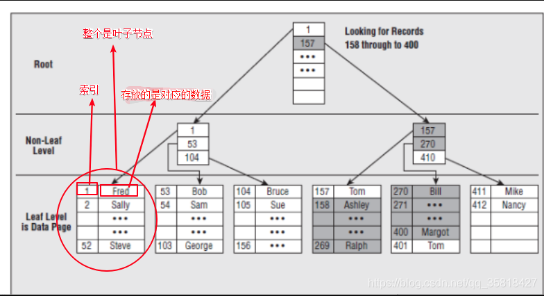

- **非聚簇索引(二级索引)：**将数据和索引分开存储，索引结构的叶子节点指向了数据的对应行，可以存多个。

## 聚簇索引选取规则

## 索引的基本原理

索引用来快速地寻找那些具有特定值的记录。如果没有索引，一般来说执行查询时遍历整张表。

索引的原理很简单，就是把无序的数据变成有序的查询：

1. 把创建了索引的列的内容进行排序
2. 对排序结果生成倒排表
3. 在倒排表内容上拼上数据地址链
4. 在查询的时候，先拿到倒排表内容，再取出数据地址链，从而拿到具体数据

## 为什么需要使用索引

①索引能极大的减少存储引擎需要扫描的数据量

②索引可以把随机I/O变为顺序I/O

③索引可以帮助我们进行分组、排序等操作时，避免使用临时表

## **BTree算法 Hash算法**

索引算法有 BTree算法和Hash算法

**BTree算法**

BTree是最常用的mysql数据库索引算法，也是mysql默认的算法。

**Hash算法**

Hash Hash索引只能用于对等比较，例如=,<=>（相当于=）操作符。

不能范围查询，不支持排序，不能模糊查询，但是在等值查询效率上高于b+tree，只需要查询一次就行。

## InnoDB  MyISAM  MyISAM

### InnoDB  

MySQL 5.5版本以后的默认引擎,**遵循ACID**(

- **原子性**： 事务作为一个整体被执行，包含在其中的对数据库的操作要么全部被执行，要么都不执行。
- **一致性**： 指在事务开始之前和事务结束以后，数据不会被破坏，假如A账户给B账户转10块钱，不管成功与否，A和B的总金额是不变的。
- **隔离性**： 多个事务并发访问时，事务之间是相互隔离的，即一个事务不影响其它事务运行效果。简言之，就是事务之间是进水不犯河水的。
- **持久性**： 表示事务完成以后，该事务对数据库所作的操作更改，将持久地保存在数据库之中。

) 模型 , **支持事务**, 可以支持行级锁（也支持表级锁） , 支持外键foreign key约束。

**B+树**  InnoDB表数据文件本身就是一个索引结构，**树的叶节点data域保存了完整的数据记录**，**聚集索引**；

InnoDB非主键索引的叶子节点存储的是主键和其他带索引的列数据，因此查询时做到覆盖索引会非常高效。

Innodb：更新（删除）操作频率也高，或者要保证数据的完整性；并发量高，支持事务和外键。比如OA自动化办公系统。

### MyISAM

使用B+树作为索引结果，叶节点的data域存放的是数据记录的地址。

MyISAM：以读写插入为主的应用程序，只有很少的更新和删除操作，对事物的完整性和并发性要求不高。比如博客系统、新闻门户网站。

### Memory

Memory引擎的表数据存储在内存中，一般是当做临时表和缓存使用的（断电、硬件问题可能丢失数据），默认hash索引。

## 索引有哪些优缺点？

**优点**

唯一索引可以保证数据库表中每一行的数据的唯一性

索引可以加快数据查询速度，减少查询时间

**缺点**

创建索引和维护索引要耗费时间

索引需要占物理空间，除了数据表占用数据空间之外，每一个索引还要占用一定的物理空间

对表中的数据进行增、删、改的时候，索引也要动态的维护。

## B树和B+树

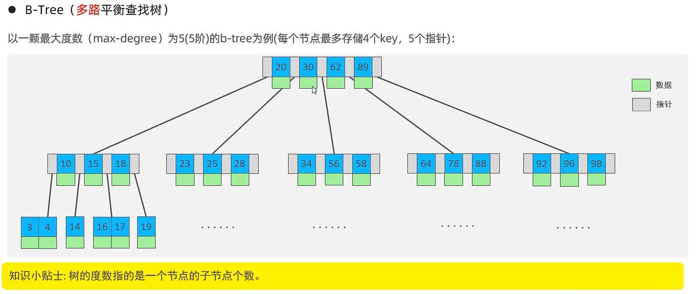

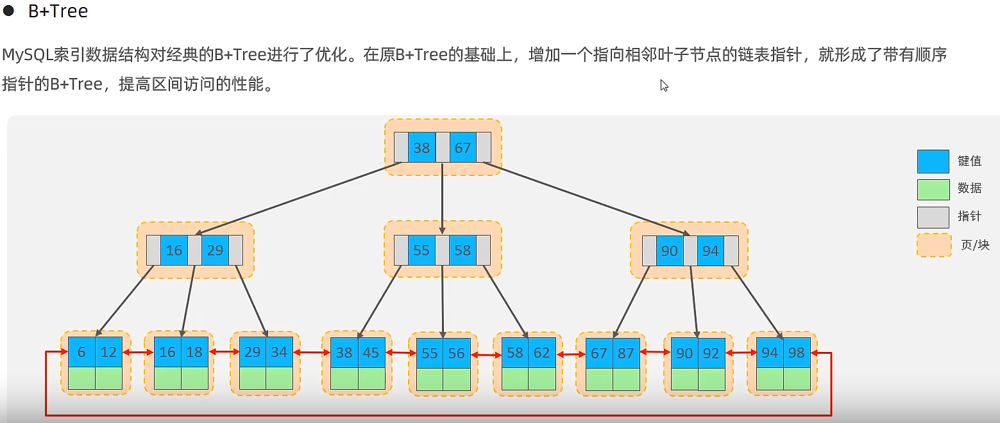

b+树中的所有元素都会出现在叶子节点

## 主键索引使用 B+树而非 B 树/二叉树/hash？

**和b树比：**

b树的叶子节点和非叶子节点都会保存数据，而b+树所有数据都保存在叶子节点。当我们有查找需求的时候，对于b+树而言，我们只需要去查它的叶子节点，查询的效率稳定；对于b树，要去每个节点找，特别是在范围查找的情况下，找到了最大值和最小值后，要中序回溯查询，而b+树中间的叶子节点就是结果集了。而且对于扫表扫库这些需求来说，b+树也只需要扫描叶子节点就可以了。

**和二叉树比：**

b+树层级更少，3层就能存几千万的数据，而且搜索效率高

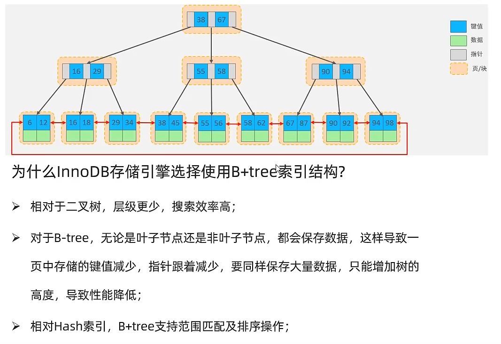

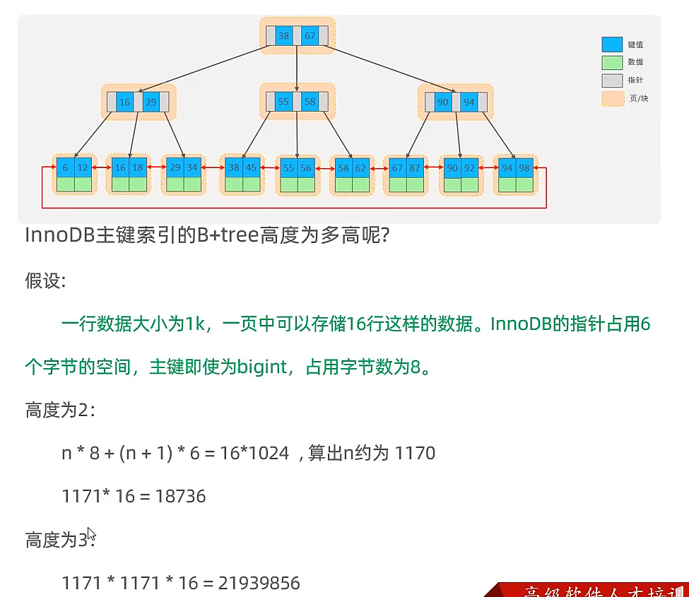

## B+树在满足聚簇索引和覆盖索引的时候不需要回表查询数据？

在B+树的索引中，叶子节点可能存储了当前的key值，也可能存储了当前的key值以及整行的数据，这就是聚簇索引和非聚簇索引。 

在InnoDB中，只有主键索引是聚簇索引，如果没有主键，则挑选一个唯一键建立聚簇索引。如果没有唯一键，则隐式的生成一个键来建立聚簇索引。

当查询使用聚簇索引时，在对应的叶子节点，可以获取到整行数据，因此不用再次进行回表查询。

## 使⽤⾃增ID和UUID作为主键有什么不同？ 

(1).如果InnoDB表的数据写⼊顺序能和B+树索引的叶⼦节点顺序⼀致的话，这时候存取效率是最⾼的。为了存储和查询性能应该使⽤⾃增⻓id做主键。

(2).对于InnoDB的主索引，数据会按照主键进⾏排序，由于UUID的⽆序性，InnoDB会产⽣巨⼤的IO压⼒，此时不适合使⽤UUID做物理主键，可以把它作为逻辑主键，物理主键依然使⽤⾃增ID。为了全局的唯⼀性，应该⽤uuid做索引关联其他表或做外键。

## 组合（联合、复合）索引最左原则

复合索引，也叫组合索引，用户可以在多个列上建立索引,这种索引叫做复合索引。

最左原则，即最左优先，在检索数据时从联合索引的最左边开始匹配。

查询必须包含索引中最左边的列 , 如果**最左边的列不存在 , 那索引失效** ; 如果**跳跃某一列索引, 这个索引后面的字段将失效**。因为,当我们创建一个组合索引的时候，如(k1,k2,k3)，相当于创建了（k1）、(k1,k2)和(k1,k2,k3)三个索引，查询k2必须从k1找起,找k3必须找到k1 k2。

语句： select * from table where k1=A AND k2=B AND k3=D

## 覆盖索引

- 覆盖索引： 查询列要被所建的索引覆盖，不必从数据表中读取，换句话说查询列要被所使用的索引覆盖。

**尽量使用覆盖索引，减少select \*的使用。**

## 回表

- 回表：二级索引无法直接查询所有列的数据，所以通过二级索引查询到聚簇索引后，再查询到想要的数据，这种通过二级索引查询出来的过程，就叫做回表。

## 非聚簇索引一定会回表查询吗？

不一定，如果查询语句的字段全部命中了索引，那么就不必再进行回表查询（哈哈，覆盖索引就是这么回事）。

举个简单的例子，假设我们在学生表的上建立了索引，那么当进行select age from student where age < 20的查询时，在索引的叶子节点上，已经包含了age信息，不会再次进行回表查询。

## 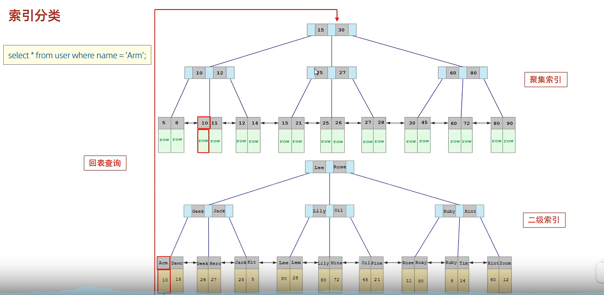

## 索引哪些情况会失效，不适合哪些场景

**索引哪些情况会失效**

- 联合索引最左原则，查询时的条件列不是联合索引中的第一个列，索引失效。
- 复合索引中，索引字段上使用**范围查询**（!= 或者 < >，not in）时，会导致索引失效。
- 对索引**列上进行运算操作**（如，+、-、*、/），索引失效。
- **字符串**类型字段使用时，**不加引号**，索引失效。
- **模糊查询，使用like通配符**可能会导致索引失效。（尾部ABC%使用不失效，头部%ABC使用失效）
- 查询条件包含**or**，可能会导致索引失效。(or两侧都是索引 , 不失效 ,  否则 , 失效)
- mysql估计**使用索引比全表扫描还要慢** , 则不使用索引。
- 索引字段上**使用is null， is not null**，可能导致索引失效。

**索引不适合哪些场景**

- 数据量少的不适合加索引
- 更新比较频繁的也不适合加索引
- 离散性低的字段不适合加索引（如性别）

## 索引设计

## 索引优化

索引对于良好的性能非常关键，尤其是当表中的数据量越来越大时，索引对性能的影响愈发重要，在数据量较小且负载较低时，不恰当的索引对性能的影响可能还不明显，但当数据量逐渐增大时，性能则会急剧下降。

索引优化应该是查询性能优化最有效的手段了（可以起到立竿见影的效果），索引能够轻易将查询性能提高几个数量级，’最优’的索引有时比一个‘好的’索引性能要好两个数量级，创建一个真正’最优’的索引经常需要重写查询。

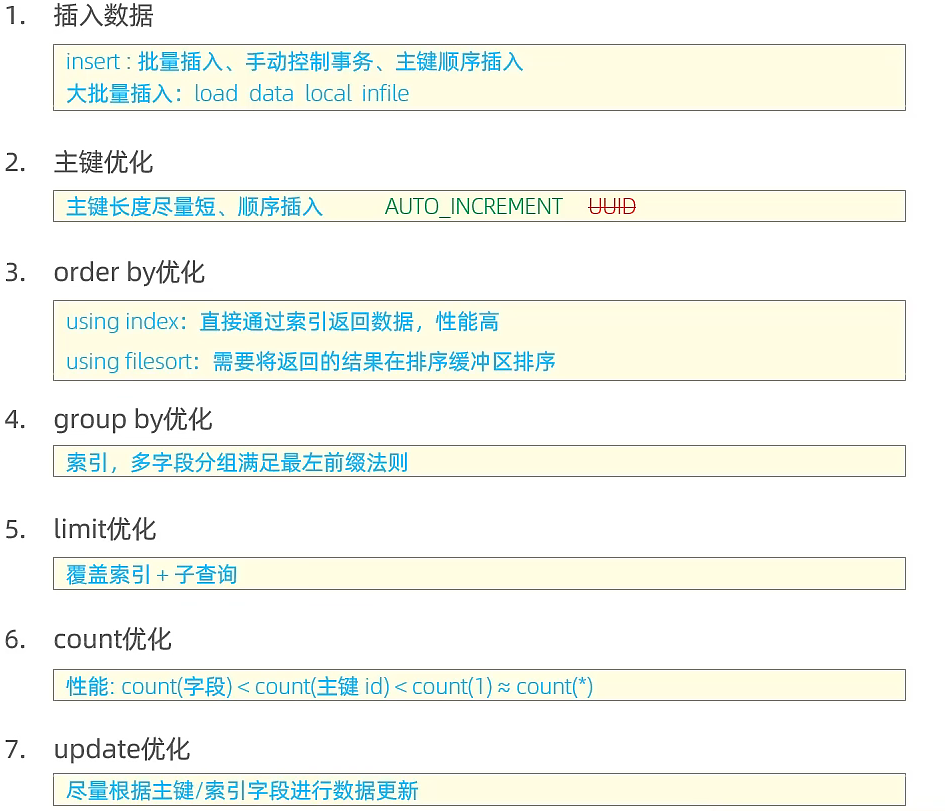

# 事务

## 什么是事务？

事务是逻辑上的一组操作，要么都执行，要么都不执行。

事务最经典也经常被拿出来说例子就是转账了。假如小明要给小红转账1000元，这个转账会涉及到两个关键操作就是：将小明的余额减少1000元，将小红的余额增加1000元。万一在这两个操作之间突然出现错误比如银行系统崩溃，导致小明余额减少 而小红的余额没有增加，这样就不对了。

事务就是保证这两个关键操作要么都成功，要么都要失败。

## MySQL事务的四大特性以及实现原理

- **原子性**： 事务作为一个整体被执行，包含在其中的对数据库的操作要么全部被执行，要么都不执行。
- **一致性**： 指在事务开始之前和事务结束以后，数据不会被破坏，假如A账户给B账户转10块钱，不管成功与否，A和B的总金额是不变的。
- **隔离性**： 多个事务并发访问时，事务之间是相互隔离的，即一个事务不影响其它事务运行效果。简言之，就是事务之间是进水不犯河水的。
- **持久性**： 表示事务完成以后，该事务对数据库所作的操作更改，将持久地保存在数据库之中。

## 事务的隔离性？

隔离性是指，多个用户的并发事务访问同一个数据库时，一个用户的事务不应该被其他用户的事务干扰，多个并发事务之间要相互隔离。

## 事务的隔离级别有哪些？MySQL的默认隔离级别是什么？

InnoDB实现了四种不同事务的隔离级别：

1. 读未提交(Read Uncommitted)  最低的隔离级别，允许读取尚未提交的数据变更，**可能会导致脏读、幻读或不可重复读**。
2. 读提交(Read Committed, RC) **最常用的隔离级别** 允许读取并发事务已经提交的数据，**可以阻止脏读，但是幻读或不可重复读仍有可能发生**。
3. 可重复读(Repeated Read, RR) **默认隔离级别** 对同一字段的多次读取结果都是一致的，除非数据是被本身事务自己所修改，**可以阻止脏读和不可重复读，但幻读仍有可能发生**。
4. 串行化(Serializable)  最高的隔离级别，完全服从ACID的隔离级别。所有的事务依次逐个执行，这样事务之间就完全不可能产生干扰，也就是说，**该级别可以防止脏读、不可重复读以及幻读**。

事务隔离级别越高，数据越安全，但是性能越低。

## 并发事务带来哪些问题?

在典型的应用程序中，多个事务并发运行，经常会操作相同的数据来完成各自的任务（多个用户对同一数据进行操作）。并发虽然是必须的，但可能会导致以下的问题：

脏读（Dirty read）: 当一个事务正在访问数据并且对数据进行了修改，而这种修改还没有提交到数据库中，这时另外一个事务也访问了这个数据，然后使用了这个数据。因为这个数据是还没有提交的数据，那么另外一个事务读到的这个数据是“脏数据”，依据“脏数据”所做的操作可能是不正确的。

丢失修改（Lost to modify）: 指在一个事务读取一个数据时，另外一个事务也访问了该数据，那么在第一个事务中修改了这个数据后，第二个事务也修改了这个数据。这样第一个事务内的修改结果就被丢失，因此称为丢失修改。 例如：事务 1 读取某表中的数据 A=20，事务 2 也读取 A=20，事务 1 修改 A=A-1，事务 2 也修改 A=A-1，最终结果 A=19，事务 1 的修改被丢失。

不可重复读（Unrepeatable read）: 指在一个事务内多次读同一数据。在这个事务还没有结束时，另一个事务也访问该数据。那么，在第一个事务中的两次读数据之间，由于第二个事务的修改导致第一个事务两次读取的数据可能不太一样。这就发生了在一个事务内两次读到的数据是不一样的情况，因此称为不可重复读。

幻读（Phantom read）: 幻读与不可重复读类似。它发生在一个事务（T1）读取了几行数据，接着另一个并发事务（T2）插入了一些数据时。在随后的查询中，第一个事务（T1）就会发现多了一些原本不存在的记录，就好像发生了幻觉一样，所以称为幻读。

**不可重复度和幻读区别：**

不可重复读的重点是修改，幻读的重点在于新增或者删除。

例1（同样的条件, 你读取过的数据, 再次读取出来发现值不一样了 ）：事务1中的A先生读取自己的工资为 1000的操作还没完成，事务2中的B先生就修改了A的工资为2000，导 致A再读自己的工资时工资变为 2000；这就是不可重复读。

例2（同样的条件, 第1次和第2次读出来的记录数不一样 ）：假某工资单表中工资大于3000的有4人，事务1读取了所有工资大于3000的人，共查到4条记录，这时事务2 又插入了一条工资大于3000的记录，事务1再次读取时查到的记录就变为了5条，这样就导致了幻读。

# 如果在⼀个事务中，代码业务流程很⻓，会有什么问题吗？为什么会出现这种问题？ 

可能出现事务超时： 

@Transactional(timeout = 60) 

如果⽤这个注解描述⼀个⽅法的话，线程已经跑到⽅法⾥⾯，如果已经过去60秒了还没跑完这个⽅法并且线程在这个⽅法中的后⾯还有涉及到对数据库的增删改查操作时会报事务超时错误（会回滚）。如果已经过去60秒了还没跑完但是后⾯已经没有涉及到对数据库的增删改查操作，那么这时不会报事务超时错误（不会回滚）。

# MVCC机制

MVCC 多版本并发控制。MVCC是一种并发控制的方法，一般在数据库管理系统中，实现对数据库的并发访问，在编程语言中实现事务内存。

MVCC就是因为大牛们，不满意只让数据库采用悲观锁这样性能不佳的形式去解决读-写冲突问题，而提出的解决方案

当前读：读取的是记录的最新(当前)版本，读取时还要保证其他并发事务不能修改当前记录，会对读取的记录进行加锁。

快照读：快照读的前提是隔离级别不是串行级别，串行级别下的快照读会退化成当前读；之所以出现快照读的情况，是基于提高并发性能的考虑，快照读的实现是基于多版本并发控制，即MVCC,可以认为MVCC是行锁的一个变种，但它在很多情况下，避免了加锁操作，降低了开销；既然是基于多版本，即快照读可能读到的并不一定是数据的最新版本，而有可能是之前的历史版本。

MVCC就是为了实现 读-写 冲突不加锁，而这个读指的就是快照读, 而非当前读，当前读实际上是一种加锁的操作，是悲观锁的实现。

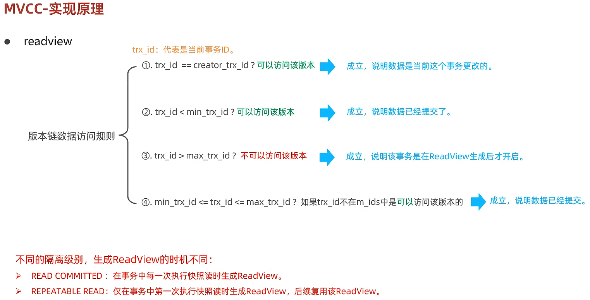

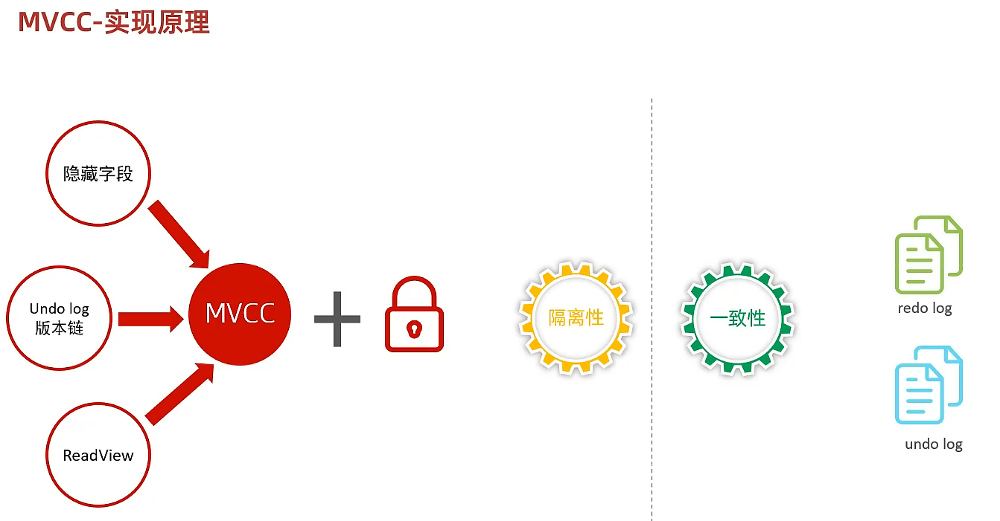

# 

# 全局锁 表级锁 行级锁

锁：协调并发访问的一种机制。保证数据并发访问的一致性。

MyISAM 采用**表级锁**

InnoDB 支持**行级锁和表级锁** , 默认为行级锁

## 全局锁：

锁定数据库中所有的表；加锁后整个数据库就处于只读状态，增删改之类的操作都会被阻塞。

主要的应用场景就是在对数据库做备份的时候，为了防止比如说备份表1时，表2被修改，导致数据不一致的情况，此时就会给全局加个锁，保证数据完整。

全局锁是一个比较重的操作，可能会导致一些问题：

1、如果在主库上备份，那在备份期间不能执行更新，除了读的所有操作都要被阻塞；

2、如果在从库上备份，那备份期间从库不能执行主库同步过来的binlog，会出现主从延迟问题。

## 表级锁： 

对当前操作的整张表加锁，资源消耗也比较少，加锁快，不会出现死锁。

其锁定粒度最大，触发锁冲突的概率最高，并发度最低，MyISAM 和 InnoDB 引擎都支持表级锁。

表级锁：

\1. **表锁** 分两类 表共享读锁/ 表独占写锁

读锁：其他客户端 只能读，不能写

写锁：其他客户端 不能读，不能写

语法：

加锁      lock tables 表名... read/write

释放锁  unlock tables /客户端断开连接

\2. **元数据锁**

系统自动控制的，不需要手动使用。在访问同一张表的时候会自动加上，来维护表元数据的一致性。

**3. 意向锁** 

 为了防止增删改操作的时候，加的行锁和表锁的冲突。比如说我们为一个表先加了一个行锁，另一个客户端为这个表试图加一个表锁，如果没有意向锁，表锁就需要每行去检查是否加了行锁，效率比较低。意向锁顾名思义，就是提前声明事务有意向对表中的某些行加锁 ，来减少表锁再去逐行检查。

意向锁分为：

意向共享锁 IS：事务有意向对表中的某些行加共享S锁 select...lock in share mode

意向排它锁 IX：事务有意向对表中的某些行加排它X锁 insert、update、delete、select...for update

## 行级锁： 

MySQL 中锁定 粒度最小 的一种锁，只针对当前操作的行进行加锁。 行级锁能大大减少数据库操作的冲突。其加锁粒度最小，并发度高，但加锁的开销也最大，加锁慢，会出现死锁。

InnoDB的数据是基于索引组织得到，行锁是通过对索引上的索引项加锁来实现的，而不是对记录加的锁。

1. **行锁** 

锁定单个行，防止其他事务更删操作。（RR/RC隔离级别都支持）

两种类型的行锁：

1、共享锁（S）：

2、排他锁（X）：

1. **间隙锁**

锁定索引记录中的间隔，确保索引记录间隙不变，防止其他事务在这个间隙中插入，产生幻读。（在RR级别下都支持）。如果把事务的隔离级别降级为读提交(Read Committed, RC)，间隙锁则会自动失效。

1. **临键锁**

行锁与间隙锁的组合，锁住数据也锁住数据的间隙，RR隔离级别下支持。

如果一个会话占有了索引记录R的共享/排他锁，其他会话不能立刻在R之前的区间插入新的索引记录。

临键锁的主要目的，也是 为了避免幻读 。如果把事务的隔离级别降级为RC，临键锁则也会失效。

# 数据库的乐观锁和悲观锁

**悲观锁**

悲观锁她专一且缺乏安全感了，她的心只属于当前事务，每时每刻都担心着它心爱的数据可能被别的事务修改，所以一个事务拥有（获得）悲观锁后，其他任何事务都不能对数据进行修改啦，只能等待锁被释放才可以执行。

**乐观锁**

乐观锁的“乐观情绪”体现在，它认为数据的变动不会太频繁。因此，它允许多个事务同时对数据进行变动。实现方式：乐观锁一般会使用版本号机制或CAS算法实现。

# 死锁

死锁是指两个或多个事务在同一资源上相互占用，并请求锁定对方的资源，从而导致恶性循环的现象。死锁有四个必要条件：互斥条件，请求和保持条件，环路等待条件，不剥夺条件。 解决死锁思路，一般就是切断环路，尽量避免并发形成环路。

- 如果不同程序会并发存取多个表，尽量约定以相同的顺序访问表，可以大大降低死锁机会。
- 在同一个事务中，尽可能做到一次锁定所需要的所有资源，减少死锁产生概率；
- 对于非常容易产生死锁的业务部分，可以尝试使用升级锁定颗粒度，通过表级锁定来减少死锁产生的概率；
- 如果业务处理不好可以用分布式事务锁或者使用乐观锁
- 死锁与索引密不可分，解决索引问题，需要合理优化你的索引

# MySQL 死锁问题如何解决

**排查死锁的步骤：**

- 查看死锁日志show engine innodb status;
- 找出死锁Sql
- 分析sql加锁情况
- 模拟死锁案发
- 分析死锁日志
- 分析死锁结果

# InnoDB引擎

## 逻辑存储结构

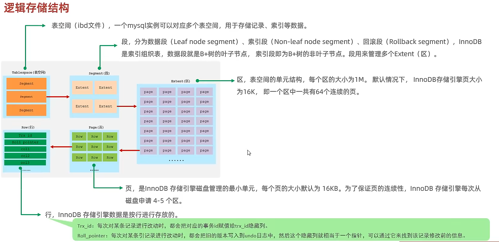

## InnoDB引擎的4大特性

- 插入缓冲（insert buffer)
- 二次写(double write)
- 自适应哈希索引(ahi)
- 预读(read ahead)

## InnoDB内存结构包含四大核心组件

- 缓冲池(Buffer Pool)
- 写缓冲(Change Buffer)
- 自适应哈希索引(Adaptive Hash Index)
- 日志缓冲(Log Buffer)

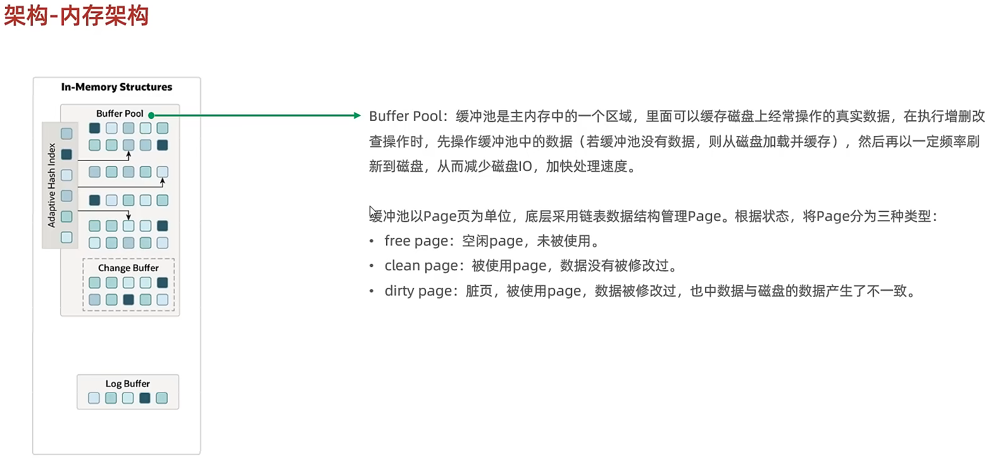

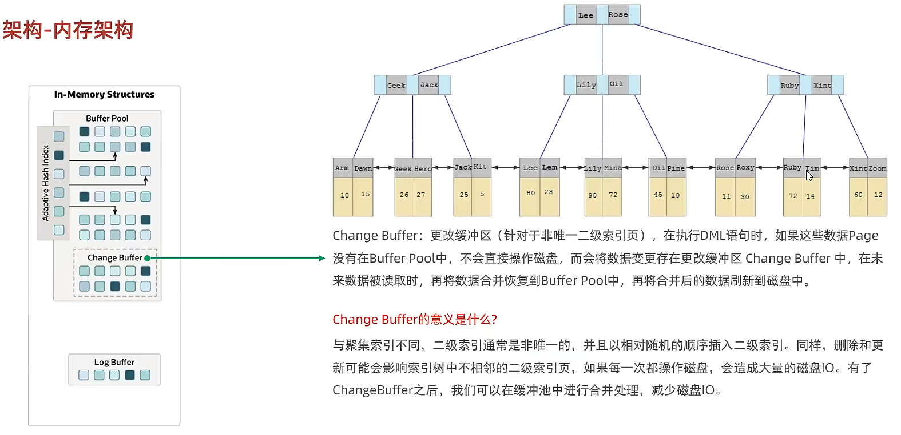

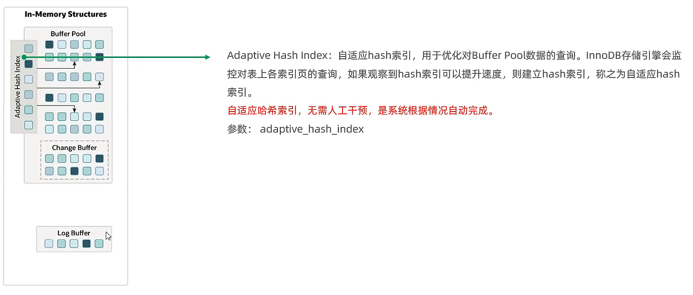

